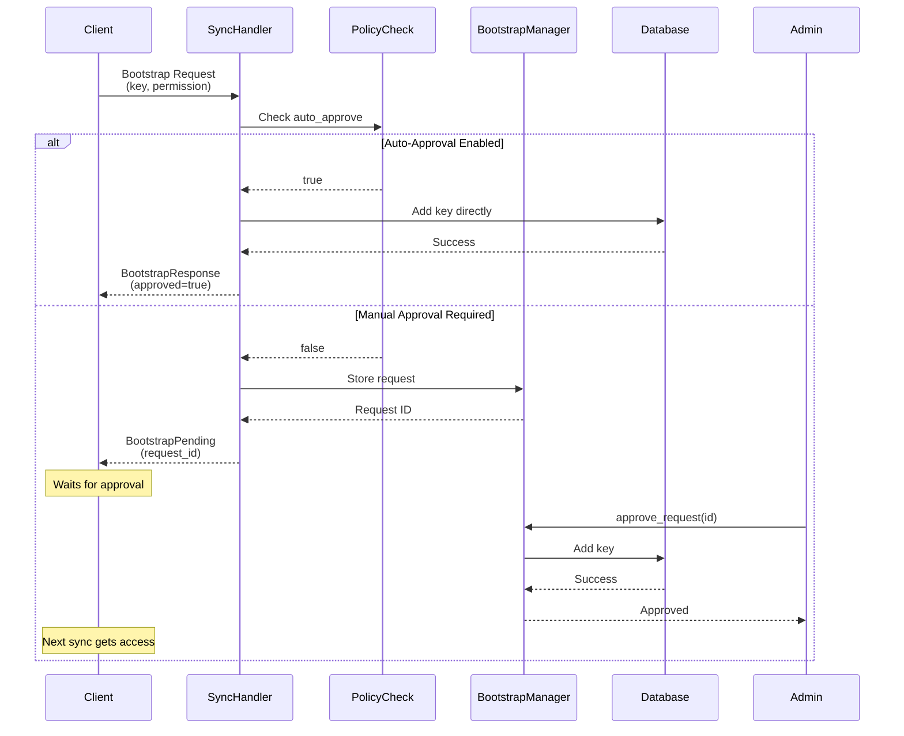

# Bootstrap Approval System

## Overview

The Bootstrap Approval System provides secure key management for Eidetica databases by controlling how new devices gain access to synchronized databases. It supports both automatic approval (for convenience) and manual approval (for security) workflows.

## Architecture

### Core Components

#### 1. Bootstrap Request Manager (`bootstrap_request_manager.rs`)

The `BootstrapRequestManager` handles storage and lifecycle of bootstrap requests within the sync database. Key responsibilities:

- **Request Storage**: Persists bootstrap requests as structured documents in the `bootstrap_requests` subtree
- **Status Tracking**: Manages request states (Pending, Approved, Rejected)
- **Request Retrieval**: Provides query APIs to list and filter requests

#### 2. Sync Handler Extensions

The `SyncHandlerImpl` processes bootstrap requests during sync operations:

- **Policy Evaluation**: Checks `_settings.auth.policy.bootstrap_auto_approve` flag
- **Auto-Approval**: Automatically adds keys when policy allows
- **Manual Queue**: Stores requests for manual review when auto-approval is disabled
- **Response Generation**: Returns appropriate sync responses (BootstrapPending, BootstrapResponse)

#### 3. Sync Module API

Public methods for request management:

- `pending_bootstrap_requests()`: Get all pending bootstrap requests
- `approved_bootstrap_requests()`: Get all approved bootstrap requests
- `rejected_bootstrap_requests()`: Get all rejected bootstrap requests
- `get_bootstrap_request()`: Retrieve specific request by ID
- `approve_bootstrap_request()`: Approve and add key to target database
- `reject_bootstrap_request()`: Deny access without adding key

### Data Flow



## Bootstrap Request Structure

Each bootstrap request contains:

**Note**: The request ID (e.g., "bootstrap_a1b2c3d4...") is the table key, not a field in the struct.

```rust,ignore
pub struct BootstrapRequest {
    /// Target database/tree ID
    pub tree_id: ID,

    /// Public key of requesting device (ed25519:...)
    pub requesting_pubkey: String,

    /// Key name for the requesting device
    pub requesting_key_name: String,

    /// Permission level requested (Admin, Write, Read)
    pub requested_permission: Permission,

    /// ISO 8601 timestamp of request
    pub timestamp: String,

    /// Current processing status
    pub status: RequestStatus,

    /// Network address for future notifications
    pub peer_address: Address,
}
```

## Client Workflow

From the client's perspective, the bootstrap approval process follows these steps:

### 1. Initial Bootstrap Attempt

The client initiates a bootstrap request when it needs access to a synchronized database:

```rust,ignore
client_sync.sync_with_peer_for_bootstrap(
    &server_address,
    &tree_id,
    "client_device_key",     // Client's key name
    Permission::Write(5)     // Requested permission level
).await
```

### 2. Response Handling

The client must handle different response scenarios:

- **Auto-Approval Enabled** (rare in production):
  - Request succeeds immediately
  - Client gains access to the database
  - Can proceed with normal operations

- **Manual Approval Required** (common):
  - Request fails with an error
  - Error indicates request is "pending"
  - Bootstrap request is queued for admin review

### 3. Waiting for Approval

While the request is pending, the client has several options:

- **Polling Strategy**: Periodically retry sync operations
- **Event-Based**: Wait for notification from server (future enhancement)
- **User-Triggered**: Let user manually retry when they expect approval

### 4. After Admin Decision

**If Approved:**

- The initial `sync_with_peer_for_bootstrap()` will still return an error
- Client must use normal `sync_with_peer()` to access the database
- Once synced, client can load and use the database normally

**If Rejected:**

- All sync attempts continue to fail
- Client remains unable to access the database
- May submit a new request with different parameters if appropriate

### 5. Retry Logic Example

```rust,ignore
async fn bootstrap_with_retry(
    client_sync: &mut Sync,
    server_addr: &str,
    tree_id: &ID,
    key_name: &str,
) -> Result<()> {
    // Initial bootstrap request
    if let Err(_) = client_sync.sync_with_peer_for_bootstrap(
        server_addr, tree_id, key_name, Permission::Write(5)
    ).await {
        println!("Bootstrap request pending approval...");

        // Poll for approval (with backoff)
        for attempt in 0..10 {
            tokio::time::sleep(Duration::from_secs(30 * (attempt + 1))).await;

            // Try normal sync after potential approval
            if client_sync.sync_with_peer(server_addr, Some(tree_id)).await.is_ok() {
                println!("Access granted!");
                return Ok(());
            }
        }

        return Err("Bootstrap request timeout or rejected".into());
    }

    Ok(()) // Auto-approved
}
```

## Request Lifecycle

### 1. Request Creation

When a client attempts bootstrap with authentication:

- Sync handler checks if tree exists
- Evaluates bootstrap policy in database settings
- If auto-approval disabled, creates bootstrap request
- Stores request in sync database's `bootstrap_requests` subtree

### 2. Manual Review

Administrators can:

- List pending requests: `sync.pending_bootstrap_requests()`
- View request details: `sync.get_bootstrap_request(request_id)`
- Make approval decision based on:
  - Requesting device's public key
  - Requested permission level
  - Request timestamp
  - Any out-of-band verification

### 3. Approval Process

When approving a request:

1. Load request from sync database
2. Validate request is still pending
3. Create transaction on target database
4. Add requesting key with specified permissions
5. Update request status to "Approved"
6. Record approver and timestamp

### 4. Rejection Process

When rejecting a request:

1. Load request from sync database
2. Validate request is still pending
3. Update status to "Rejected"
4. Record rejector and timestamp
5. No keys added to target database

## Security Considerations

### Policy Configuration

The bootstrap auto-approval policy is stored at:

```text
_settings.auth.policy.bootstrap_auto_approve: bool
```

**Default**: `false` (manual approval required)

### Authentication Flow

1. **Request Phase**: Client provides its public key and desired permissions
2. **Verification**: Sync handler validates request format and tree existence
3. **Authorization**:
   - Auto-approval: Policy check only
   - Manual: Admin with appropriate key must approve
4. **Key Addition**: Approved keys added to target database's auth settings

### Trust Model

- **Auto-Approval**: Trusts any device that can reach the sync endpoint
  - Suitable for: Development, private networks, low-security scenarios
  - Risk: Any device can gain specified permissions automatically

- **Manual Approval**: Requires explicit admin action
  - Suitable for: Production, public networks, high-security scenarios
  - Benefit: Complete control over database access

### Audit Trail

All bootstrap requests maintain:

- Request timestamp
- Approval/rejection timestamp
- Approver/rejector identity
- Original request details

This provides forensic capability for security reviews.

## Implementation Details

### Storage Location

Bootstrap requests are stored in the sync database (not target databases):

- Tree: `_sync` database maintained by sync infrastructure
- Subtree: `bootstrap_requests`
- Structure: Document store with request_id as primary key

### Request Persistence

Bootstrap requests are persisted indefinitely for security auditing purposes:

- **No automatic cleanup**: Requests remain in the sync database permanently
- **Audit trail**: Complete history of all bootstrap attempts is maintained
- **Security forensics**: Historical requests can be reviewed for security analysis
- **Storage impact**: Requests are lightweight, making long-term storage practical

### Concurrent Operations

The system handles:

- Multiple pending requests for same database
- Concurrent approval/rejection operations
- Request deduplication by ID (each request gets a unique ID)

**Note on Duplicate Requests**: Currently, if the same client makes multiple identical bootstrap requests, each creates a separate request with a unique ID. Future enhancements may include duplicate detection to consolidate requests from the same client/key combination.

### Error Handling

Key error scenarios:

- `RequestNotFound`: Invalid request ID
- `RequestAlreadyExists`: Duplicate request ID
- `InvalidRequestState`: Request not in expected state
- `InsufficientPermissions`: Approver lacks required permissions

## Usage Examples

### Enable Auto-Approval (Development)

```rust,ignore
// In database creation or settings update
let mut settings = Doc::new();
let mut auth_doc = Doc::new();
let mut policy_doc = Doc::new();

policy_doc.set_json("bootstrap_auto_approve", true)?;
auth_doc.set_node("policy", policy_doc);
settings.set_node("auth", auth_doc);
```

### Manual Approval Workflow

```rust,ignore
// 1. List pending requests
let pending = sync.pending_bootstrap_requests()?;
for (request_id, request) in pending {
    println!("Request {}: {} wants {} access to tree {}",
        request_id,
        request.requesting_key_name,
        request.requested_permission,
        request.tree_id
    );
}

// 2. Approve a request
sync.approve_bootstrap_request(
    "bootstrap_a1b2c3d4...",
    "admin_key"  // Your admin key name
)?;

// 3. Or reject a request
sync.reject_bootstrap_request(
    "bootstrap_e5f6g7h8...",
    "admin_key"
)?;

```

### Client Bootstrap Workflow

```rust,ignore
// Step 1: Initial bootstrap attempt with authentication
let bootstrap_result = client_sync.sync_with_peer_for_bootstrap(
    &server_address,
    &tree_id,
    "my_device_key",
    Permission::Write(5)
).await;

// Step 2: Handle the response based on approval policy
match bootstrap_result {
    Ok(_) => {
        // Rare case: Auto-approval was enabled
        println!("Bootstrap auto-approved! Access granted immediately.");
    },
    Err(e) => {
        // Common case: Manual approval required
        // The error indicates the request is pending
        println!("Bootstrap request submitted, awaiting admin approval...");

        // Step 3: Wait for admin to review and approve
        // Options:
        // a) Poll periodically
        // b) Wait for out-of-band notification
        // c) User-triggered retry

        // Step 4: After admin approval, retry with normal sync
        // (bootstrap sync will still fail, use regular sync instead)
        tokio::time::sleep(Duration::from_secs(30)).await;

        // After approval, normal sync will succeed
        match client_sync.sync_with_peer(&server_address, Some(&tree_id)).await {
            Ok(_) => {
                println!("Access granted! Database synchronized.");
                // Client can now load and use the database
                let db = client_instance.load_database(&tree_id)?;
            },
            Err(_) => {
                println!("Still pending or rejected. Check with admin.");
            }
        }
    }
}

// Handling rejection scenario
// If the request was rejected, all sync attempts will continue to fail
// The client will need to submit a new bootstrap request if appropriate
```

## Troubleshooting

### Common Issues

1. **"Authentication required but not configured"**
   - Cause: Sync handler cannot authenticate with target database
   - Solution: Ensure proper key configuration for database operations

2. **"Bootstrap request already exists"**
   - Cause: Duplicate request ID generated
   - Solution: Retry with new request (IDs are random)

3. **"Invalid request state"**
   - Cause: Attempting to approve/reject non-pending request
   - Solution: Check request status before operation

### Debug Logging

Enable detailed logging:

```bash
RUST_LOG=eidetica::sync=debug cargo run
```

Key log points:

- Policy evaluation results
- Request storage operations
- Approval/rejection processing
- Key addition to databases

### Performance Considerations

- Bootstrap requests are lightweight (~1KB each)
- Sync database grows linearly with request count
- Request queries are indexed by ID
