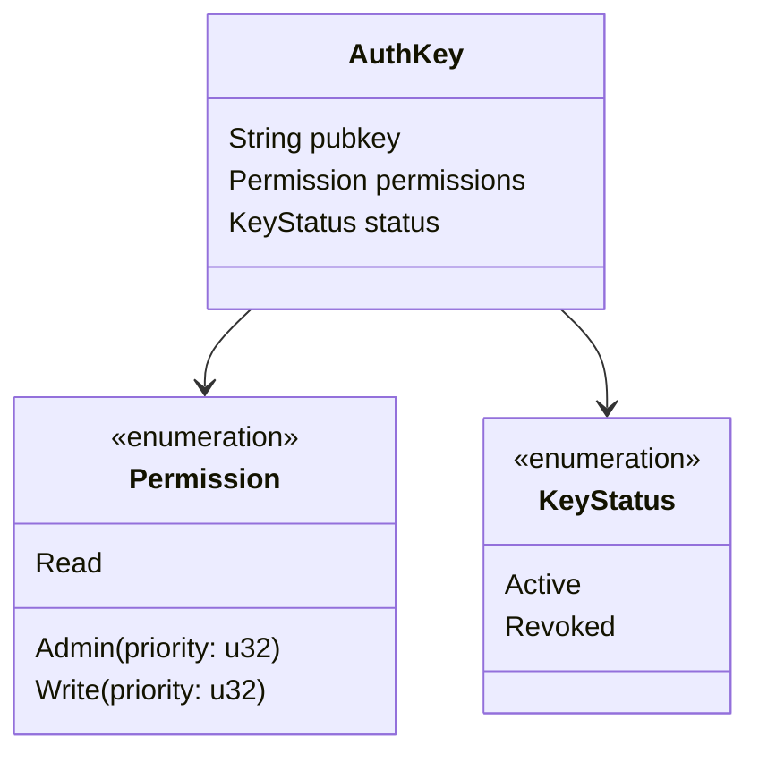
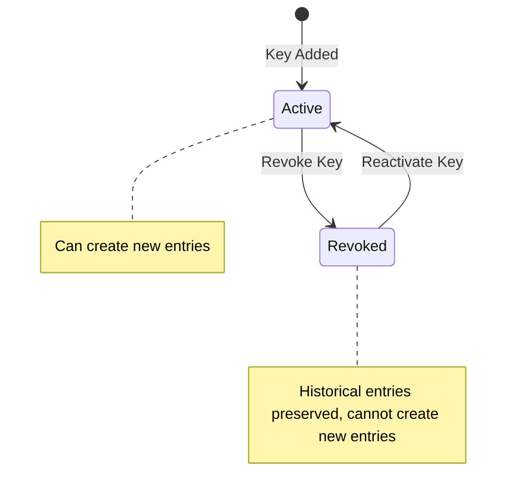
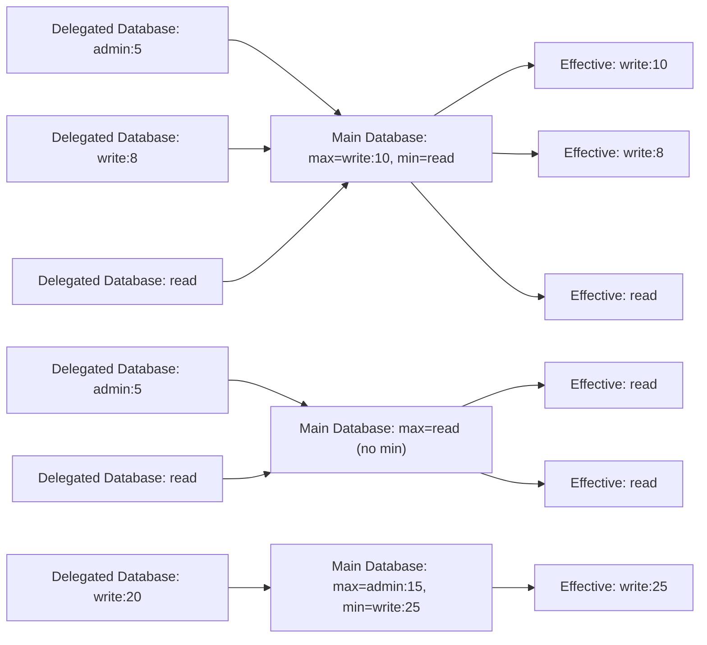
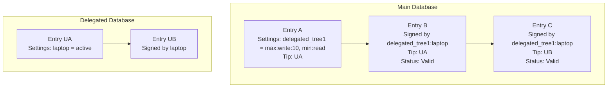
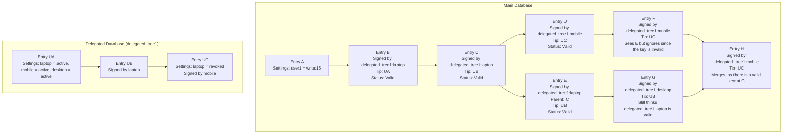
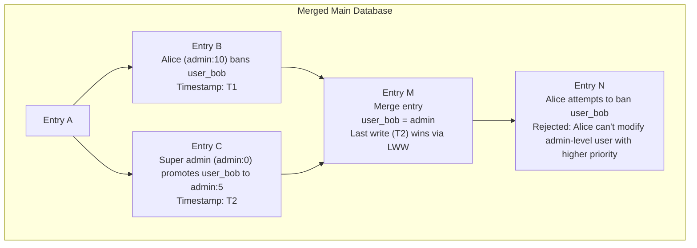
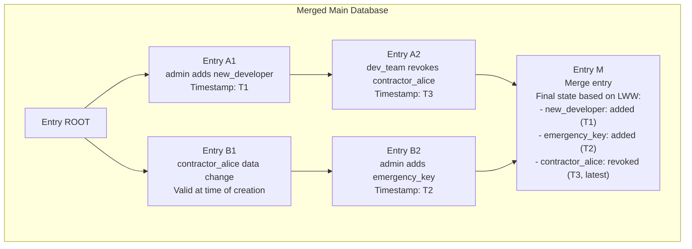

**Implementation Status**:

- ✅ **Direct Keys** - Fully implemented and functional
- ✅ **Delegated Databases** - Fully implemented and functional with comprehensive test coverage

# Authentication Design

This document outlines the authentication and authorization scheme for Eidetica, a decentralized database built on Merkle-CRDT principles. The design emphasizes flexibility, security, and integration with the core CRDT system while maintaining distributed consistency.

## Table of Contents

- [Authentication Design](#authentication-design)
  - [Table of Contents](#table-of-contents)
  - [Overview](#overview)
  - [Authentication Modes and Bootstrap Behavior](#authentication-modes-and-bootstrap-behavior)
    - [Unsigned Mode (No Authentication)](#unsigned-mode-no-authentication)
    - [Signed Mode (Mandatory Authentication)](#signed-mode-mandatory-authentication)
    - [Automatic Bootstrap Transition](#automatic-bootstrap-transition)
    - [Future: Overlay Databases](#future-overlay-databases)
  - [Design Goals and Principles](#design-goals-and-principles)
    - [Primary Goals](#primary-goals)
    - [Non-Goals](#non-goals)
  - [System Architecture](#system-architecture)
    - [Authentication Data Location](#authentication-data-location)
    - [Permission Hierarchy](#permission-hierarchy)
  - [Authentication Framework](#authentication-framework)
    - [Key Structure](#key-structure)
    - [Direct Key Example](#direct-key-example)
    - [Entry Signing Format](#entry-signing-format)
  - [Key Management](#key-management)
    - [Key Lifecycle](#key-lifecycle)
    - [Key Status Semantics](#key-status-semantics)
    - [Priority System](#priority-system)
    - [Key Naming and Aliasing](#key-naming-and-aliasing)
  - [Delegation (Delegated Databases)](#delegation-delegated-databases)
    - [Concept and Benefits](#concept-and-benefits)
    - [Structure](#structure)
    - [Permission Clamping](#permission-clamping)
    - [Multi-Level References](#multi-level-references)
    - [Delegated Database References](#delegated-database-references)
      - [Latest Known Tips](#latest-known-tips)
      - [Tip Tracking and Validation](#tip-tracking-and-validation)
    - [Key Revocation](#key-revocation)
  - [Conflict Resolution and Merging](#conflict-resolution-and-merging)
    - [Key Status Changes in Delegated Databases: Examples](#key-status-changes-in-delegated-databases-examples)
      - [Example 1: Basic Delegated Database Key Status Change](#example-1-basic-delegated-database-key-status-change)
      - [Example 2: Last Write Wins Conflict Resolution](#example-2-last-write-wins-conflict-resolution)
  - [Authorization Scenarios](#authorization-scenarios)
    - [Network Partition Recovery](#network-partition-recovery)
  - [Security Considerations](#security-considerations)
    - [Threat Model](#threat-model)
      - [Protected Against](#protected-against)
      - [Requires Manual Recovery](#requires-manual-recovery)
    - [Cryptographic Assumptions](#cryptographic-assumptions)
    - [Attack Vectors](#attack-vectors)
      - [Mitigated](#mitigated)
      - [Partial Mitigation](#partial-mitigation)
      - [Not Addressed](#not-addressed)
  - [Implementation Details](#implementation-details)
    - [Authentication Validation Process](#authentication-validation-process)
    - [Sync Permissions](#sync-permissions)
    - [CRDT Metadata Considerations](#crdt-metadata-considerations)
    - [Implementation Architecture](#implementation-architecture)
      - [Core Components](#core-components)
      - [Storage Format](#storage-format)
  - [Future Considerations](#future-considerations)
    - [Current Implementation Status](#current-implementation-status)
    - [Future Enhancements](#future-enhancements)
  - [References](#references)

## Overview

Eidetica's authentication scheme is designed to leverage the same CRDT and Merkle-DAG principles that power the core database while providing robust access control for distributed environments. Unlike traditional authentication systems, this design must handle authorization conflicts that can arise from network partitions and concurrent modifications to access control rules.

Databases operate in one of two authentication modes: **unsigned mode** (no authentication configured) or **signed mode** (authentication required). This design supports both security-critical databases requiring signed operations, unsigned and typically local-only databases for higher performance, and unsigned 'overlay' trees that can be computed from signed trees.

The authentication system is **not** implemented as a pure consumer of the database API but is tightly integrated with the core system. This integration enables efficient validation and conflict resolution during entry creation and database merging operations.

## Authentication Modes and Bootstrap Behavior

Eidetica databases support two distinct authentication modes with automatic transitions between them:

### Unsigned Mode (No Authentication)

Databases are in **unsigned mode** when created without authentication configuration. In this mode:

- The `_settings.auth` key is either missing or contains an empty `Doc` (`{"auth": {}}`)
- Both states are equivalent and treated identically by the system
- **Unsigned operations succeed**: Transactions without signatures are allowed
- **No validation overhead**: Authentication validation is skipped for performance
- **Suitable for**: Local-only databases, temporary workspaces, development environments, overlay networks

Unsigned mode enables use cases where authentication overhead is unnecessary, such as:

- Local computation that never needs to sync
- Development and testing environments
- Temporary scratch databases
- The upcoming "overlays" feature (see below)

### Signed Mode (Mandatory Authentication)

Once authentication is configured, databases are in **signed mode** where:

- The `_settings.auth` key contains at least one authentication key
- **All operations require valid signatures**: Only authenticated and transactions are valid
- **Fail-safe validation**: Corrupted or deleted auth configuration causes all transactions to fail
- **Permanent transition**: Cannot return to unsigned mode (would require creating a new database)

In signed mode, unsigned operations will fail with an authentication error. The system enforces mandatory authentication to maintain security guarantees once authentication has been established.

**Fail-Safe Behavior**:

The validation system uses two-layer protection to prevent and detect authentication corruption:

1. **Proactive Prevention** (Layer 1): Transactions that would corrupt or delete auth configuration fail during `commit()`, before the entry enters the Merkle DAG
2. **Reactive Fail-Safe** (Layer 2): If auth is already corrupted (from older code versions or external manipulation), all subsequent operations on top of the corrupted state are also invalid

**Validation States**:

| Auth State        | `_settings.auth` Value      | Unsigned Operations | Authenticated Operations | Status            |
| ----------------- | --------------------------- | ------------------- | ------------------------ | ----------------- |
| **Unsigned Mode** | Missing or `{}` (empty Doc) | ✓ Allowed           | ✓ Triggers bootstrap     | Valid             |
| **Signed Mode**   | Valid key configuration     | ✗ Rejected          | ✓ Validated              | Valid             |
| **Corrupted**     | Wrong type (String, etc.)   | ✗ PREVENTED         | ✗ PREVENTED              | Cannot be created |
| **Deleted**       | Tombstone (was deleted)     | ✗ PREVENTED         | ✗ PREVENTED              | Cannot be created |

**Note**: Corrupted and Deleted states shown in the table are **theoretical** - the system prevents their creation through proactive validation. The fail-safe layer (Layer 2) remains as defense-in-depth against historical corruption or external DAG manipulation.

This defense-in-depth approach ensures that corrupted authentication configuration cannot be created or exploited to bypass security. See [Authentication Behavior Reference](../internal/auth_behavior_reference.md) for detailed implementation information.

### Future: Overlay Databases

The unsigned mode design enables a planned feature called "overlays", computed databases that can be calculated from multiple machines.

The idea is that an "overlay" adds information to a database, backups for example, that can be reconstructed entirely from the original database.

## Design Goals and Principles

### Primary Goals

1. **Flexible Authentication**: Support both unsigned mode for local-only work and signed mode for distributed collaboration
2. **Distributed Consistency**: Authentication rules must merge deterministically across network partitions
3. **Cryptographic Security**: All authentication based on Ed25519 public/private key cryptography
4. **Hierarchical Access Control**: Support admin, read/write, and read-only permission levels
5. **Delegation**: Support for delegating authentication to other databases without granting admin privileges (infrastructure built, activation pending)
6. **Auditability**: All authentication changes are tracked in the immutable DAG history

### Non-Goals

- **Perfect Security**: Admin key compromise requires manual intervention
- **Real-time Revocation**: Key revocation is eventually consistent, not immediate

## System Architecture

### Authentication Data Location

Authentication configuration is stored in the special `_settings` store under the `auth` key. This placement ensures that:

- Authentication rules are included in `_settings`, which contains all the data necessary to validate the database and add new Entries
- Access control changes are tracked in the immutable history
- Settings can be validated against the current entry being created

The `_settings` store uses the `crate::crdt::Doc` type, which is a hierarchical CRDT that resolves conflicts using Last-Write-Wins (LWW) semantics. The ordering for LWW is determined deterministically by the DAG design (see CRDT documentation for details).

**Clarification**: Throughout this document, when we refer to `Doc`, this is the hierarchical CRDT document type supporting nested structures. The `_settings` store specifically uses `Doc` to enable complex authentication configurations including nested policy documents and key management.

### Permission Hierarchy

Eidetica implements a three-tier permission model:

| Permission Level | Modify `_settings` | Add/Remove Keys | Change Permissions | Read Data | Write Data | Public Database Access |
| ---------------- | ------------------ | --------------- | ------------------ | --------- | ---------- | ---------------------- |
| **Admin**        | ✓                  | ✓               | ✓                  | ✓         | ✓          | ✓                      |
| **Write**        | ✗                  | ✗               | ✗                  | ✓         | ✓          | ✓                      |
| **Read**         | ✗                  | ✗               | ✗                  | ✓         | ✗          | ✓                      |

## Authentication Framework

### Key Structure

The current implementation supports direct authentication keys stored in the `_settings.auth` configuration. Each key consists of:



**Note**: Both direct keys and delegated databases are fully implemented and functional, including `DelegatedTreeRef`, `PermissionBounds`, and `TreeReference` types.

### Direct Key Example

```json
{
  "_settings": {
    "auth": {
      "KEY_LAPTOP": {
        "pubkey": "ed25519:PExACKOW0L7bKAM9mK_mH3L5EDwszC437uRzTqAbxpk",
        "permissions": "write:10",
        "status": "active"
      },
      "KEY_DESKTOP": {
        "pubkey": "ed25519:QJ7bKAM9mK_mH3L5EDwszC437uRzTqAbxpkPExACKOW0L",
        "permissions": "read",
        "status": "active"
      },
      "*": {
        "pubkey": "*",
        "permissions": "read",
        "status": "active"
      },
      "PUBLIC_WRITE": {
        "pubkey": "*",
        "permissions": "write:100",
        "status": "active"
      }
    },
    "name": "My Database"
  }
}
```

**Note**: The wildcard key `*` enables global permissions for anyone. Wildcard keys:

- Can have any permission level: "read", "write:N", or "admin:N"
- Are commonly used for world-readable databases (with "read" permissions) but can grant broader access
- Can be revoked like any other key
- Can be included in delegated databases (if you delegate to a database with a wildcard, that's valid)

### Entry Signing Format

Every entry in Eidetica must be signed. The authentication information is embedded in the entry structure:

```json
{
  "database": {
    "root": "tree_root_id",
    "parents": ["parent_entry_id"],
    "data": "{\"key\": \"value\"}",
    "metadata": "{\"_settings\": [\"settings_tip_id\"]}"
  },
  "stores": [
    {
      "name": "users",
      "parents": ["parent_entry_id"],
      "data": "{\"user_data\": \"example\"}"
    }
  ],
  "auth": {
    "sig": "ed25519_signature_base64_encoded",
    "key": "KEY_LAPTOP"
  }
}
```

The `auth.key` field can be either:

- **Direct key**: A string referencing a key name in this database's `_settings.auth`
- **Delegation path**: An ordered list of `{"key": "delegated_tree_1", "tips": ["A", "B"]}` elements, where the last element must contain only a `"key"` field

The `auth.sig` field contains the base64-encoded Ed25519 signature of the entry's content hash.

## Key Management

### Key Lifecycle

The current implementation supports two key statuses:



### Key Status Semantics

1. **Active**: Key can create new entries and all historical entries remain valid
2. **Revoked**: Key cannot create new entries. Historical entries remain valid and their content is preserved during merges

**Key Behavioral Details**:

- Entries created before revocation remain valid to preserve history integrity
- An Admin can transition a key back to Active state from Revoked status
- Revoked status prevents new entries but preserves existing content in merges

### Priority System

Priority is integrated into the permission levels for Admin and Write permissions:

- **Admin(priority)**: Can modify settings and manage keys with equal or lower priority
- **Write(priority)**: Can write data but not modify settings
- **Read**: No priority, read-only access

Priority values are u32 integers where lower values indicate higher priority:

- Priority `0`: Highest priority, typically the initial admin key
- Higher numbers = lower priority
- Keys can only modify other keys with equal or lower priority (equal or higher number)

**Important**: Priority **only** affects administrative operations (key management). It does **not** influence CRDT merge conflict resolution, which uses Last Write Wins semantics based on the DAG structure.

### Key Naming and Aliasing

Auth settings serve two distinct purposes in delegation:

1. **Delegation references** - Names that point to OTHER DATABASES (DelegatedTreeRef containing TreeReference)
2. **Signing keys** - Names that point to PUBLIC KEYS (AuthKey containing Ed25519 public key)

Auth settings can also contain multiple names for the same public key, each potentially with different permissions. This enables:

- **Readable delegation paths** - Use friendly names like `"alice_laptop"` instead of long public key strings
- **Permission contexts** - Same key can have different permissions depending on how it's referenced
- **API compatibility** - Bootstrap can use public key strings while delegation uses friendly names

**Example**: Multiple names for same key

```json
{
  "_settings": {
    "auth": {
      "Ed25519:abc123...": {
        "pubkey": "Ed25519:abc123...",
        "permissions": "admin:0",
        "status": "active"
      },
      "alice_work": {
        "pubkey": "Ed25519:abc123...",
        "permissions": "write:10",
        "status": "active"
      },
      "alice_readonly": {
        "pubkey": "Ed25519:abc123...",
        "permissions": "read",
        "status": "active"
      }
    }
  }
}
```

**Use Cases**:

- **Instance API bootstrap**: When using `instance.new_database(settings, key_name)`, the database is automatically bootstrapped with the signing key added to auth settings using the **public key string** as the name (e.g., `"Ed25519:abc123..."`). This is the name used for signature verification.

- **User API bootstrap**: When using `user.new_database(settings, key_id)`, the behavior is similar - the key is added with its public key string as the name, regardless of any display name stored in user key metadata.

- **Delegation paths**: Delegation references keys by their **name** in auth settings. To enable readable delegation paths like `["alice@example.com", "alice_laptop"]` instead of `["alice@example.com", "Ed25519:abc123..."]`, add friendly name aliases to the delegated database's auth settings.

- **Permission differentiation**: The same physical key can have different permission levels depending on which name is used to reference it.

**Key Aliasing Pattern**:

```rust,ignore
// Bootstrap creates entry with public key string as name
let database = instance.new_database(settings, "alice_key")?;
// Auth now contains: { "Ed25519:abc123...": AuthKey(...) }

// Add friendly name alias for delegation
let transaction = database.new_transaction()?;
let settings = transaction.get_settings()?;
settings.update_auth_settings(|auth| {
    // Same public key, friendly name, potentially different permission
    auth.add_key("alice_laptop", AuthKey::active(
        "Ed25519:abc123...",  // Same public key
        Permission::Write(10),  // Can differ from bootstrap permission
    )?)?;
    Ok(())
})?;
transaction.commit()?;
// Auth now contains both:
// { "Ed25519:abc123...": AuthKey(..., Admin(0)) }
// { "alice_laptop": AuthKey(..., Write(10)) }
```

**Important Notes**:

- Both entries reference the same cryptographic key but can have different permissions
- Signature verification works with any name that maps to the correct public key
- Delegation paths use the key **name** from auth settings, making friendly aliases essential for readable delegation
- The name used in the `auth.key` field (either direct or in a delegation path) must exactly match a name in the auth settings
- Adding multiple names for the same key does not create duplicates - they are intentional aliases with potentially different permission contexts

## Delegation (Delegated Authentication)

**Status**: Fully implemented and functional with comprehensive test coverage.

### Concept and Benefits

Delegation allows any database to be referenced as a source of authentication keys for another database. This enables flexible authentication patterns where databases can delegate authentication to other databases without granting administrative privileges on the delegating database. Key benefits include:

- **Flexible Delegation**: Any database can delegate authentication to any other database
- **User Autonomy**: Users can manage their own personal databases with keys they control
- **Cross-Project Authentication**: Share authentication across multiple projects or databases
- **Granular Permissions**: Set both minimum and maximum permission bounds for delegated keys

Delegated databases are normal databases, and their authentication settings are used with permission clamping applied.

**Important**: Any database can be used as a delegated database - there's no special "authentication database" type. This means:

- A project's main database can delegate to a user's personal database
- Multiple projects can delegate to the same shared authentication database
- Databases can form delegation networks where databases delegate to each other
- The delegated database doesn't need to know it's being used for delegation

### Structure

A delegated database reference in the main database's `_settings.auth` contains:

```json
{
  "_settings": {
    "auth": {
      "example@eidetica.dev": {
        "permission-bounds": {
          "max": "write:15",
          "min": "read" // optional, defaults to no minimum
        },
        "database": {
          "root": "hash_of_root_entry",
          "tips": ["hash1", "hash2"]
        }
      },
      "another@example.com": {
        "permission-bounds": {
          "max": "admin:20" // min not specified, so no minimum bound
        },
        "database": {
          "root": "hash_of_another_root",
          "tips": ["hash3"]
        }
      }
    }
  }
}
```

The referenced delegated database maintains its own `_settings.auth` with direct keys:

```json
{
  "_settings": {
    "auth": {
      "KEY_LAPTOP": {
        "pubkey": "ed25519:AAAAC3NzaC1lZDI1NTE5AAAAI...",
        "permissions": "admin:0",
        "status": "active"
      },
      "KEY_MOBILE": {
        "pubkey": "ed25519:AAAAC3NzaC1lZDI1NTE5AAAAI...",
        "permissions": "write:10",
        "status": "active"
      }
    }
  }
}
```

### Permission Clamping

Permissions from delegated databases are clamped based on the `permission-bounds` field in the main database's reference:

- **max** (required): The maximum permission level that keys from the delegated database can have
  - Must be <= the permissions of the key adding the delegated database reference
- **min** (optional): The minimum permission level for keys from the delegated database
  - If not specified, there is no minimum bound
  - If specified, keys with lower permissions are raised to this level

The effective priority is derived from the **effective permission returned after clamping**. If the delegated key's permission already lies within the `min`/`max` bounds its original priority value is preserved; when a permission is clamped to a bound the bound's priority value becomes the effective priority:



**Clamping Rules**:

- Effective permission = clamp(delegated_tree_permission, min, max)
  - If delegated database permission > max, it's lowered to max
  - If min is specified and delegated database permission < min, it's raised to min
  - If min is not specified, no minimum bound is applied
- The max bound must be <= permissions of the key that added the delegated database reference
- Effective priority = priority embedded in the **effective permission** produced by clamping. This is either the delegated key's priority (when already inside the bounds) or the priority that comes from the `min`/`max` bound that performed the clamp.
- Delegated database admin permissions only apply within that delegated database
- Permission clamping occurs at each level of delegation chains
- Note: There is no "none" permission level - absence of permissions means no access

### Multi-Level References

Delegated databases can reference other delegated databases, creating delegation chains:

```json
{
  "auth": {
    "sig": "signature_bytes",
    "key": [
      {
        "key": "example@eidetica.dev",
        "tips": ["current_tip"]
      },
      {
        "key": "old-identity",
        "tips": ["old_tip"]
      },
      {
        "key": "LEGACY_KEY"
      }
    ]
  }
}
```

**Delegation Chain Rules**:

- The `auth.key` field contains an ordered list representing the delegation path
- Each element has a `"key"` field and optionally `"tips"` for delegated databases
- The final element must contain only a `"key"` field (the actual signing key)
- Each step represents traversing from one database to the next in the delegation chain

**Path Traversal**:

- Steps with `tips` → lookup **delegation reference name** in current DB → find DelegatedTreeRef → jump to referenced database
- Final step (no tips) → lookup **signing key name** in current DB → find AuthKey → get Ed25519 public key for signature verification
- **Key names** at each step reference entries in that database's auth settings by name (see [Key Naming and Aliasing](#key-naming-and-aliasing))

**Permission and Validation**:

- Permission clamping applies at each level using the min/max function
- Priority at each step is the priority inside the permission value that survives the clamp at that level (outer reference, inner key, or bound, depending on which one is selected by the clamping rules)
- Tips must be valid at each level of the chain for the delegation to be valid

### Delegated Database References

The main database must validate the delegated database structure as well as the main database.

#### Latest Known Tips

"Latest known tips" refers to the latest tips of a delegated database that have been seen used in valid key signatures within the current database. This creates a "high water mark" for each delegated database:

1. When an entry uses a delegated database key, it includes the delegated database's tips at signing time
2. The database tracks these tips as the "latest known tips" for that delegated database
3. Future entries using that delegated database must reference tips that are equal to or newer than the latest known tips, or must be valid at the latest known tips
4. This ensures that key revocations in delegated databases are respected once observed

#### Tip Tracking and Validation

To validate entries with delegated database keys:

1. Check that the referenced tips are descendants of (or equal to) the latest known tips for that delegated database
2. If they're not, check that the entry validates at the latest known tips
3. Verify the key exists and has appropriate permissions at those tips
4. Update the latest known tips if these are newer
5. Apply permission clamping based on the delegation reference

This mechanism ensures that once a key revocation is observed in a delegated database, no entry can use an older version of that database where the key was still valid.

### Key Revocation

Delegated database key deletion is always treated as `revoked` status in the main database. This prevents new entries from building on the deleted key's content while preserving the historical content during merges. This approach maintains the integrity of existing entries while preventing future reliance on removed authentication credentials.

By treating delegated database key deletion as `revoked` status, users can manage their own key lifecycle in the Main Database while ensuring that:

- Historical entries remain valid and their content is preserved
- New entries cannot use the revoked key's entries as parents
- The merge operation proceeds normally with content preserved
- Users cannot create conflicts that would affect other users' valid entries

## Conflict Resolution and Merging

Conflicts in the `_settings` database are resolved by the `crate::crdt::Doc` type using Last Write Wins (LWW) semantics. When the database has diverged with both sides of the merge having written to the `_settings` database, the write with the higher logical timestamp (determined by the DAG structure) will win, regardless of the priority of the signing key.

Priority rules apply only to **administrative permissions** - determining which keys can modify other keys - but do **not** influence the conflict resolution during merges.

This is applied to delegated databases as well. A write to the Main Database must also recursively merge any changed settings in the delegated databases using the same LWW strategy to handle network splits in the delegated databases.

### Key Status Changes in Delegated Databases: Examples

The following examples demonstrate how key status changes in delegated databases affect entries in the main database.

#### Example 1: Basic Delegated Database Key Status Change

**Initial State**:



**After Key Status Change in Delegated Database**:



#### Example 2: Last Write Wins Conflict Resolution

**Scenario**: Two admins make conflicting authentication changes during a network partition. Priority determines who can make the changes, but Last Write Wins determines the final merged state.

**After Network Reconnection and Merge**:



**Key Points**:

- All administrative actions are preserved in history
- Last Write Wins resolves the merge conflict: the most recent change (T2) takes precedence
- Permission-based authorization still prevents unauthorized modifications: Alice (admin:10) cannot ban a higher-priority user (admin:5) due to insufficient priority level
- The merged state reflects the most recent write, not the permission priority
- Permission priority rules prevent Alice from making the change in Entry N, as she lacks authority to modify higher-priority admin users

## Authorization Scenarios

### Network Partition Recovery

When network partitions occur, the authentication system must handle concurrent changes gracefully:

**Scenario**: Two branches of the database independently modify the auth settings, requiring CRDT-based conflict resolution using Last Write Wins.

Both branches share the same root, but a network partition has caused them to diverge before merging back together.



**Conflict Resolution Rules Applied**:

- **Settings Merge**: All authentication changes are merged using Doc CRDT semantics with Last Write Wins
- **Timestamp Ordering**: Changes are resolved based on logical timestamps, with the most recent change taking precedence
- **Historical Validity**: Entry B1 remains valid because it was created before the status change
- **Content Preservation**: With "revoked" status, content is preserved in merges but cannot be used as parents for new entries
- **Future Restrictions**: Future entries by contractor_alice would be rejected based on the applied status change

## Security Considerations

### Threat Model

#### Protected Against

- **Unauthorized Entry Creation**: All entries must be signed by valid keys
- **Permission Escalation**: Users cannot grant themselves higher privileges than their main database reference
- **Historical Tampering**: Immutable DAG prevents retroactive modifications
- **Replay Attacks**: Content-addressable IDs prevent entry duplication
- **Administrative Hierarchy Violations**: Lower priority keys cannot modify higher priority keys (but can modify equal priority keys)
- **Permission Boundary Violations**: Delegated database permissions are constrained within their specified min/max bounds
- **Race Conditions**: Last Write Wins provides deterministic conflict resolution

#### Requires Manual Recovery

- **Admin Key Compromise**: When no higher-priority key exists
- **Conflicting Administrative Changes**: LWW may result in unintended administrative state during network partitions

### Cryptographic Assumptions

- **Ed25519 Security**: Default to ed25519 signatures with explicit key type storage
- **Hash Function Security**: SHA-256 for content addressing
- **Key Storage**: Private keys must be securely stored by clients
- **Network Security**: Assumption of eventually consistent but potentially unreliable network

### Attack Vectors

#### Mitigated

- **Key Replay**: Content-addressable entry IDs prevent signature replay
- **Downgrade Attacks**: Explicit key type storage prevents algorithm confusion
- **Partition Attacks**: CRDT merging handles network partition scenarios
- **Privilege Escalation**: Permission clamping prevents users from exceeding granted permissions

#### Partial Mitigation

- **DoS via Large Histories**: Priority system limits damage from compromised lower-priority keys
- **Social Engineering**: Administrative hierarchy limits scope of individual key compromise
- **Timestamp Manipulation**: LWW conflict resolution is deterministic but may be influenced by the chosen timestamp resolution algorithm
- **Administrative Confusion**: Network partitions may result in unexpected administrative states due to LWW resolution

#### Not Addressed

- **Side-Channel Attacks**: Client-side key storage security is out of scope
- **Physical Key Extraction**: Assumed to be handled by client security measures
- **Long-term Cryptographic Breaks**: Future crypto-agility may be needed

## Implementation Details

### Authentication Validation Process

The current validation process:

1. **Extract Authentication Info**: Parse the `auth` field from the entry
2. **Resolve Key Name**: Lookup the direct key in `_settings.auth`
3. **Check Key Status**: Verify the key is Active (not Revoked)
4. **Validate Signature**: Verify the Ed25519 signature against the entry content hash
5. **Check Permissions**: Ensure the key has sufficient permissions for the operation

**Current features include**: Direct key validation, delegated database resolution, tip validation, and permission clamping.

### Sync Permissions

Eidetica servers require proof of read permissions before allowing database synchronization. The server challenges the client to sign a random nonce, then validates the signature against the database's authentication configuration.

### Authenticated Bootstrap Protocol

The authenticated bootstrap protocol enables devices to join existing databases without prior local state while requesting authentication access:

**Bootstrap Flow**:

1. **Bootstrap Detection**: Empty tips in SyncTreeRequest signals bootstrap needed
2. **Auth Request**: Client includes requesting key, key name, and requested permission
3. **Global Permission Check**: Server checks if global `*` wildcard permission satisfies request
4. **Immediate Approval**: If global permission exists and satisfies, access granted immediately
5. **Manual Approval Queue**: If no global permission, request stored for admin review
6. **Database Transfer**: Complete database state sent with approval confirmation
7. **Access Granted**: Client receives database and can make authenticated operations

**Protocol Extensions**:

- `SyncTreeRequest` includes: `requesting_key`, `requesting_key_name`, `requested_permission`
- `BootstrapResponse` includes: `key_approved`, `granted_permission`
- `BootstrapPending` response for manual approval scenarios
- New sync API: `sync_with_peer_for_bootstrap()` for authenticated bootstrap scenarios

**Security**:

- Ed25519 key cryptography for secure identity
- Permission levels maintained (Read/Write/Admin)
- Global wildcard permissions for automatic approval (secure by configuration)
- Manual approval queue for controlled access (secure by default)
- Immutable audit trail of all key additions in database history

### CRDT Metadata Considerations

The current system uses entry metadata to reference settings tips. With authentication:

- Metadata continues to reference current `_settings` tips for validation efficiency
- Authentication validation uses the settings state at the referenced tips
- This ensures entries are validated against the authentication rules that were current when created

### Implementation Architecture

#### Core Components

1. **AuthValidator** (`auth/validation.rs`): Validates entries and resolves authentication
   - Direct key resolution and validation
   - Signature verification
   - Permission checking
   - Caching for performance

2. **Crypto Module** (`auth/crypto.rs`): Cryptographic operations
   - Ed25519 key generation and parsing
   - Entry signing and verification
   - Key format: `ed25519:<base64-encoded-public-key>`

3. **AuthSettings** (`auth/settings.rs`): Settings management interface
   - Add/update/get authentication keys
   - Convert between settings storage and auth types
   - Validate authentication operations
   - Check permission access with `can_access()` method for both specific and wildcard keys

4. **Permission Module** (`auth/permission.rs`): Permission logic
   - Permission checking for operations
   - Permission clamping for delegated databases

#### Storage Format

Authentication configuration is stored in `_settings.auth` as a Doc CRDT:

```rust,ignore
// Key storage structure
AuthKey {
    pubkey: String,           // Ed25519 public key
    permissions: Permission,  // Admin(u32), Write(u32), or Read
    status: KeyStatus,        // Active or Revoked
}
```

## Future Considerations

### Current Implementation Status

1. **Direct Keys**: ✅ Fully implemented and tested
2. **Delegated Databases**: ✅ Fully implemented with comprehensive test coverage
3. **Permission Clamping**: ✅ Functional for delegation chains
4. **Delegation Depth Limits**: ✅ Implemented with MAX_DELEGATION_DEPTH=10

### Future Enhancements

1. **Advanced Key Status**: Add Ignore and Banned statuses for more nuanced key management
2. **Performance Optimizations**: Further caching and validation improvements
3. User experience improvements for key management

## References

1. [Eidetica Core Concepts](../user_guide/core_concepts.md)
2. [CRDT Principles](../internal/crdt_principles.md)
3. [Entry Structure](../internal/core_components/entry.md)
