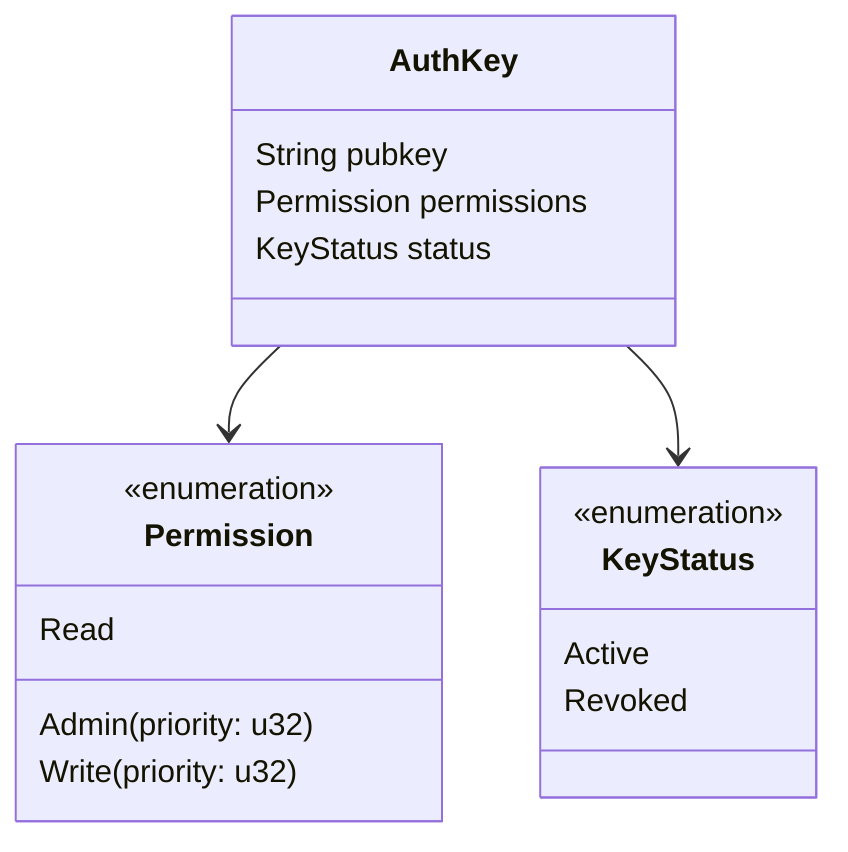
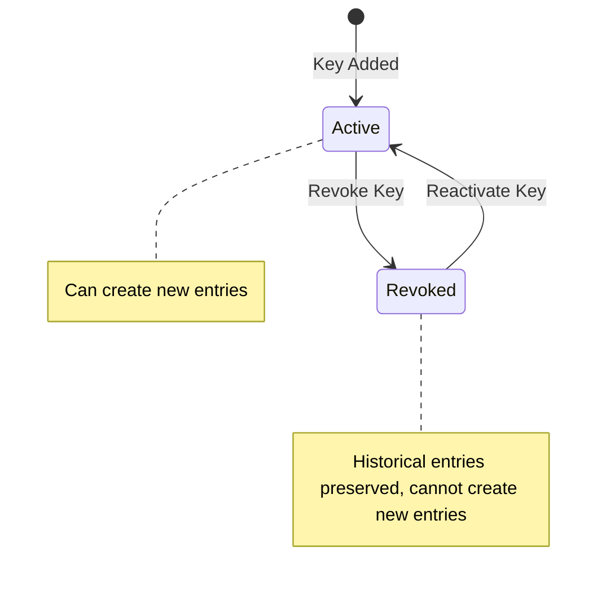
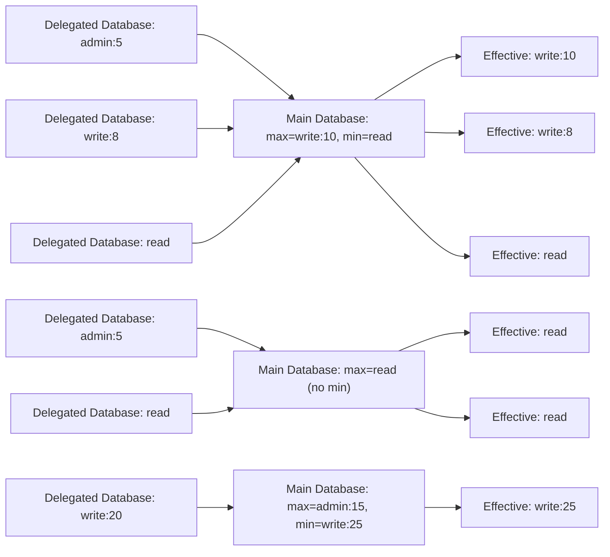
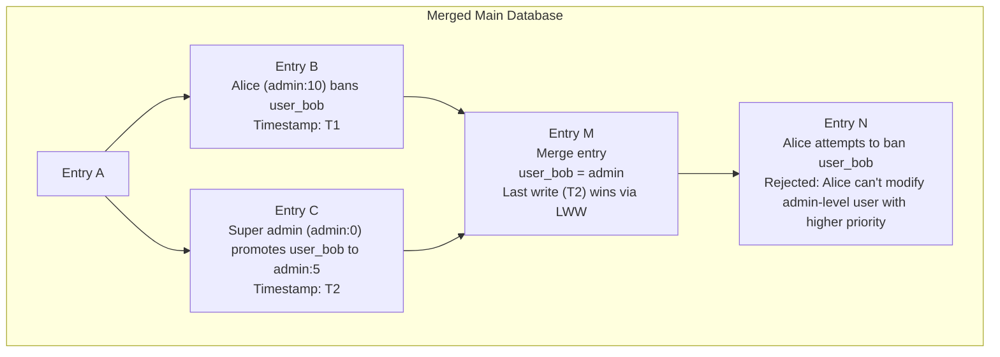
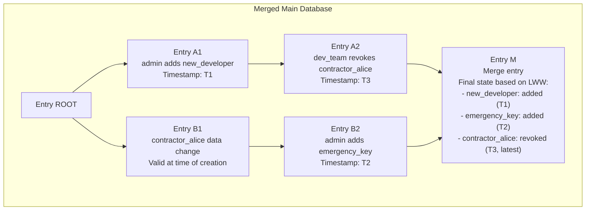

> ✅ **Status: Mostly Implemented**
>
> Core authentication is fully implemented: direct keys, delegated databases, permission clamping, and bootstrap protocol all have comprehensive test coverage.
>
> **Planned enhancements:** Overlay databases, advanced key statuses (Ignore/Banned), performance optimizations.

# Authentication Design

This document outlines the authentication and authorization scheme for Eidetica, a decentralized database built on Merkle-CRDT principles. The design emphasizes flexibility, security, and integration with the core CRDT system while maintaining distributed consistency.

## Table of Contents

- [Authentication Design](#authentication-design)
  - [Table of Contents](#table-of-contents)
  - [Overview](#overview)
  - [Authentication Modes and Bootstrap Behavior](#authentication-modes-and-bootstrap-behavior)
    - [Unsigned Mode (No Authentication)](#unsigned-mode-no-authentication)
    - [Signed Mode (Mandatory Authentication)](#signed-mode-mandatory-authentication)
    - [Future: Overlay Databases](#future-overlay-databases)
  - [Design Goals and Principles](#design-goals-and-principles)
    - [Primary Goals](#primary-goals)
    - [Non-Goals](#non-goals)
  - [System Architecture](#system-architecture)
    - [Authentication Data Location](#authentication-data-location)
    - [Permission Hierarchy](#permission-hierarchy)
  - [Authentication Framework](#authentication-framework)
    - [Key Structure](#key-structure)
    - [Direct Key Example](#direct-key-example)
    - [Entry Signing Format](#entry-signing-format)
  - [Key Management](#key-management)
    - [Key Lifecycle](#key-lifecycle)
    - [Key Status Semantics](#key-status-semantics)
    - [Priority System](#priority-system)
    - [Key Naming and Aliasing](#key-naming-and-aliasing)
  - [Delegation (Delegated Databases)](#delegation-delegated-databases)
    - [Concept and Benefits](#concept-and-benefits)
    - [Structure](#structure)
    - [Permission Clamping](#permission-clamping)
    - [Multi-Level References](#multi-level-references)
    - [Delegated Database References](#delegated-database-references)
      - [Committed Delegation Pointers](#committed-delegation-pointers)
      - [Causal Snapshot Validation](#causal-snapshot-validation)
      - [Incomplete Delegated Proof](#incomplete-delegated-proof)
      - [Local State and Snapshot Boundaries](#local-state-and-snapshot-boundaries)
    - [Key Revocation](#key-revocation)
  - [Conflict Resolution and Merging](#conflict-resolution-and-merging)
    - [Key Status Changes in Delegated Databases: Examples](#key-status-changes-in-delegated-databases-examples)
      - [Example 1: Basic Delegated Database Key Status Change](#example-1-basic-delegated-database-key-status-change)
      - [Example 2: Last Write Wins Conflict Resolution](#example-2-last-write-wins-conflict-resolution)
  - [Authorization Scenarios](#authorization-scenarios)
    - [Network Partition Recovery](#network-partition-recovery)
  - [Security Considerations](#security-considerations)
    - [Threat Model](#threat-model)
      - [Protected Against](#protected-against)
      - [Requires Manual Recovery](#requires-manual-recovery)
    - [Cryptographic Assumptions](#cryptographic-assumptions)
    - [Attack Vectors](#attack-vectors)
      - [Mitigated](#mitigated)
      - [Partial Mitigation](#partial-mitigation)
      - [Not Addressed](#not-addressed)
  - [Implementation Details](#implementation-details)
    - [Authentication Validation Process](#authentication-validation-process)
    - [Sync Permissions](#sync-permissions)
    - [CRDT Metadata Considerations](#crdt-metadata-considerations)
    - [Implementation Architecture](#implementation-architecture)
      - [Core Components](#core-components)
      - [Storage Format](#storage-format)
  - [Future Considerations](#future-considerations)
    - [Current Implementation Status](#current-implementation-status)
    - [Future Enhancements](#future-enhancements)
  - [References](#references)

## Overview

Eidetica's authentication scheme is designed to leverage the same CRDT and Merkle-DAG principles that power the core database while providing robust access control for distributed environments. Unlike traditional authentication systems, this design must handle authorization conflicts that can arise from network partitions and concurrent modifications to access control rules.

Databases operate in one of two authentication modes: **unsigned mode** (no authentication configured) or **signed mode** (authentication required). This design supports both security-critical databases requiring signed operations, unsigned and typically local-only databases for higher performance, and unsigned 'overlay' trees that can be computed from signed trees.

The authentication system is **not** implemented as a pure consumer of the database API but is tightly integrated with the core system. This integration enables efficient validation and conflict resolution during entry creation and database merging operations.

## Authentication Modes and Bootstrap Behavior

The entry validator distinguishes unauthenticated histories from histories with configured authentication.
`Database::create` bootstraps a signing key in the genuine genesis entry; a later signed settings write cannot bootstrap its own authority.

### Unsigned Mode (No Authentication)

Databases are in **unsigned mode** when created without authentication configuration. In this mode:

- The `_settings.auth` key is either missing or contains an empty `Doc` (`{"auth": {}}`)
- Both states are equivalent and treated identically by the system
- **Unsigned operations succeed**: Transactions without signatures are allowed
- **No validation overhead**: Authentication validation is skipped for performance
- **Suitable for**: Local-only databases, temporary workspaces, development environments, overlay networks

Unsigned mode enables use cases where authentication overhead is unnecessary, such as:

- Local computation that never needs to sync
- Development and testing environments
- Temporary scratch databases
- The upcoming "overlays" feature (see below)

### Signed Mode (Mandatory Authentication)

Once authentication is configured, databases are in **signed mode** where:

- The `_settings.auth` key contains at least one authentication key
- **All operations require valid signatures**: Only authenticated and transactions are valid
- **Fail-safe validation**: Corrupted or deleted auth configuration causes all transactions to fail
- **Permanent transition**: Cannot return to unsigned mode (would require creating a new database)

In signed mode, unsigned operations will fail with an authentication error. The system enforces mandatory authentication to maintain security guarantees once authentication has been established.

**Fail-Safe Behavior**:

The validation system uses two-layer protection to prevent and detect authentication corruption:

1. **Proactive Prevention** (Layer 1): Transactions that would corrupt or delete auth configuration fail during `commit()`, before the entry enters the Merkle DAG
2. **Reactive Fail-Safe** (Layer 2): If auth is already corrupted (from older code versions or external manipulation), all subsequent operations on top of the corrupted state are also invalid

**Validation States**:

| Auth State        | `_settings.auth` Value      | Unsigned Operations | Authenticated Operations | Status            |
| ----------------- | --------------------------- | ------------------- | ------------------------ | ----------------- |
| **Unsigned Mode** | Missing or `{}` (empty Doc) | ✓ Allowed           | Genesis bootstrap only   | Valid             |
| **Signed Mode**   | Valid key configuration     | ✗ Rejected          | ✓ Validated              | Valid             |
| **Corrupted**     | Wrong type (String, etc.)   | ✗ PREVENTED         | ✗ PREVENTED              | Cannot be created |
| **Deleted**       | Tombstone (was deleted)     | ✗ PREVENTED         | ✗ PREVENTED              | Cannot be created |

**Note**: Corrupted and Deleted states shown in the table are **theoretical** - the system prevents their creation through proactive validation. The fail-safe layer (Layer 2) remains as defense-in-depth against historical corruption or external DAG manipulation.

This defense-in-depth approach ensures that corrupted authentication configuration cannot be created or exploited to bypass security. See [Authentication Reference](../internal/authentication.md) for detailed implementation information.

### Future: Overlay Databases

The unsigned mode design enables a planned feature called "overlays", computed databases that can be calculated from multiple machines.

The idea is that an "overlay" adds information to a database, backups for example, that can be reconstructed entirely from the original database.

## Design Goals and Principles

### Primary Goals

1. **Flexible Authentication**: Support both unsigned mode for local-only work and signed mode for distributed collaboration
2. **Distributed Consistency**: Authentication rules must merge deterministically across network partitions
3. **Cryptographic Security**: All authentication based on Ed25519 public/private key cryptography
4. **Hierarchical Access Control**: Support admin, read/write, and read-only permission levels
5. **Delegation**: Support snapshot-pinned delegation to other databases without granting admin privileges; automatic dependency tracking remains future work
6. **Auditability**: All authentication changes are tracked in the immutable DAG history

### Non-Goals

- **Perfect Security**: Admin key compromise requires manual intervention
- **Real-time Revocation**: Key revocation is eventually consistent, not immediate

## System Architecture

### Authentication Data Location

Authentication configuration is stored in the special `_settings` store under the `auth` key. This placement ensures that:

- Authentication rules are included in `_settings`, which contains all the data necessary to validate the database and add new Entries
- Access control changes are tracked in the immutable history
- Settings can be validated against the current entry being created

The `_settings` store uses the `crate::crdt::Doc` type, which is a hierarchical CRDT that resolves conflicts using Last-Write-Wins (LWW) semantics. The ordering for LWW is determined deterministically by the DAG design (see CRDT documentation for details).

**Clarification**: Throughout this document, when we refer to `Doc`, this is the hierarchical CRDT document type supporting nested structures. The `_settings` store specifically uses `Doc` to enable complex authentication configurations including nested policy documents and key management.

### Permission Hierarchy

Eidetica implements a three-tier permission model:

| Permission Level | Modify `_settings` | Add/Remove Keys | Change Permissions | Read Data | Write Data | Public Database Access |
| ---------------- | ------------------ | --------------- | ------------------ | --------- | ---------- | ---------------------- |
| **Admin**        | ✓                  | ✓               | ✓                  | ✓         | ✓          | ✓                      |
| **Write**        | ✗                  | ✗               | ✗                  | ✓         | ✓          | ✓                      |
| **Read**         | ✗                  | ✗               | ✗                  | ✓         | ✗          | ✓                      |

## Authentication Framework

### Key Structure

The current implementation supports direct authentication keys stored in the `_settings.auth` configuration. Each key consists of:


```mermaid
classDiagram
    class AuthKey {
        String pubkey
        Permission permissions
        KeyStatus status
    }

    class Permission {
        <<enumeration>>
        Admin(priority: u32)
        Write(priority: u32)
        Read
    }

    class KeyStatus {
        <<enumeration>>
        Active
        Revoked
    }

    AuthKey --> Permission
    AuthKey --> KeyStatus
```

**Note**: Both direct keys and delegated databases are fully implemented and functional, including `DelegatedTreeRef`, `PermissionBounds`, and `TreeReference` types.

### Direct Key Example

Keys are stored by their public key string under the `keys` sub-object. Names are optional metadata on each key.

```json
{
  "_settings": {
    "auth": {
      "keys": {
        "ed25519:PExACKOW0L7bKAM9mK_mH3L5EDwszC437uRzTqAbxpk": {
          "name": "laptop",
          "permissions": { "Write": 10 },
          "status": "Active"
        },
        "ed25519:QJ7bKAM9mK_mH3L5EDwszC437uRzTqAbxpkPExACKOW0L": {
          "name": "desktop",
          "permissions": "Read",
          "status": "Active"
        },
        "*": {
          "permissions": "Read",
          "status": "Active"
        }
      }
    },
    "name": "My Database"
  }
}
```

**Note**: The wildcard key `*` enables global permissions for anyone. Wildcard keys:

- Can have any permission level: "read", "write:N", or "admin:N"
- Are commonly used for world-readable databases (with "read" permissions) but can grant broader access
- Can be revoked like any other key
- Can be included in delegated databases (if you delegate to a database with a wildcard, that's valid)
- **Cannot be used in delegation paths** - intermediate steps reference tree IDs (content hashes), and the final step must resolve to a named key with an actual Ed25519 public key
- **Apply via fallback**: permission resolution looks up the acting pubkey directly first; only on a miss does it fall through to the wildcard slot. So a named member of the tree always gets their explicit grant, even if it's narrower than the wildcard's; the wildcard fires only for callers who aren't otherwise listed

### Entry Signing Format

Normal transaction APIs require signing. Low-level unsigned entries are accepted only when no authentication is configured at their causal boundary.
The authentication information is embedded in the entry structure:

```json
{
  "tree": {
    "root": "tree_root_id",
    "parents": ["parent_entry_id"]
  },
  "subtrees": [
    {
      "name": "users",
      "parents": ["parent_entry_id"],
      "data": "{\"user_data\": \"example\"}"
    }
  ],
  "sig": {
    "sig": "ed25519_signature_base64_encoded",
    "key": {
      "Direct": {
        "hint": {
          "pubkey": "ed25519:PExACKOW0L7bKAM9mK_mH3L5EDwszC437uRzTqAbxpk"
        }
      }
    }
  }
}
```

The `sig.key` enum contains a `Direct` or `Delegation` variant, with explicit `hint` fields for key lookup:

- **`pubkey`**: Direct public key string (e.g., `"ed25519:..."`)
- **`name`**: Key name hint for lookup by name

For global permissions, a direct hint sets `is_global: true` and carries the actual signer's public key.

For delegation paths, the key includes a `path` array of delegation steps:

```json
{
  "sig": {
    "sig": "ed25519_signature_base64_encoded",
    "key": {
      "Delegation": {
        "path": [
          { "tree": "delegated_tree_root_id", "tips": ["tip1", "tip2"] }
        ],
        "hint": { "pubkey": "ed25519:final_signer_pubkey" }
      }
    }
  }
}
```

The `auth.signature` field contains the base64-encoded Ed25519 signature of the entry's content hash. It serializes as `sig` inside the entry's `sig` map, which is the on-disk name.

## Key Management

### Key Lifecycle

The current implementation supports two key statuses:


```mermaid
stateDiagram-v2
    [*] --> Active: Key Added
    Active --> Revoked: Revoke Key
    Revoked --> Active: Reactivate Key

    note right of Active : Can create new entries
    note right of Revoked : Historical entries preserved, cannot create new entries
```

### Key Status Semantics

1. **Active**: Key can create new entries and all historical entries remain valid
2. **Revoked**: Key cannot create new entries. Historical entries remain valid and their content is preserved during merges

**Key Behavioral Details**:

- Entries created before revocation remain valid to preserve history integrity
- An Admin can transition a key back to Active state from Revoked status
- Revoked status prevents new entries but preserves existing content in merges

### Priority System

Priority is integrated into the permission levels for Admin and Write permissions:

- **Admin(priority)**: Can modify settings and manage keys with equal or lower priority
- **Write(priority)**: Can write data but not modify settings
- **Read**: No priority, read-only access

Priority values are u32 integers where lower values indicate higher priority:

- Priority `0`: Highest priority, typically the initial admin key
- Higher numbers = lower priority
- Keys can only modify other keys with equal or lower priority (equal or higher number)

**Important**: Priority **only** affects administrative operations (key management). It does **not** influence CRDT merge conflict resolution, which uses Last Write Wins semantics based on the DAG structure.

### Key Naming and Aliasing

Auth settings contain two types of data:

1. **Signing keys** - Stored under `keys.{pubkey}`, with optional `name` metadata
2. **Delegation references** - Stored under `delegations.{root_id}`, pointing to other databases by their root entry ID

Keys are always stored by their public key string. The `name` field is optional metadata that enables:

- **Readable lookups** - Find keys by friendly name like `"alice_laptop"`
- **Name collisions** - Multiple keys can have the same name; validation tries each until signature verifies

**Example**: Keys stored by pubkey with optional names

```json
{
  "_settings": {
    "auth": {
      "keys": {
        "ed25519:abc123...": {
          "name": "alice_laptop",
          "permissions": { "Admin": 0 },
          "status": "Active"
        },
        "ed25519:def456...": {
          "name": "alice_laptop",
          "permissions": { "Write": 10 },
          "status": "Active"
        }
      },
      "delegations": {
        "team@example.com": {
          "permission_bounds": { "max": { "Write": 10 } },
          "tree": { "root": "bafyr4i...", "tips": ["bafyr4i..."] }
        }
      }
    }
  }
}
```

Note: Two keys can have the same `name`. When resolving a name hint, the system returns all matching keys and tries each until the signature verifies.

**Key Lookup Patterns**:

When an entry's signature needs to be verified, the system resolves the `sig.key` hint:

1. **By pubkey**: If `pubkey` field is set, lookup key at `keys.{pubkey}`
2. **By name**: If `name` field is set, find all keys where `key.name == name`, try each until signature verifies
3. **Global**: If pubkey starts with `"*:"`, check global `keys.*` permission and use actual pubkey after `*:` for verification

**Example API Usage**:

```rust,ignore
// Bootstrap creates database with signing key stored by pubkey
let key_id = user.get_default_key()?;
let database = user.create_database(Doc::new(), &key_id).await?;
// Auth now contains: { "keys": { "ed25519:abc123...": AuthKey(...) } }

// Optionally add a friendly name to the key
let transaction = database.new_transaction()?;
let settings = transaction.get_settings()?;
let auth = settings.get_auth_settings().await?;
let key = auth.get_key_by_pubkey(&key_id)?;
settings.set_auth_key(&key_id, AuthKey::active(
    Some("alice_laptop"),  // Add friendly name
    key.permissions().clone(),
)).await?;
transaction.commit()?;
// Auth now contains: { "keys": { "ed25519:abc123...": AuthKey(name="alice_laptop", ...) } }
```

## Delegation (Delegated Authentication)

**Status**: Mostly implemented and functional. Known gaps remain.

### Concept and Benefits

Delegation allows any database to be referenced as a source of authentication keys for another database. This enables flexible authentication patterns where databases can delegate authentication to other databases without granting administrative privileges on the delegating database. Key benefits include:

- **Flexible Delegation**: Any database can delegate authentication to any other database
- **User Autonomy**: Users can manage their own personal databases with keys they control
- **Cross-Project Authentication**: Share authentication across multiple projects or databases
- **Granular Permissions**: Set both minimum and maximum permission bounds for delegated keys

Delegated databases are normal databases, and their authentication settings are used with permission clamping applied.

**Important**: Any database can be used as a delegated database - there's no special "authentication database" type. This means:

- A project's main database can delegate to a user's personal database
- Multiple projects can delegate to the same shared authentication database
- Databases can form delegation networks where databases delegate to each other
- The delegated database doesn't need to know it's being used for delegation

### Structure

Declarations are stored under `_settings.auth.delegations.<root-ID>`, not under a key name or email alias.
`SettingsStore::add_delegated_tree` writes a `DelegatedTreeRef` containing permission bounds and a `TreeReference` (`root`, `tips`).
The settings Doc represents the tips as numerically keyed fields; use the typed API rather than constructing raw Doc encodings.
The referenced database maintains its own `_settings.auth.keys`, indexed by public key, and may itself contain delegation declarations.
See the [user-guide example](../user_guide/authentication_guide.md#basic-delegation-setup).

### Permission Clamping

Permissions from delegated databases are clamped based on the `permission-bounds` field in the main database's reference:

- **max** (required): The maximum permission level that keys from the delegated database can have
  - Must be <= the permissions of the key adding the delegated database reference
- **min** (optional): The minimum permission level for keys from the delegated database
  - If not specified, there is no minimum bound
  - If specified, keys with lower permissions are raised to this level

The effective priority is derived from the **effective permission returned after clamping**. If the delegated key's permission already lies within the `min`/`max` bounds its original priority value is preserved; when a permission is clamped to a bound the bound's priority value becomes the effective priority:


```mermaid
graph LR
    A["Delegated Database: admin:5"] --> B["Main Database: max=write:10, min=read"] --> C["Effective: write:10"]
    D["Delegated Database: write:8"] --> B --> E["Effective: write:8"]
    F["Delegated Database: read"] --> B --> G["Effective: read"]

    H["Delegated Database: admin:5"] --> I["Main Database: max=read (no min)"] --> J["Effective: read"]
    K["Delegated Database: read"] --> I --> L["Effective: read"]
    M["Delegated Database: write:20"] --> N["Main Database: max=admin:15, min=write:25"] --> O["Effective: write:25"]
```

**Clamping Rules**:

- Effective permission = clamp(delegated_tree_permission, min, max)
  - If delegated database permission > max, it's lowered to max
  - If min is specified and delegated database permission < min, it's raised to min
  - If min is not specified, no minimum bound is applied
- The max bound must be <= permissions of the key that added the delegated database reference
- Effective priority = priority embedded in the **effective permission** produced by clamping. This is either the delegated key's priority (when already inside the bounds) or the priority that comes from the `min`/`max` bound that performed the clamp.
- Delegated database admin permissions only apply within that delegated database
- Permission clamping occurs at each level of delegation chains
- Note: There is no "none" permission level - absence of permissions means no access

### Multi-Level References

Delegated databases can reference other delegated databases, creating delegation chains:

The serialized authentication fragment has an ordered path and a final hint:

```json
{
  "sig": {
    "sig": "signature_bytes",
    "key": {
      "Delegation": {
        "path": [
          { "tree": "middle_root_ID", "tips": ["middle_tip_ID"] },
          { "tree": "identity_root_ID", "tips": ["identity_tip_ID"] }
        ],
        "hint": { "name": "laptop" }
      }
    }
  }
}
```

**Delegation Chain Rules**:

- Each path step names a root ID and a nonempty claimed snapshot
- The final hint identifies a concrete signer by public key or name, not the global wildcard
- Declarations are resolved from each preceding database's historical settings
- The path is a flat list; it is not recursive wire data

**Path Traversal**:

- Steps with `tips` → lookup **delegation by root tree ID** in current DB → find DelegatedTreeRef → jump to referenced database
- Final hint → lookup **signing key** by pubkey or name in final DB → find AuthKey → get Ed25519 public key for signature verification
- **Delegation steps** reference trees by their root entry ID; the **final hint** references a key in the last database's auth settings

**Permission and Validation**:

- Permission clamping applies at each level using the min/max function
- Priority at each step is the priority inside the permission value that survives the clamp at that level (outer reference, inner key, or bound, depending on which one is selected by the clamping rules)
- Tips must be valid at each level of the chain for the delegation to be valid

### Delegated Database References

This section is the canonical contract for causal delegated authorization.
The [implementation and regression map](../internal/authentication.md#invariant-to-regression-map) identifies the checks that enforce it.

#### Committed Delegation Pointers

A declaration in `_settings.auth.delegations` identifies a delegated database by its root Entry ID and configures a snapshot in `DelegatedTreeRef.tree.tips`.
A signature supplies a separate **claimed snapshot** at each step of its delegation path.
A snapshot is a canonical set of tip IDs, not a root identity, an authorization verdict, or evidence of the latest state.
A claim **covers** a floor when every floor tip is an ancestor of at least one claimed tip; equality is allowed.
Two incomparable branch tips must both be covered, not compared by height or selected by LWW.

The primary database incorporates only its own first-hop configured pointers into its derived state.
At deeper steps the resolver reads each declaration from the preceding delegated database's claimed historical settings and requires coverage of that declaration's pointer.
The delegated databases also enforce their own causal rules when their entries are verified.

#### Causal Snapshot Validation

For an entry `E`, validation follows these boundaries:

1. **Pre-write authority.** Derive the complete canonical `_settings` frontier from `E`'s main parents and require its signed `settings_tips` metadata to equal that frontier. A signer cannot choose an older settings pin to evade a revocation already in its parents. Only a genuine genesis entry may authorize itself with its own initial settings.
2. **Resulting settings.** A settings write must consume exactly its main parents' `_settings` frontier as its signed subtree parents. Fold the actual settings DAG, including `E`'s delta, to determine effective declarations after the entry. This post-entry state is not its pre-write signature pin and is never read from an unrelated live head.
3. **Parent join.** Load the authorization state of every locally `Verified` immediate main parent. Union their per-root frontiers, including observations carried through direct-key signatures or signatures through other identities.
4. **Pointer transition.** Effective absence of a first-hop declaration clears that root's direct component. On a settings write, add each resulting configured pointer to the retained direct floor. A direct-key Admin may set any valid pointer, including an older one, without covering the inherited floor; this does not erase retained observations.
5. **Claims and proof.** At every signature step, the claim must cover both its declaration's pointer and the primary entry's inherited floor for that root. Every configured pointer and claimed snapshot requires correct tree membership and complete locally `Verified` delegated ancestry, not merely a `Verified` tip. Empty snapshots are invalid.
6. **Signature and permissions.** Resolve keys at the claimed snapshots, apply permission bounds at each step, then check the signature and operation. A validated claim replaces the inherited component it covers; incomparable observations are retained when parents join.

The projection separates **direct** and **nested** observations even when both refer to the same root.
Removal resets only the direct component.
Nested observations survive first-hop removal and re-addition; clearing them would discard observations made through another still-active route.
A delegated settings signer must also cover a new first-hop pointer written on that same entry.
It cannot use its settings write to relax its own pre-write permissions.

**Merge example:** branches of a primary database claim identity snapshots `iA` and `iB`, both descending from `i0` but incomparable.
Each sibling is valid against its own parents.
A merge descendant must claim `{iA, iB}` or a later identity snapshot covering both.
Selecting the pointer that wins the settings merge does not discard the losing branch's observed floor.

**Rewind and removal example:** a primary entry has observed `i1`; a direct-key Admin rewinds its configured pointer to `i0`.
That Admin write is allowed, but a descendant delegated claim at `i0` still fails because `i1` remains inherited.
An effective removal followed by re-addition at `i0` starts a fresh direct floor.
If a removal delta loses to a concurrent active settings write, it is not a reset.
Conversely, if the merged resulting settings remove the declaration, the direct floor is cleared even when another parent had observed `i1`.
This is an explicit recovery exception to monotonic floors, not a change to Doc conflict resolution.

**Nested example:** primary database `P` signs through `M` to identity `I`, observing `m1` and `i1`.
A later direct-key signature still carries both observations.
Removing and re-adding `P -> M` resets the direct `M` component, but does not reset nested `I`.
A subsequent path through `M` cannot claim `i0` below `i1`.
If `P` also delegates directly to `I`, removing that direct declaration likewise cannot erase the nested `I` observation.
This limits recovery by removal: an Admin cannot use it to discard every nested floor.

#### Incomplete Delegated Proof

| Condition                                                                                                                                                              | Decision                                                                                  |
| ---------------------------------------------------------------------------------------------------------------------------------------------------------------------- | ----------------------------------------------------------------------------------------- |
| Missing main/settings/delegated ancestry, or delegated ancestry present but `Unverified`                                                                               | Retryable; retain the remote entry as `Unverified`, outside default reads                 |
| Complete but forged causal pin, foreign-tree tip/parent, empty claim/pointer, proven regression, `Failed` delegated ancestor, bad signature or insufficient permission | Definitive rejection; remote verification marks `Failed`                                  |
| Backend I/O, database or cache failure                                                                                                                                 | Propagate the operational error; do not convert it to permission denial or an empty floor |

`DelegatedTreeUnsynced` names the delegated root and known dependency IDs.
Despite the field name `missing`, those IDs can be present locally but not yet `Verified`.
Local commits with undecidable proof return an error without storing a new entry.
Remote ingest retains the immutable entry for retry; receiving bytes is not proof of authorization.
Neither an immediate parent's label nor a published projection can independently promote a child.

Verification holds a per-tree lock and suppresses access-time verification during the pass.
The resolver must not recursively verify another database under that lock: nested dependencies could acquire locks in the opposite order or re-enter verification.
Explicitly verify dependencies first and then retry the dependent database.
Automatic dependency acquisition and dependency-first scheduling are deferred to [PR #126](https://github.com/arcuru/eidetica/pull/126); they are not supplied by these validation rules.
See the supported [reset and re-verification procedure](../user_guide/cli.md#db-reset-local-verification-offline-trust-reset).

#### Local State and Snapshot Boundaries

Authorization frontiers are disposable, Entry-ID-keyed derived state, not signed fields.
A cache miss for a `Verified` parent rebuilds from its `Verified` ancestry, never an empty default for a non-root entry.
Partial builds are not published; a cached value is usable only after checking its source entry's local status.
The signed Entry/AuthInfo encoding and IDs are unchanged.

Local transaction settings reads, subtree-parent selection and the signed pre-write pin use the same fixed main-parent boundary, including historical transactions.
SQL's current-boundary optimization reads main and store tips in one statement snapshot; InMemory holds its inner lock.
Historical traversal rejects missing and foreign ancestors.
The service preserves a nonempty incomplete-boundary error rather than returning an empty snapshot; only the empty pre-genesis boundary has the empty result.
These rules prevent a concurrent grant from entering validation while the signature pins older settings.
A connected client's local build is not a verdict: the service verifies the submitted entry on its own node.

Raw current-tip caches are **not** completeness proofs: they index ingested entries, including unsettled ones.
Their correctness for authorized reads/writes assumes immutable DAG data and validator-owned, prefix-closed verification labels.
Complete main-ancestry and delegated-proof checks run independently before supported signed promotion.
Manually promoting entries through low-level backend APIs, changing stored DAG data out of band, or retaining legacy labels can violate this precondition.
Do not use a raw cached frontier to certify arbitrary incomplete or corrupt history.

**Upgrade risk:** before trusting data checked under older authorization rules, operators must reset all local verification labels, including `Failed`, and all derived caches, then reverify immutable Entries.
There is no automatic migration or verification-version marker.
Skipping the reset may trust old `Verified` labels; clearing only the cache is not a substitute.
The [CLI procedure](../user_guide/cli.md#db-reset-local-verification-offline-trust-reset) is operator-managed and offline.

#### Implementation Status: Snapshot Pinning and Causal Floors

The validation path implements these rules with at most 10 signature-path steps and 64 claimed tips per step; configured pointers checked during settings transitions have the same tip cap.
These limits bound signature fan-out, not total historical traversal cost.
Snapshot floors do not promise live-head freshness, immediate revocation across partitions, or retroactive invalidation of valid old siblings.
The [verification model](verification.md#authority-reduction-revocation--the-known-gap) distinguishes causal revocation from the unimplemented retroactive branch policy.

### Key Revocation

A key absent or revoked at the claimed delegated snapshot cannot authorize the signature.
Once a primary branch has observed that snapshot, its descendants cannot resurrect the key by claiming an older snapshot below the inherited floor.
Older siblings that never observed the reduction can still be valid; revocation does not retroactively reject their content or forbid using all entries they signed as parents.
This is causal revocation, not a latest-head branch-invalidation policy.

## Conflict Resolution and Merging

Conflicts in the `_settings` database are resolved by the `crate::crdt::Doc` type using Last Write Wins (LWW) semantics. When the database has diverged with both sides of the merge having written to the `_settings` database, the write with the higher logical timestamp (determined by the DAG structure) will win, regardless of the priority of the signing key.

Priority rules apply only to **administrative permissions** - determining which keys can modify other keys - but do **not** influence the conflict resolution during merges.

Delegated databases apply their own Doc merge rules. A primary write resolves their settings at its claimed snapshots; it does not recursively merge their unrelated live heads.

### Key Status Changes in Delegated Databases: Examples

The following examples demonstrate how key status changes in delegated databases affect entries in the main database.

#### Example 1: Basic Delegated Database Key Status Change

Suppose identity snapshots form `i0 -> i1 -> i2`, and `i2` revokes the laptop key.
A primary entry signed by the laptop at `i1` can remain valid on a sibling whose parents have only observed `i1`.
An entry that instead descends from a primary observation of `i2` must cover `i2`: claiming `i1` regresses, and claiming `i2` cannot authorize the revoked laptop.
An active mobile key can sign a descendant at `i2` and merge the older valid sibling without deleting its content.
See the [merge and nested examples](#causal-snapshot-validation) for inherited floors across multiple parents.

#### Example 2: Last Write Wins Conflict Resolution

**Scenario**: Two admins make conflicting authentication changes during a network partition. Priority determines who can make the changes, but Last Write Wins determines the final merged state.

**After Network Reconnection and Merge**:


```mermaid
graph TD
    subgraph "Merged Main Database"
        A["Entry A"]
        B["Entry B<br/>Alice (admin:10) bans user_bob<br/>Timestamp: T1"]
        C["Entry C<br/>Super admin (admin:0) promotes user_bob to admin:5<br/>Timestamp: T2"]
        M["Entry M<br/>Merge entry<br/>user_bob = admin<br/>Last write (T2) wins via LWW"]
        N["Entry N<br/>Alice attempts to ban user_bob<br/>Rejected: Alice can't modify admin-level user with higher priority"]
    end

    A --> B
    A --> C
    B --> M
    C --> M
    M --> N
```

**Key Points**:

- All administrative actions are preserved in history
- Last Write Wins resolves the merge conflict: the most recent change (T2) takes precedence
- Permission-based authorization still prevents unauthorized modifications: Alice (admin:10) cannot ban a higher-priority user (admin:5) due to insufficient priority level
- The merged state reflects the most recent write, not the permission priority
- Permission priority rules prevent Alice from making the change in Entry N, as she lacks authority to modify higher-priority admin users

## Authorization Scenarios

### Network Partition Recovery

When network partitions occur, the authentication system must handle concurrent changes gracefully:

**Scenario**: Two branches of the database independently modify the auth settings, requiring CRDT-based conflict resolution using Last Write Wins.

Both branches share the same root, but a network partition has caused them to diverge before merging back together.


```mermaid
graph TD
    subgraph "Merged Main Database"
        ROOT["Entry ROOT"]
        A1["Entry A1<br/>admin adds new_developer<br/>Timestamp: T1"]
        A2["Entry A2<br/>dev_team revokes contractor_alice<br/>Timestamp: T3"]
        B1["Entry B1<br/>contractor_alice data change<br/>Valid at time of creation"]
        B2["Entry B2<br/>admin adds emergency_key<br/>Timestamp: T2"]
        M["Entry M<br/>Merge entry<br/>Final state based on LWW:<br/>- new_developer: added (T1)<br/>- emergency_key: added (T2)<br/>- contractor_alice: revoked (T3, latest)"]
    end

    ROOT --> A1
    ROOT --> B1
    A1 --> A2
    B1 --> B2
    A2 --> M
    B2 --> M
```

**Conflict Resolution Rules Applied**:

- **Settings Merge**: All authentication changes are merged using Doc CRDT semantics with Last Write Wins
- **Timestamp Ordering**: Changes are resolved based on logical timestamps, with the most recent change taking precedence
- **Historical Validity**: Entry B1 remains valid because it was created before the status change
- **Content Preservation**: Previously valid content remains mergeable and may still be a parent
- **Future Restrictions**: Descendants whose causal settings include the revocation reject contractor_alice; pre-revocation siblings are not retroactively invalidated

## Security Considerations

### Threat Model

#### Protected Against

- **Unauthorized Entry Creation**: All entries must be signed by valid keys
- **Permission Escalation**: Users cannot grant themselves higher privileges than their main database reference
- **Historical Tampering**: Immutable DAG prevents retroactive modifications
- **Replay Attacks**: Content-addressable IDs prevent entry duplication
- **Administrative Hierarchy Violations**: Lower priority keys cannot modify higher priority keys (but can modify equal priority keys)
- **Permission Boundary Violations**: Delegated database permissions are constrained within their specified min/max bounds
- **Cross-Tree Tip Forgery**: Claimed delegation tips are validated as members of the referenced delegated database, not merely as entries existing somewhere in the backend
- **Delegated-Tree Snapshot Regression (bounded)**: Auth resolution is pinned to the snapshot the signer claimed, which must cover both the configured first-hop pointer and per-root derived floors inherited through every parent. This does not establish live-head freshness or retroactive authority reduction (see §Implementation Status)
- **Snapshot Boundary Drift**: Fixed main-parent reads and atomic current-tip queries prevent concurrent settings writes from changing the authorization context of an already-built entry

#### Requires Manual Recovery

- **Admin Key Compromise**: When no higher-priority key exists
- **Conflicting Administrative Changes**: LWW may result in unintended administrative state during network partitions

### Cryptographic Assumptions

- **Ed25519 Security**: Default to ed25519 signatures with explicit key type storage
- **Hash Function Security**: BLAKE3 for content addressing
- **Key Storage**: Private keys must be securely stored by clients
- **Network Security**: Assumption of eventually consistent but potentially unreliable network

### Attack Vectors

#### Mitigated

- **Key Replay**: Content-addressable entry IDs prevent signature replay
- **Downgrade Attacks**: Explicit key type storage prevents algorithm confusion
- **Partition Attacks**: CRDT merging handles network partition scenarios
- **Privilege Escalation**: Permission clamping prevents users from exceeding granted permissions

#### Partial Mitigation

- **DoS via Large Histories**: Priority system limits damage from compromised lower-priority keys
- **DoS via Delegation Amplification**: Path length and per-step tip count bound fan-out, not total ancestry traversal cost; a permitted snapshot can still have a large history
- **Delegated-Tree Snapshot Regression**: Claimed snapshots must cover the configured first-hop pointer and per-root derived floors inherited through every parent; this does not assert live-head freshness or make later authority reduction retroactive (see §Implementation Status)
- **Social Engineering**: Administrative hierarchy limits scope of individual key compromise
- **Timestamp Manipulation**: LWW conflict resolution is deterministic but may be influenced by the chosen timestamp resolution algorithm
- **Administrative Confusion**: Network partitions may result in unexpected administrative states due to LWW resolution

#### Not Addressed

- **Side-Channel Attacks**: Client-side key storage security is out of scope
- **Physical Key Extraction**: Assumed to be handled by client security measures
- **Long-term Cryptographic Breaks**: Future crypto-agility may be needed

## Implementation Details

### Authentication Validation Process

The current validation process:

1. **Extract Authentication Info**: Parse the `auth` field from the entry
2. **Resolve Key Name**: Lookup the direct key in `_settings.auth`
3. **Check Key Status**: Verify the key is Active (not Revoked)
4. **Validate Signature**: Verify the Ed25519 signature against the entry content hash
5. **Check Permissions**: Ensure the key has sufficient permissions for the operation

**Current features include**: Direct key validation, delegated database resolution, snapshot-pinned tip validation (tree-membership checks plus committed and causal inherited floors described in §Implementation Status), and permission clamping.

### Verification Status vs. Signature Validity

Signature/permission validity (the process above) is **orthogonal** to an
entry's stored **verification status**. The validation process answers "is
this entry correctly signed by an authorized key, given some auth settings?".
The verification status records whether _this node_ has actually run that
check and what the outcome was: `Unverified` (not yet checked), `Verified`
(checked and accepted), or `Failed` (checked and definitively rejected).

Two rules connect them:

1. **Local validation is the only path to `Verified`.** The storage layer
   stores every entry as `Unverified` on `put` and exposes no way for a
   service client or sync peer to assert a status. Privileged local backend
   promotion is validator-owned. Only a local
   validation pass (`Transaction` commit, or `Database::verify()`) may
   promote an entry to `Verified`. Validation is always performed against the
   `_settings` the entry _pins_ in its signed metadata, not the current
   settings, after independently matching that pin to the causal main-parent
   frontier. An unrelated later revocation cannot retroactively invalidate
   valid historical siblings.

2. **Verification is prefix-closed.** An entry is promoted to `Verified` only
   if every ancestor is already `Verified`; a `Failed` ancestor taints its
   descendants to `Failed`; an ancestor that is still `Unverified` or not yet
   held locally leaves the entry `Unverified` for a later pass. Consequently
   the set of `Verified` entries is always ancestor-closed, and a `Database`
   read exposes only the "Verified frontier" unless `.allow_unverified()` is
   set. See the synchronization design doc for how this interacts with peers.

The full status model — the three-state enum, why pinned-settings validation
binds validation to causal parents, the disclosure posture, and the boundary
between causal revocation and unbuilt retroactive branch invalidation — is documented in the
[Verification Model](verification.md) design doc.

### Sync Permissions

Eidetica servers require proof of read permissions before allowing database synchronization. The server challenges the client to sign a random nonce, then validates the signature against the database's authentication configuration.

### Authenticated Bootstrap Protocol

The authenticated bootstrap protocol enables devices to join existing databases without prior local state while requesting authentication access:

**Bootstrap Flow**:

1. **Bootstrap Detection**: Empty tips in SyncTreeRequest signals bootstrap needed
2. **Auth Request**: Client includes requesting key, key name, and requested permission
3. **Global Permission Check**: Server checks if global `*` wildcard permission satisfies request
4. **Immediate Approval**: If global permission exists and satisfies, access granted immediately
5. **Manual Approval Queue**: If no global permission, request stored for admin review
6. **Database Transfer**: Complete database state sent with approval confirmation
7. **Access Granted**: Client receives database and can make authenticated operations

**Protocol Extensions**:

- `SyncTreeRequest` includes: `requesting_key`, `requesting_key_name`, `requested_permission`
- `BootstrapResponse` includes: `key_approved`, `granted_permission`
- `BootstrapPending` response for manual approval scenarios
- User API: `user.request_database_access()` for authenticated bootstrap scenarios

**Security**:

- Ed25519 key cryptography for secure identity
- Permission levels maintained (Read/Write/Admin)
- Global wildcard permissions for automatic approval (secure by configuration)
- Manual approval queue for controlled access (secure by default)
- Immutable audit trail of all key additions in database history

### CRDT Metadata Considerations

The current system uses entry metadata to reference settings tips. With authentication:

- Metadata pins the canonical pre-write `_settings` frontier of the fixed main parents
- Validation derives that frontier independently before trusting the signed pin
- Post-entry settings decide delegation removal; they cannot authorize the same non-genesis write

### Implementation Architecture

#### Core Components

1. **AuthValidator** (`auth/validation.rs`): Validates entries and resolves authentication
   - Direct key resolution and validation
   - Signature verification
   - Permission checking
   - Caching for performance

2. **Crypto Module** (`auth/crypto.rs`): Cryptographic operations
   - Ed25519 key generation and parsing
   - Entry signing and verification
   - Key format: `ed25519:<base64-encoded-public-key>`

3. **AuthSettings** (`auth/settings.rs`): Settings management interface
   - Add/update/get authentication keys
   - Convert between settings storage and auth types
   - Validate authentication operations
   - Resolve keys and permissions for access decisions (direct and wildcard); delegation-aware access resolves through `Database::find_sigkeys`/`Database::can_access`

4. **Permission Module** (`auth/permission.rs`): Permission logic
   - Permission checking for operations
   - Permission clamping for delegated databases

#### Storage Format

Authentication configuration is stored in `_settings.auth` as a Doc CRDT:

```rust,ignore
// Key storage structure
AuthKey {
    pubkey: String,           // Ed25519 public key
    permissions: Permission,  // Admin(u32), Write(u32), or Read
    status: KeyStatus,        // Active or Revoked
}
```

## Future Considerations

### Current Implementation Status

1. **Direct Keys**: ✅ Fully implemented and tested
2. **Delegated Databases**: ✅ Fully implemented with comprehensive test coverage
3. **Permission Clamping**: ✅ Functional for delegation chains
4. **Delegation Depth Limits**: ✅ Implemented with MAX_DELEGATION_STEPS=10 — a delegation path is a flat list, so its length is the chain depth, and it is bounded before any delegated database is loaded

### Future Enhancements

1. **Advanced Key Status**: Add Ignore and Banned statuses for more nuanced key management
2. **Performance Optimizations**: Further caching and validation improvements
3. User experience improvements for key management

## References

1. [Eidetica Core Concepts](../user_guide/core_concepts.md)
2. [CRDT Merging](../internal/crdt.md)
3. [DAG Structure](../internal/dag.md)
