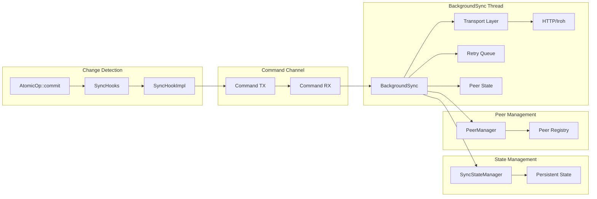

# Synchronization Design Document

This document outlines the design principles, architecture decisions, and implementation strategy for Eidetica's synchronization system.

## Design Goals

### Primary Objectives

1. **Decentralized Architecture**: No central coordination required
2. **Performance**: Minimize latency and maximize throughput
3. **Reliability**: Handle network failures and recover gracefully
4. **Scalability**: Support many peers and large datasets
5. **Security**: Authenticated and verified peer communications
6. **Simplicity**: Easy to configure and use

### Non-Goals

- **Selective sync**: Sync entire trees only (not partial)
- **Multi-hop routing**: Direct peer connections only
- **Complex conflict resolution**: CRDT-based automatic resolution only
- **Centralized coordination**: No dependency on coordination servers

## Core Design Principles

### 1. Merkle-CRDT Foundation

The sync system builds on Merkle DAG and CRDT principles:

- **Content-addressable entries**: Immutable, hash-identified data
- **DAG structure**: Parent-child relationships form directed acyclic graph
- **CRDT merging**: Deterministic conflict resolution
- **Causal consistency**: Operations maintain causal ordering

**Benefits:**

- Natural deduplication (same content = same hash)
- Efficient diff computation (compare tips)
- Automatic conflict resolution
- Partition tolerance

### 2. BackgroundSync Engine with Command Pattern

**Decision:** Single background thread with command-channel communication

**Rationale:**

- **Clean architecture**: Eliminates circular dependencies
- **Ownership clarity**: Background thread owns all sync state
- **Non-blocking**: Commands sent via channels don't block operations
- **Flexibility**: Fire-and-forget or request-response patterns

**Implementation:**

The sync system uses a thin frontend that sends commands to a background thread:

- Frontend handles API and tree management
- Background owns transport and all sync state
- Commands processed immediately on receipt
- Failed operations added to retry queue

**Trade-offs:**

- ✅ No circular dependencies or complex locking
- ✅ Clear ownership model (background owns everything)
- ✅ Works in both async and sync contexts
- ✅ Graceful startup/shutdown handling
- ❌ All sync operations serialized through single thread

### 3. Hook-Based Change Detection

**Decision:** Use trait-based hooks integrated into AtomicOp commit

**Rationale:**

- **Automatic**: No manual sync triggering required
- **Consistent**: Every commit is considered for sync
- **Extensible**: Additional hooks can be added
- **Performance**: Minimal overhead when sync disabled

**Architecture:**

```rust
// Hook trait for extensibility
trait SyncHook {
    fn on_entry_committed(&self, context: &SyncHookContext) -> Result<()>;
}

// Integration point in AtomicOp
impl AtomicOp {
    pub fn commit(self) -> Result<ID> {
        let entry = self.build_and_store_entry()?;

        // Execute sync hooks after successful storage
        if let Some(hooks) = &self.sync_hooks {
            let context = SyncHookContext { tree_id, entry, ... };
            hooks.execute_hooks(&context)?;
        }

        Ok(entry.id())
    }
}
```

**Benefits:**

- Zero-configuration automatic sync
- Guaranteed coverage of all changes
- Failure isolation (hook failures don't affect commits)
- Easy testing and debugging

### 4. Modular Transport Layer with SyncHandler Architecture

**Decision:** Abstract transport layer with handler-based request processing

**Core Interface:**

```rust
pub trait SyncTransport: Send + Sync {
    /// Start server with handler for processing sync requests
    async fn start_server(&mut self, addr: &str, handler: Arc<dyn SyncHandler>) -> Result<()>;

    /// Send sync request and get response
    async fn send_request(&self, address: &Address, request: &SyncRequest) -> Result<SyncResponse>;
}

pub trait SyncHandler: Send + Sync {
    /// Process incoming sync requests with database access
    async fn handle_request(&self, request: &SyncRequest) -> SyncResponse;
}
```

**Rationale:**

- **Database Access**: Handlers can store received entries via backend
- **Stateful Processing**: Support GetTips, GetEntries, SendEntries operations
- **Clean Separation**: Transport handles networking, handler handles sync logic
- **Flexibility**: Support different network environments
- **Evolution**: Easy to add new transport protocols
- **Testing**: Mock transports for unit tests

**Supported Transports:**

#### HTTP Transport

```rust
pub struct HttpTransport {
    client: reqwest::Client,
    server: Option<HttpServer>,
    handler: Option<Arc<dyn SyncHandler>>,
}
```

**Implementation:**

- Axum server with handler state injection
- JSON serialization at `/api/v0` endpoint
- Handler processes requests with database access

**Use cases:**

- Simple development and testing
- Firewall-friendly environments
- Integration with existing HTTP infrastructure

**Trade-offs:**

- ✅ Widely supported and debuggable
- ✅ Works through most firewalls/proxies
- ✅ Full database access via handler
- ❌ Less efficient than P2P protocols
- ❌ Requires port management

#### Iroh P2P Transport

```rust
pub struct IrohTransport {
    endpoint: Option<Endpoint>,
    server_state: ServerState,
    handler: Option<Arc<dyn SyncHandler>>,
}
```

**Implementation:**

- QUIC bidirectional streams for request/response
- Handler integration in stream processing
- JsonHandler for serialization consistency

**Use cases:**

- Production deployments
- NAT traversal required
- Direct peer-to-peer communication

**Trade-offs:**

- ✅ Efficient P2P protocol with NAT traversal
- ✅ Built-in relay and hole punching
- ✅ QUIC-based with modern networking features
- ✅ Full database access via handler
- ❌ More complex setup and debugging
- ❌ Additional dependency

### 5. Persistent State Management

**Decision:** Separate persistent state from transient queue

**Architecture:**

```
In-Memory (Transient):
├── sync_queue: HashMap<PeerID, Vec<PendingSyncEntry>>

Persistent (Durable):
├── sync_state/cursors/{peer}/{tree} -> SyncCursor
├── sync_state/metadata/{peer} -> SyncMetadata
├── sync_state/history/{sync_id} -> SyncHistoryEntry
└── peers/{peer} -> PeerInfo
```

**Rationale:**

- **Performance**: Fast operations on transient data
- **Durability**: Critical state survives restarts
- **Separation**: Different access patterns and lifecycles
- **Recovery**: Resume sync after failures

## Architecture Deep Dive

### Component Interactions



### Data Flow Design

#### 1. Entry Commit Flow

```
1. Application calls tree.new_operation().commit()
2. AtomicOp stores entry in backend
3. AtomicOp executes sync hooks
4. SyncHookImpl creates QueueEntry command
5. Command sent to BackgroundSync via channel
6. BackgroundSync fetches entry from backend
7. Entry sent immediately to peer via transport
8. Failed sends added to retry queue
```

#### 2. Peer Connection Flow

```
1. Application calls sync.connect_to_peer(address)
2. Sync creates HandshakeRequest with device info
3. Transport sends handshake to peer
4. Peer responds with HandshakeResponse
5. Both peers verify signatures and protocol versions
6. Successful peers are registered in PeerManager
7. Connection state updated to Connected
```

#### 3. Sync Relationship Flow

```
1. Application calls sync.add_tree_sync(peer_id, tree_id)
2. PeerManager stores relationship in sync tree
3. Future commits to tree trigger sync hooks
4. SyncChangeDetector finds this peer in relationships
5. Entries queued for sync with this peer
```

### BackgroundSync Command Management

#### Command Structure

The BackgroundSync engine processes commands sent from the frontend:

- **SendEntries**: Direct entry transmission to peer
- **QueueEntry**: Entry committed, needs sync
- **AddPeer/RemovePeer**: Peer registry management
- **CreateRelationship**: Tree-peer sync mapping
- **StartServer/StopServer**: Transport server control
- **ConnectToPeer**: Establish peer connection
- **SyncWithPeer**: Trigger bidirectional sync
- **Shutdown**: Graceful termination

#### Processing Model

**Immediate processing:** Commands handled as received

- No batching delays or queue buildup
- Failed operations go to retry queue
- Fire-and-forget for most operations
- Request-response via oneshot channels when needed

**Retry queue:** Failed sends with exponential backoff

- 2^attempts seconds delay (max 64s)
- Configurable max attempts before dropping
- Processed every 30 seconds by timer

#### Error Handling Strategy

**Transient errors:** Retry with exponential backoff

- Network timeouts
- Temporary peer unavailability
- Transport-level failures

**Persistent errors:** Remove after max retries

- Invalid peer addresses
- Authentication failures
- Protocol incompatibilities

**Recovery mechanisms:**

```rust
// Automatic retry tracking
entry.mark_attempted(Some(error.to_string()));

// Cleanup failed entries periodically
queue.cleanup_failed_entries(max_retries)?;

// Metrics for monitoring
let stats = queue.get_sync_statistics()?;
```

### Security Design

#### Authentication Model

**Device Identity:**

- Each database instance has an Ed25519 keypair
- Public key serves as device identifier
- Private key signs all sync operations

**Peer Verification:**

- Handshake includes signature challenge
- Both peers verify counterpart signatures
- Only verified peers allowed to sync

**Entry Authentication:**

- All entries signed by creating device
- Receiving peer verifies signatures
- Invalid signatures rejected

#### Trust Model

**Assumptions:**

- Peers are semi-trusted (authenticated but may be malicious)
- Private keys are secure
- Transport layer provides integrity

**Threat Mitigation:**

- **Man-in-middle:** Ed25519 signatures prevent tampering
- **Replay attacks:** Entry IDs are content-based (no replays possible)
- **Denial of service:** Rate limiting and queue size limits
- **Data corruption:** Signature verification catches corruption

#### Protocol Security

**Handshake Protocol:**

```
A -> B: HandshakeRequest {
    device_id: string,
    public_key: ed25519_pubkey,
    challenge: random_bytes(32),
    signature: sign(private_key, challenge)
}

B -> A: HandshakeResponse {
    device_id: string,
    public_key: ed25519_pubkey,
    challenge_response: sign(private_key, original_challenge),
    counter_challenge: random_bytes(32)
}

A -> B: verify(B.public_key, challenge_response, challenge)
B -> A: verify(A.public_key, signature, challenge)
```

### Performance Considerations

#### Memory Usage

**Queue sizing:**

- Default: 100 entries per peer × 100 bytes = 10KB per peer
- Configurable limits prevent memory exhaustion
- Automatic cleanup of failed entries

**Persistent state:**

- Minimal: ~1KB per peer relationship
- Periodic cleanup of old history entries
- Efficient serialization formats

#### Network Efficiency

**Batching benefits:**

- Reduce TCP/HTTP overhead
- Better bandwidth utilization
- Fewer transport-layer handshakes

**Compression potential:**

- Similar entries share structure
- JSON/binary format optimization
- Transport-level compression (HTTP gzip, QUIC)

#### CPU Usage

**Background worker:**

- Configurable check intervals
- Async processing doesn't block application
- Efficient queue scanning

**Hook execution:**

- Fast in-memory operations only
- Hook failures don't affect commits
- Minimal serialization overhead

### Configuration Design

#### Queue Configuration

```rust
pub struct SyncQueueConfig {
    pub max_queue_size: usize,      // Size-based flush trigger
    pub max_queue_age_secs: u64,    // Age-based flush trigger
    pub batch_size: usize,          // Max entries per network call
}
```

**Tuning guidelines:**

- **High-frequency apps:** Lower max_queue_age_secs (5-15s)
- **Batch workloads:** Higher max_queue_size (200-1000)
- **Low bandwidth:** Lower batch_size (10-25)
- **High bandwidth:** Higher batch_size (100-500)

#### Worker Configuration

```rust
pub struct SyncFlushConfig {
    pub check_interval_secs: u64,   // How often to check for flushes
    pub enabled: bool,              // Enable/disable background worker
}
```

**Trade-offs:**

- Lower check_interval = more responsive, higher CPU
- Higher check_interval = less responsive, lower CPU

## Implementation Strategy

### Phase 1: Core Infrastructure ✅

- [x] BackgroundSync engine with command pattern
- [x] Hook-based change detection
- [x] Basic peer management
- [x] HTTP transport
- [x] Ed25519 handshake protocol

### Phase 2: Production Features ✅

- [x] Iroh P2P transport (handler needs fix)
- [x] Retry queue with exponential backoff
- [x] Sync state persistence via DocStore
- [x] Channel-based communication
- [x] 78 integration tests passing

### Phase 3: Advanced Features

- [ ] Sync priorities and QoS
- [ ] Bandwidth throttling
- [ ] Monitoring and metrics
- [ ] Multi-database coordination

### Phase 4: Scalability

- [ ] Persistent queue spillover
- [ ] Streaming for large entries
- [ ] Advanced conflict resolution
- [ ] Performance analytics

## Testing Strategy

### Unit Testing

**Component isolation:**

- Mock transport layer for networking tests
- In-memory backends for storage tests
- Deterministic time for age-based tests

**Coverage targets:**

- Queue operations: 100%
- Hook execution: 100%
- Error handling: 95%
- State management: 95%

### Integration Testing

**Multi-peer scenarios:**

- 2-peer bidirectional sync
- 3+ peer mesh networks
- Tree sync relationship management
- Network failure recovery

**Performance testing:**

- Large queue handling
- High-frequency updates
- Memory usage under load
- Network efficiency measurement

### End-to-End Testing

**Real network conditions:**

- Simulated network failures
- High latency connections
- Bandwidth constraints
- Concurrent peer connections

## Migration and Compatibility

### Backward Compatibility

**Protocol versioning:**

- Version negotiation in handshake
- Graceful degradation for older versions
- Clear upgrade paths

**Data format evolution:**

- Extensible serialization formats
- Schema migration strategies
- Rollback procedures

### Deployment Considerations

**Configuration migration:**

- Default configuration for new installations
- Migration scripts for existing data
- Validation of configuration parameters

**Operational procedures:**

- Health check endpoints
- Monitoring integration
- Log aggregation and analysis

## Future Evolution

### Planned Enhancements

1. **Selective sync:** Per-subtree sync control
2. **Conflict resolution:** Advanced merge strategies
3. **Performance:** Compression and protocol optimization
4. **Monitoring:** Rich metrics and observability
5. **Scalability:** Large-scale deployment support

### Research Areas

1. **Byzantine fault tolerance:** Handle malicious peers
2. **Incentive mechanisms:** Economic models for sync
3. **Privacy:** Encrypted sync protocols
4. **Consensus:** Distributed agreement protocols
5. **Sharding:** Horizontal scaling techniques

## Success Metrics

### Performance Targets

- **Queue latency:** < 1ms for queue operations
- **Sync latency:** < 5s for small changes in normal conditions
- **Throughput:** > 1000 entries/second per peer
- **Memory usage:** < 10MB for 100 active peers

### Reliability Targets

- **Availability:** 99.9% sync success rate
- **Recovery:** < 30s to resume after network failure
- **Consistency:** 100% eventual consistency (no data loss)
- **Security:** 0 known authentication bypasses

### Usability Targets

- **Setup time:** < 5 minutes for basic configuration
- **Documentation:** Complete API and troubleshooting guides
- **Error messages:** Clear, actionable error descriptions
- **Monitoring:** Built-in observability for operations teams
