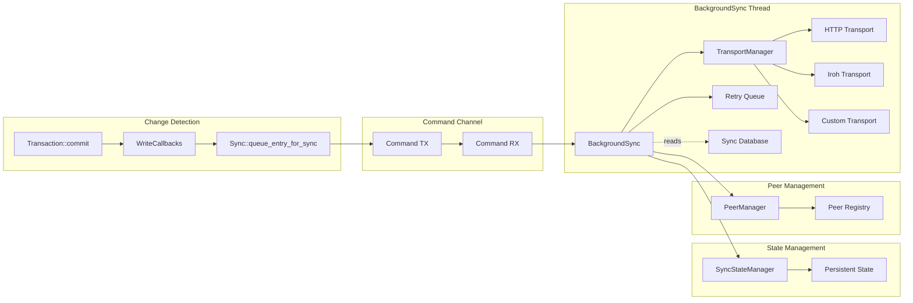

> ✅ **Status: Implemented**
>
> This design is fully implemented and functional.

# Synchronization Design Document

This document outlines the design principles, architecture decisions, and implementation strategy for Eidetica's synchronization system.

## Design Goals

### Primary Objectives

1. **Decentralized Architecture**: No central coordination required
2. **Performance**: Minimize latency and maximize throughput
3. **Reliability**: Handle network failures and recover gracefully
4. **Scalability**: Support many peers and large datasets
5. **Security**: Authenticated and verified peer communications
6. **Simplicity**: Easy to configure and use

### Non-Goals

- **Selective sync**: Sync entire databases only (not partial)
- **Multi-hop routing**: Direct peer connections only
- **Complex conflict resolution**: CRDT-based automatic resolution only
- **Centralized coordination**: No dependency on coordination servers

## Key Design Innovation: Bootstrap-First Sync

**Problem:** Traditional distributed databases require complex setup procedures for new nodes to join existing networks. Peers must either start with empty databases or go through complex initialization.

**Solution:** Eidetica's bootstrap-first sync protocol enables **zero-state joining**:

- **Single API call** handles both bootstrap and incremental sync
- **Automatic detection** determines whether full or partial sync is needed
- **No setup required** - new devices can immediately join existing databases
- **Bidirectional capability** - any peer can bootstrap from any other peer

**Use Cases Enabled:**

- **Chat/messaging apps**: Join conversation rooms instantly with full history
- **Collaborative documents**: Open shared documents from any device
- **Data synchronization**: Sync app data to new devices automatically
- **Backup/restore**: Restore complete application state from peers

## Core Design Principles

### 1. Merkle-CRDT Foundation

The sync system builds on Merkle DAG and CRDT principles:

- **Content-addressable entries**: Immutable, hash-identified data
- **DAG structure**: Parent-child relationships form directed acyclic graph
- **CRDT merging**: Deterministic conflict resolution
- **Causal consistency**: Operations maintain causal ordering

**Benefits:**

- Natural deduplication (same content = same hash)
- Efficient diff computation (compare tips)
- Automatic conflict resolution
- Partition tolerance

### 2. BackgroundSync Engine with Command Pattern

**Decision:** Single background thread with command-channel communication

**Rationale:**

- **Clean architecture**: Eliminates circular dependencies
- **Ownership clarity**: Background thread owns transport state
- **Non-blocking**: Commands sent via channels don't block operations
- **Flexibility**: Fire-and-forget or request-response patterns

**Implementation:**

The sync system uses a thin frontend that sends commands to a background thread:

- Frontend handles API and peer/relationship management in sync database
- Background owns transport and handles network operations
- Both components access sync database directly for peer data
- Commands used only for operations requiring background processing
- Failed operations added to retry queue

**Trade-offs:**

- ✅ No circular dependencies or complex locking
- ✅ Clear ownership model (transport in background, data in sync database)
- ✅ Works in both async and sync contexts
- ✅ Graceful startup/shutdown handling
- ❌ All sync operations serialized through single thread

### 3. Hook-Based Change Detection

**Decision:** Use write callbacks for change detection and sync triggering

**Rationale:**

- **Flexible**: Callbacks can be attached per-database with full context
- **Consistent**: Every commit triggers registered callbacks
- **Simple**: Direct function calls with Entry, Database, and Instance parameters
- **Performance**: Minimal overhead, no trait dispatch

**Architecture:**

```rust,ignore
// Callback function type (stored internally as Arc by Instance)
pub type WriteCallback = dyn Fn(&Entry, &Database, &Instance) -> Result<()> + Send + Sync;

// Integration with Database
impl Database {
    pub fn on_local_write<F>(&self, callback: F) -> Result<()>
    where
        F: Fn(&Entry, &Database, &Instance) -> Result<()> + Send + Sync + 'static
    {
        // Register callback with instance for this database
        // Instance wraps the callback in Arc internally
    }
}

// Usage example for sync
let sync = instance.sync().expect("Sync enabled");
let sync_clone = sync.clone();
let peer_pubkey = "peer_key".to_string();
database.on_local_write(move |entry, db, _instance| {
    sync_clone.queue_entry_for_sync(&peer_pubkey, entry.id(), db.root_id())
})?;
```

**Benefits:**

- Direct access to Entry, Database, and Instance in callbacks
- No need for context wrappers or trait implementations
- Callbacks receive full context needed for sync decisions
- Simple cloning pattern for use in closures
- Easy testing and debugging

### 4. Connection Architecture: Outbound vs Inbound Separation

**Decision:** Separate outbound (client) and inbound (server) connection handling with explicit opt-in for incoming connections.

**Rationale:**

- **Security by default**: Nodes don't accept incoming connections unless explicitly enabled
- **Zero-config outbound**: Applications can sync data immediately without server setup
- **Explicit opt-in**: Server functionality requires deliberate action each restart
- **Flexible deployment**: Support client-only, server-only, or full peer-to-peer modes

**State Model:**

```text
register_transport()
    │ - Transport ready for outbound requests
    ▼
[OUTBOUND READY]
    │ - sync_with_peer() works
    │ - Push hooks work
    │ - NO incoming connections accepted
    ▼
accept_connections()
    │ - Starts server on registered transports
    ▼
[FULL P2P]
    │ - Outbound works
    │ - Inbound works
```

**Benefits:**

- ✅ Secure by default (no listening without explicit call)
- ✅ Zero-config for client-only usage
- ✅ Clear separation of concerns
- ✅ Predictable behavior across restarts

### 5. Modular Transport Layer with TransportManager

**Decision:** Abstract transport layer with handler-based request processing, transport metadata, and multi-transport support via TransportManager

**Core Interface:**

```rust,ignore
pub trait SyncTransport: Send + Sync {
    /// Get the transport type identifier (e.g., "http", "iroh")
    fn transport_type(&self) -> &'static str;

    /// Check if this transport can handle the given address
    fn can_handle_address(&self, address: &Address) -> bool;

    /// Start server with handler for processing sync requests
    /// The transport uses its pre-configured bind address (set during construction)
    async fn start_server(&mut self, handler: Arc<dyn SyncHandler>) -> Result<()>;

    /// Send sync request and get response
    async fn send_request(&self, address: &Address, request: &SyncRequest) -> Result<SyncResponse>;
}

pub trait SyncHandler: Send + Sync {
    /// Process incoming sync requests with request context
    async fn handle_request(&self, request: &SyncRequest, context: &RequestContext) -> SyncResponse;
}

/// Context information about incoming requests
pub struct RequestContext {
    /// Remote address from which the request originated
    pub remote_address: Option<Address>,
    /// Peer public key from the sync request
    pub peer_pubkey: Option<String>,
}
```

**TransportManager** manages multiple named transports and routes requests:

```rust,ignore
pub struct TransportManager {
    transports: HashMap<String, Box<dyn SyncTransport>>,
}

impl TransportManager {
    /// Route request to appropriate transport based on address
    pub async fn send_request(&self, address: &Address, request: &SyncRequest) -> Result<SyncResponse>;

    /// Start servers on all registered transports
    pub async fn start_all_servers(&mut self, handler: Arc<dyn SyncHandler>) -> Result<()>;
}
```

**RequestContext** captures transport metadata (remote address, peer pubkey after handshake) for automatic peer registration and address discovery.

**Rationale:**

- **Multi-Transport**: Support multiple transports simultaneously (HTTP + Iroh)
- **Address-Based Routing**: Requests routed to appropriate transport via `can_handle_address()`
- **Database Access**: Handlers can store received entries via backend
- **Stateful Processing**: Support GetTips, GetEntries, SendEntries operations
- **Clean Separation**: Transport handles networking, handler handles sync logic
- **Flexibility**: Support different network environments
- **Evolution**: Easy to add new transport protocols
- **Testing**: Mock transports for unit tests

**Supported Transports:**

#### HTTP Transport

```rust,ignore
pub struct HttpTransport {
    client: reqwest::Client,
    server: Option<HttpServer>,
    handler: Option<Arc<dyn SyncHandler>>,
}
```

**Implementation:**

- Axum server with handler state injection
- JSON serialization at `/api/v0` endpoint
- Handler processes requests with database access

**Use cases:**

- Simple development and testing
- Firewall-friendly environments
- Integration with existing HTTP infrastructure

**Trade-offs:**

- ✅ Widely supported and debuggable
- ✅ Works through most firewalls/proxies
- ✅ Full database access via handler
- ❌ Less efficient than P2P protocols
- ❌ Requires port management

#### Iroh P2P Transport

```rust,ignore
pub struct IrohTransport {
    endpoint: Option<Endpoint>,
    server_state: ServerState,
    handler: Option<Arc<dyn SyncHandler>>,
}
```

**Implementation:**

- QUIC bidirectional streams for request/response
- Handler integration in stream processing
- JsonHandler for serialization consistency

**Use cases:**

- Production deployments
- NAT traversal required
- Direct peer-to-peer communication

**Trade-offs:**

- ✅ Efficient P2P protocol with NAT traversal
- ✅ Built-in relay and hole punching
- ✅ QUIC-based with modern networking features
- ✅ Full database access via handler
- ❌ More complex setup and debugging
- ❌ Additional dependency

### 6. Automatic Peer and Relationship Management

**Decision:** Automatically register peers during handshake and track tree/peer relationships when peers request trees

**Peer Registration:** Captures advertised addresses from handshake plus actual remote address from transport connection for NAT traversal.

**Relationship Tracking:** Each sync request includes the peer's device public key, enabling automatic tracking of tree/peer relationships. This enables bidirectional `sync_on_commit` without manual setup.

### 7. Declarative Sync API

**Decision:** Provide `register_sync_peer()` for declaring sync intent with `SyncHandle` for status tracking

Applications register sync relationships once; the background engine handles synchronization automatically. Status tracking via polling (async events planned for future).

### 8. Persistent State Management

**Decision:** All peer and relationship state stored persistently in sync database

**Architecture:**

```text
Sync Database (Persistent):
├── peers/{peer_pubkey} -> PeerInfo (addresses, status, metadata)
├── relationships/{peer}/{database} -> SyncRelationship
├── sync_state/cursors/{peer}/{database} -> SyncCursor
├── sync_state/metadata/{peer} -> SyncMetadata
└── sync_state/history/{sync_id} -> SyncHistoryEntry

BackgroundSync (Transient):
├── retry_queue: Vec<RetryEntry> (failed sends pending retry)
└── sync_tree_id: ID (reference to sync database for peer lookups)
```

**Design:**

- All peer data is stored in the sync database via PeerManager
- BackgroundSync reads peer information on-demand when needed
- Frontend writes peer/relationship changes directly to sync database
- Single source of truth in persistent storage

**Rationale:**

- **Durability**: All critical state survives restarts
- **Consistency**: Single source of truth in sync database
- **Recovery**: Full state recovery after failures
- **Simplicity**: No duplicate state management

## Architecture Deep Dive

### Component Interactions



The TransportManager routes requests to the appropriate transport based on address type, enabling simultaneous use of multiple transports for different network conditions.

### Data Flow Design

#### 1. Entry Commit Flow

```text
1. Application calls database.new_transaction().commit()
2. Transaction stores entry in backend
3. Transaction triggers write callbacks with Entry, Database, and Instance
4. Callback invokes sync.queue_entry_for_sync()
5. Sync sends QueueEntry command to BackgroundSync via channel
6. BackgroundSync fetches entry from backend
7. Entry sent immediately to peer via transport
8. Failed sends added to retry queue
```

#### 2. Peer Connection Flow

```text
1. Application calls sync.connect_to_peer(address)
2. Sync creates HandshakeRequest with device info
3. Transport sends handshake to peer
4. Peer responds with HandshakeResponse
5. Both peers verify signatures and protocol versions
6. Successful peers are registered in PeerManager
7. Connection state updated to Connected
```

#### 3. Sync Relationship Flow

```text
1. Application calls sync.add_tree_sync(peer_id, tree_id)
2. PeerManager stores relationship in sync database
3. Future commits to database trigger sync callbacks
4. Callbacks query relationships from sync database
5. Entries queued for sync with configured peers
```

### BackgroundSync Command Management

#### Command Structure

The BackgroundSync engine processes commands sent from the frontend:

- **SendEntries**: Direct entry transmission to peer
- **QueueEntry**: Entry committed, needs sync
- **AddPeer/RemovePeer**: Peer registry management
- **CreateRelationship**: Database-peer sync mapping
- **StartServer/StopServer**: Transport server control
- **ConnectToPeer**: Establish peer connection
- **SyncWithPeer**: Trigger bidirectional sync
- **Shutdown**: Graceful termination

#### Processing Model

**Immediate processing:** Commands handled as received

- No batching delays or queue buildup
- Failed operations go to retry queue
- Fire-and-forget for most operations
- Request-response via oneshot channels when needed

**Retry queue:** Failed sends with exponential backoff

- 2^attempts seconds delay (max 64s)
- Configurable max attempts before dropping
- Processed every 30 seconds by timer

#### Error Handling Strategy

**Transient errors:** Retry with exponential backoff

- Network timeouts
- Temporary peer unavailability
- Transport-level failures

**Persistent errors:** Remove after max retries

- Invalid peer addresses
- Authentication failures
- Protocol incompatibilities

**Recovery mechanisms:**

```rust,ignore
// Automatic retry tracking
entry.mark_attempted(Some(error.to_string()));

// Cleanup failed entries periodically
queue.cleanup_failed_entries(max_retries)?;

// Metrics for monitoring
let stats = queue.get_sync_statistics()?;
```

### Transport Layer Design

#### Iroh Transport Configuration

**Design Decision:** Builder pattern for transport configuration

The Iroh transport uses a builder pattern to support different deployment scenarios:

**RelayMode Options:**

- **Default**: Production deployments use n0's global relay infrastructure
- **Staging**: Testing against n0's staging infrastructure
- **Disabled**: Local testing without internet dependency
- **Custom**: Enterprise deployments with private relay servers

**Rationale:**

- **Flexibility**: Different environments need different configurations
- **Performance**: Local tests run faster without relay overhead
- **Privacy**: Enterprises can run private relay infrastructure
- **Simplicity**: Defaults work for most users without configuration

**Address Serialization:**

The Iroh transport serializes NodeAddr information as JSON containing:

- Node ID (cryptographic identity)
- Direct socket addresses (for P2P connectivity)

This allows the same `get_server_address()` interface to work for both HTTP (returns socket address) and Iroh (returns rich connectivity info).

### Security Design

#### Authentication Model

**Device Identity:**

- Each database instance has an Ed25519 keypair
- Public key serves as device identifier
- Private key signs all sync operations

**Peer Verification:**

- Handshake includes signature challenge
- Both peers verify counterpart signatures
- Only verified peers allowed to sync

**Entry Authentication:**

- All entries signed by creating device
- Receiving peer verifies signatures
- Invalid signatures rejected

#### Trust Model

**Assumptions:**

- Peers are semi-trusted (authenticated but may be malicious)
- Private keys are secure
- Transport layer provides integrity

**Threat Mitigation:**

- **Man-in-middle:** Ed25519 signatures prevent tampering
- **Replay attacks:** Entry IDs are content-based (no replays possible)
- **Denial of service:** Rate limiting and queue size limits
- **Data corruption:** Signature verification catches corruption

#### Protocol Security

**Handshake Protocol:**

```text
A -> B: HandshakeRequest {
    device_id, public_key, challenge, signature,
    listen_addresses: [Address]  // Advertised addresses for A
}

B -> A: HandshakeResponse {
    device_id, public_key, challenge_response, counter_challenge
}

// B registers A with listen_addresses + remote_address from transport
```

**Bootstrap-First Protocol:**

The sync protocol supports zero-state joining through automatic bootstrap detection:

```text
# Bootstrap Scenario (client has no local database)
A -> B: SyncTreeRequest {
    tree_id: ID,
    our_tips: [], // Empty = bootstrap needed
    peer_pubkey: Some(device_pubkey) // For automatic peer tracking
}

B -> A: BootstrapResponse {
    tree_id: ID,
    root_entry: Entry,
    all_entries: Vec<Entry> // Complete database
}

# Incremental Scenario (client has database)
A -> B: SyncTreeRequest {
    tree_id: ID,
    our_tips: [tip1, tip2, ...], // Current tips
    peer_pubkey: Some(device_pubkey) // For automatic peer tracking
}

B -> A: IncrementalResponse {
    tree_id: ID,
    missing_entries: Vec<Entry>, // New changes for client
    their_tips: [tip1, tip2, ...] // Server's tips for bidirectional sync
}

# Bidirectional Completion (client sends missing entries to server)
A -> B: SendEntriesRequest {
    tree_id: ID,
    entries: Vec<Entry> // Entries server is missing
}

B -> A: SendEntriesResponse {
    success: bool
}
```

**Design Benefits:**

- **Unified API:** Single request type handles both scenarios
- **Auto-detection:** Server determines sync type from empty tips
- **Zero-configuration:** No manual bootstrap setup required
- **Efficient:** Only transfers necessary data (full or incremental)
- **True Bidirectional:** Complete synchronization in single operation using existing protocol fields

### Performance Considerations

#### Memory Usage

**Queue sizing:**

- Default: 100 entries per peer × 100 bytes = 10KB per peer
- Configurable limits prevent memory exhaustion
- Automatic cleanup of failed entries

**Persistent state:**

- Minimal: ~1KB per peer relationship
- Periodic cleanup of old history entries
- Efficient serialization formats

#### Network Efficiency

**Batching benefits:**

- Reduce TCP/HTTP overhead
- Better bandwidth utilization
- Fewer transport-layer handshakes

**Compression potential:**

- Similar entries share structure
- JSON/binary format optimization
- Transport-level compression (HTTP gzip, QUIC)

#### CPU Usage

**Background worker:**

- Configurable check intervals
- Async processing doesn't block application
- Efficient queue scanning

**Hook execution:**

- Fast in-memory operations only
- Hook failures don't affect commits
- Minimal serialization overhead

### Configuration Design

#### Queue Configuration

```rust,ignore
pub struct SyncQueueConfig {
    pub max_queue_size: usize,      // Size-based flush trigger
    pub max_queue_age_secs: u64,    // Age-based flush trigger
    pub batch_size: usize,          // Max entries per network call
}
```

**Tuning guidelines:**

- **High-frequency apps:** Lower max_queue_age_secs (5-15s)
- **Batch workloads:** Higher max_queue_size (200-1000)
- **Low bandwidth:** Lower batch_size (10-25)
- **High bandwidth:** Higher batch_size (100-500)

#### Worker Configuration

```rust,ignore
pub struct SyncFlushConfig {
    pub check_interval_secs: u64,   // How often to check for flushes
    pub enabled: bool,              // Enable/disable background worker
}
```

**Trade-offs:**

- Lower check_interval = more responsive, higher CPU
- Higher check_interval = less responsive, lower CPU

## Implementation Strategy

### Phase 1: Core Infrastructure ✅

- [x] BackgroundSync engine with command pattern
- [x] Hook-based change detection
- [x] Basic peer management
- [x] HTTP transport
- [x] Ed25519 handshake protocol

### Phase 2: Production Features ✅

- [x] Iroh P2P transport (handler needs fix)
- [x] Retry queue with exponential backoff
- [x] Sync state persistence via DocStore
- [x] Channel-based communication
- [x] RequestContext for transport metadata
- [x] Automatic peer registration
- [x] Automatic tree/peer relationship tracking
- [x] Declarative sync API (register_sync_peer)
- [x] SyncHandle and SyncStatus tracking
- [x] 78 integration tests passing

### Phase 3: Advanced Features

- [ ] Sync priorities and QoS
- [ ] Bandwidth throttling
- [ ] Monitoring and metrics
- [ ] Multi-database coordination

### Phase 4: Scalability

- [ ] Persistent queue spillover
- [ ] Streaming for large entries
- [ ] Advanced conflict resolution
- [ ] Performance analytics

## Testing Strategy

### Unit Testing

**Component isolation:**

- Mock transport layer for networking tests
- In-memory backends for storage tests
- Deterministic time for age-based tests

**Coverage targets:**

- Queue operations: 100%
- Hook execution: 100%
- Error handling: 95%
- State management: 95%

### Integration Testing

**Multi-peer scenarios:**

- 2-peer bidirectional sync
- 3+ peer mesh networks
- Database sync relationship management
- Network failure recovery

**Performance testing:**

- Large queue handling
- High-frequency updates
- Memory usage under load
- Network efficiency measurement

### End-to-End Testing

**Real network conditions:**

- Simulated network failures
- High latency connections
- Bandwidth constraints
- Concurrent peer connections

## Migration and Compatibility

### Backward Compatibility

**Protocol versioning:**

- Version negotiation in handshake
- Graceful degradation for older versions
- Clear upgrade paths

**Data format evolution:**

- Extensible serialization formats
- Schema migration strategies
- Rollback procedures

### Deployment Considerations

**Configuration migration:**

- Default configuration for new installations
- Migration scripts for existing data
- Validation of configuration parameters

**Operational procedures:**

- Health check endpoints
- Monitoring integration
- Log aggregation and analysis

## Future Evolution

### Planned Enhancements

1. **Selective sync:** Per-store sync control
2. **Conflict resolution:** Advanced merge strategies
3. **Performance:** Compression and protocol optimization
4. **Monitoring:** Rich metrics and observability
5. **Scalability:** Large-scale deployment support

### Research Areas

1. **Byzantine fault tolerance:** Handle malicious peers
2. **Incentive mechanisms:** Economic models for sync
3. **Privacy:** Encrypted sync protocols
4. **Consensus:** Distributed agreement protocols
5. **Sharding:** Horizontal scaling techniques

## Success Metrics

### Performance Targets

- **Queue latency:** < 1ms for queue operations
- **Sync latency:** < 5s for small changes in normal conditions
- **Throughput:** > 1000 entries/second per peer
- **Memory usage:** < 10MB for 100 active peers

### Reliability Targets

- **Availability:** 99.9% sync success rate
- **Recovery:** < 30s to resume after network failure
- **Consistency:** 100% eventual consistency (no data loss)
- **Security:** 0 known authentication bypasses

### Usability Targets

- **Setup time:** < 5 minutes for basic configuration
- **Documentation:** Complete API and troubleshooting guides
- **Error messages:** Clear, actionable error descriptions
- **Monitoring:** Built-in observability for operations teams
