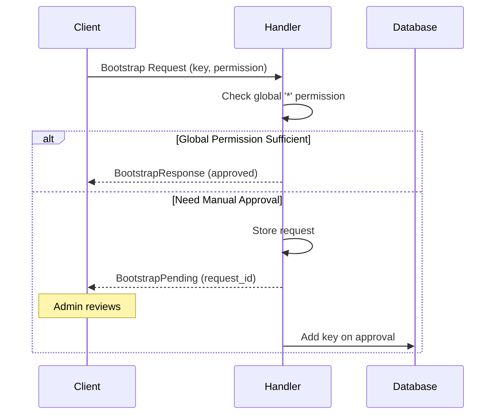

# Bootstrap

Secure key management and access control for new devices joining existing databases.

## Architecture

Bootstrap requests are stored in the sync database (`_sync`), not target databases. The system supports automatic approval via global `*` permissions or manual approval workflow.

## Request Flow



## Global Permission Auto-Approval

If the database has a global `*` permission that satisfies the request, approval is immediate without adding a new key. The device uses the global permission for all operations.

Permission hierarchy uses **lower numbers = higher priority**:

- Global `Write(10)` allows requests for `Read`, `Write(11)`, `Write(15)`
- Global `Write(10)` rejects requests for `Write(5)`, `Admin(*)`

## Manual Approval API

```rust,ignore
// Query requests
sync.pending_bootstrap_requests()?;
sync.approved_bootstrap_requests()?;

// Approve/reject
sync.approve_bootstrap_request(id, signing_key)?;
sync.reject_bootstrap_request(id, signing_key)?;
```

## Request Status

- **Pending**: Awaiting admin review
- **Approved**: Key added to database
- **Rejected**: Request denied, no key added

Requests are retained indefinitely for audit trail.

See `src/sync/bootstrap_request_manager.rs` and `src/sync/handler.rs` for implementation.
