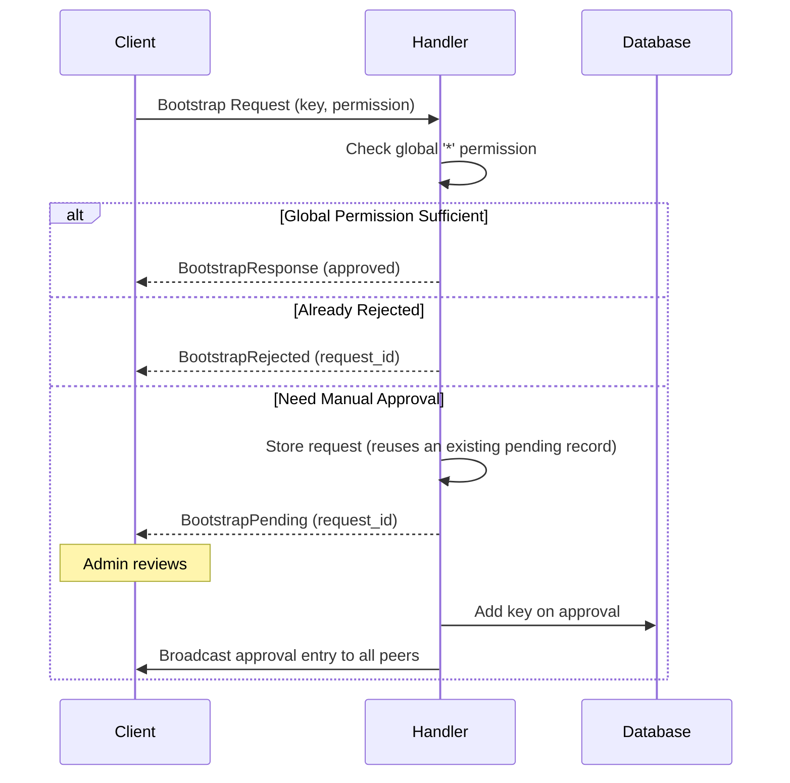

# Bootstrap

Secure key management and access control for new devices joining existing databases.

## Architecture

Bootstrap requests are stored in the sync database (`_sync`), not target databases. The system supports automatic approval via global `*` permissions or manual approval workflow.

## Request Flow


```mermaid
sequenceDiagram
    participant Client
    participant Handler
    participant Database

    Client->>Handler: Bootstrap Request (key, permission)
    Handler->>Handler: Check global '*' permission

    alt Global Permission Sufficient
        Handler-->>Client: BootstrapResponse (approved)
    else Already Rejected
        Handler-->>Client: BootstrapRejected (request_id)
    else Need Manual Approval
        Handler->>Handler: Store request (reuses an existing pending record)
        Handler-->>Client: BootstrapPending (request_id)
        Note over Client: Admin reviews
        Handler->>Database: Add key on approval
        Handler->>Client: Broadcast approval entry to all peers
    end
```

## Global Permission Auto-Approval

If the database has a global `*` permission that satisfies the request, approval is immediate without adding a new key. The device uses the global permission for all operations.

Permission hierarchy uses **lower numbers = higher priority**:

- Global `Write(10)` allows requests for `Read`, `Write(11)`, `Write(15)`
- Global `Write(10)` rejects requests for `Write(5)`, `Admin(*)`

## Manual Approval API

```rust,ignore
// Query requests
sync.pending_bootstrap_requests()?;
sync.approved_bootstrap_requests()?;

// Approve/reject
sync.approve_bootstrap_request(id, signing_key)?;
sync.reject_bootstrap_request(id, signing_key)?;
```

## Broadcast on Approval

On approval the handler adds the requesting key to the target database and then
broadcasts the resulting auth entry to **all** of the database's peers via the
normal outbound send queue, independent of `sync_on_commit`. The requesting peer
is one of those peers (registered during its sync request), so the broadcast is
how it sees that access was granted without relying on a poll interval —
improving time-to-visibility under fluctuating network conditions. Delivery
reuses the send queue's retry/backoff for unreachable peers and is best-effort:
an enqueue failure is logged and does not undo the committed approval.

## Request Status

- **Pending**: Awaiting admin review
- **Approved**: Key added to database and broadcast to peers
- **Rejected**: Request denied, no key added

Requests are retained indefinitely for audit trail.

Storage is idempotent per `(tree_id, requesting_pubkey)`: a re-request reuses an
existing `Pending` or `Rejected` record instead of inserting another, so the
client's completion sweep cannot append a row per tick. `Approved` records are
not reused — the store path is only reached when the auth check found no live
grant, meaning the approval was revoked and a new request is correct.

A `Rejected` record answers subsequent requests with `BootstrapRejected`, which
the requester treats as terminal (its outgoing record is marked `Rejected` and
leaves the sweep set) rather than as another pending wait.

See `src/sync/bootstrap_request_manager.rs` and `src/sync/handler.rs` for implementation.
