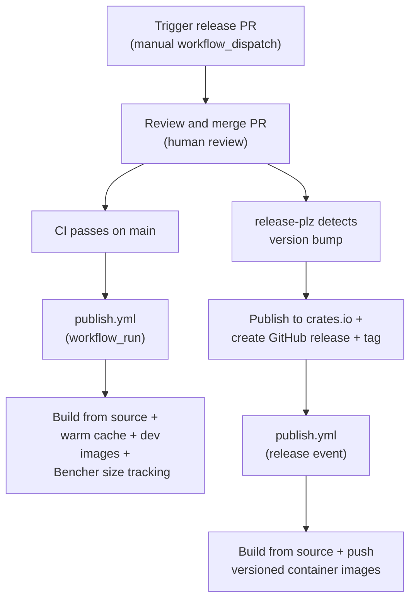

# CI/Build Infrastructure

Eidetica uses a CI/build system with GitHub Actions, Forgejo CI, and Nix flakes.

The philosophy for CI is that compute resources are cheap and developer resources (my time) are expensive. CI is used for comprehensive testing, status reporting, security checks, dependency updates, documentation generation, and releasing. In the current setup some of these are run multiple times on several platforms to ensure compatibility and reliability across different environments.

Fuzz / simulation testing are planned for the future.

## CI Systems

### GitHub Actions

The primary CI runs on GitHub with these workflows:

- **[ci.yml](https://github.com/arcuru/eidetica/blob/main/.github/workflows/ci.yml)**: Main CI pipeline (lint, test, integration tests, docs)
- **[publish.yml](https://github.com/arcuru/eidetica/blob/main/.github/workflows/publish.yml)**: Publish pipeline (container images, cache warming, size tracking)
- **[sanitizers.yml](https://github.com/arcuru/eidetica/blob/main/.github/workflows/sanitizers.yml)**: Memory and thread sanitizer checks
- **[benchmarks.yml](https://github.com/arcuru/eidetica/blob/main/.github/workflows/benchmarks.yml)**: Performance benchmarks
- **[coverage.yml](https://github.com/arcuru/eidetica/blob/main/.github/workflows/coverage.yml)**: Multi-backend code coverage tracking via Codecov
- **[deploy-docs.yml](https://github.com/arcuru/eidetica/blob/main/.github/workflows/deploy-docs.yml)**: Documentation deployment to GitHub Pages
- **[release-plz.yml](https://github.com/arcuru/eidetica/blob/main/.github/workflows/release-plz.yml)**: Automated releases and crates.io publishing
- **[codeberg.yml](https://github.com/arcuru/eidetica/blob/main/.github/workflows/codeberg.yml)**: Codeberg mirror sync (main branch only)
- **[security-audit.yml](https://github.com/arcuru/eidetica/blob/main/.github/workflows/security-audit.yml)**: Daily advisory scanning
- **[cargo-update.yml](https://github.com/arcuru/eidetica/blob/main/.github/workflows/cargo-update.yml)**: Monthly cargo dependency updates
- **[flake-update.yml](https://github.com/arcuru/eidetica/blob/main/.github/workflows/flake-update.yml)**: Monthly Nix flake input updates
- **[actions-update.yml](https://github.com/arcuru/eidetica/blob/main/.github/workflows/actions-update.yml)**: Monthly GitHub Actions version updates
- **[dependency-hold.yml](https://github.com/arcuru/eidetica/blob/main/.github/workflows/dependency-hold.yml)**: Merge gate for dependency PRs
- **[update-hold.yml](https://github.com/arcuru/eidetica/blob/main/.github/workflows/update-hold.yml)**: Automatic hold expiry

### Forgejo CI

A dedicated Forgejo runner provides CI redundancy on [Codeberg](https://codeberg.org/arcuru/eidetica). The Forgejo workflows mirror the testing in the GitHub Actions setup with minor adaptations for the Forgejo environment.

## Nix Flake

The Nix flake defines reproducible builds and CI checks that run identically locally and in CI:

- `nix build` - Build the default package
- `nix flake check` - Run all CI checks (audit, clippy, doc, test, etc.)

Binary caching via a [nix binary cache](https://wiki.nixos.org/wiki/Binary_Cache) speeds up builds by providing pre-built dependencies. It is located at:

- URL - `https://cache.eidetica.dev`
- Public Key - `cache.eidetica.dev-1:eND5gRJlbnool3ZLCWT2H8kkygWS8JcsU76HYXbWPBI=`

## Nix Package Groups

The Nix flake organizes packages into groups with a consistent pattern:

- `.#<group>.default` — runs a sensible default subset
- `.#<group>.all` — runs ALL items in the group
- `.#<group>.<name>` — runs a specific item

| Group         | Default                       | All                         |
| ------------- | ----------------------------- | --------------------------- |
| `test`        | sqlite                        | all backends                |
| `doc`         | api + test + booktest + links | includes book               |
| `lint`        | all except udeps, minversions | includes udeps, minversions |
| `coverage`    | sqlite                        | all backends                |
| `sanitize`    | asan + lsan                   | includes miri               |
| `integration` | all                           | nixos + container           |
| `eval`        | all                           | nixos + hm                  |

## Interactive Runners

Interactive runners execute commands with live output, accepting additional arguments:

| Command                   | Description                                              |
| ------------------------- | -------------------------------------------------------- |
| `nix run`                 | Run the eidetica binary                                  |
| `nix run .#fix`           | Auto-fix linting issues and format code                  |
| `nix run .#bench`         | Run benchmarks interactively                             |
| `nix run .#coverage`      | Run coverage interactively                               |
| `nix run .#test`          | Run tests (no backend set, override with `TEST_BACKEND`) |
| `nix run .#test-sqlite`   | Run tests with sqlite backend                            |
| `nix run .#test-inmemory` | Run tests with inmemory backend                          |
| `nix run .#test-postgres` | Run tests with postgres backend (Linux)                  |
| `nix run .#test-all`      | Run tests with all backends sequentially                 |

## Code Coverage

Code coverage runs against all storage backends to ensure comprehensive test coverage:

| Backend    | CI  | just                     | Nix                             |
| ---------- | --- | ------------------------ | ------------------------------- |
| SQLite     | ✓   | `just coverage`          | `nix build .#coverage.sqlite`   |
| InMemory   | ✓   | `just coverage inmemory` | `nix build .#coverage.inmemory` |
| PostgreSQL | ✓   | `just coverage postgres` | `nix build .#coverage.postgres` |
| All        | —   | `just coverage all`      | `nix build .#coverage.all`      |

### Local Coverage Commands

```bash
just coverage            # SQLite backend (default)
just coverage inmemory   # InMemory backend
just coverage postgres   # PostgreSQL (starts a container automatically)
just coverage all        # All backends, merged into coverage/lcov.info
```

The `coverage all` command runs all three backends sequentially and merges the LCOV reports using `lcov`. Individual reports are saved as `coverage/lcov-{backend}.info`.

### CI Coverage

GitHub Actions runs coverage for each backend in parallel and uploads to [Codecov](https://codecov.io) with backend-specific flags. Codecov automatically merges the reports server-side, providing both combined coverage metrics and per-backend breakdowns.

For local development setup, see [Contributing](contributing.md).

## Dependency Management

Dependencies are managed through purpose-built GitHub Actions workflows rather than third-party tools. Three categories of dependencies are updated monthly, each with a mandatory hold period before merge. A daily security audit catches advisory database updates between dependency cycles.

### Security Audits

The [`security-audit.yml`](https://github.com/arcuru/eidetica/blob/main/.github/workflows/security-audit.yml) workflow runs daily at 06:00 UTC. It executes `cargo deny check advisories` against the RustSec Advisory Database.

- On failure: creates or updates a GitHub issue with the `security` label containing the full advisory output
- On success: auto-closes any existing security advisory issue

The `.config/deny.toml` configuration contains an ignore list for known advisories from transitive dependencies (e.g., unmaintained crates pulled in by iroh). The CI lint target (`nix build .#lint.deny`) checks `bans licenses sources` but not `advisories` — advisories are excluded from regular CI because new advisories appear without code changes and would cause flaky builds. The dedicated daily workflow fills this gap.

### Update Workflows

Three monthly update workflows run on the 1st of each month:

| Workflow                                                                                                  | Branch                | What it updates                     |
| --------------------------------------------------------------------------------------------------------- | --------------------- | ----------------------------------- |
| [`cargo-update.yml`](https://github.com/arcuru/eidetica/blob/main/.github/workflows/cargo-update.yml)     | `deps/cargo-update`   | `Cargo.lock` via `cargo update`     |
| [`flake-update.yml`](https://github.com/arcuru/eidetica/blob/main/.github/workflows/flake-update.yml)     | `deps/flake-update`   | `flake.lock` via `nix flake update` |
| [`actions-update.yml`](https://github.com/arcuru/eidetica/blob/main/.github/workflows/actions-update.yml) | `deps/actions-update` | SHA pins in workflow files          |

Each workflow:

1. Sets up the `deps/` branch (creates new or rebases existing onto main)
2. Runs the update command
3. Checks if anything changed (exits cleanly if not)
4. Commits and pushes with `--force-with-lease` (preserving any existing user commits)
5. Creates a PR (or updates the existing one) with `dependencies` and `on-hold` labels
6. Embeds a `<!-- hold-until: YYYY-MM-DD -->` comment in the PR body; CI handles verification

Shared branch setup and commit/PR logic is extracted into composite actions at `.github/actions/`.

The flake update workflow generates an input diff summary with GitHub compare links for each changed flake input (nixpkgs, crane, fenix, etc.).

The actions update workflow parses `uses:` lines across all `.github/workflows/*.yml` and `.forgejo/workflows/*.yml` files, queries the GitHub API for the latest release of each action, and updates SHA pins in-place. It respects the Forgejo constraint: `actions/checkout` in `.forgejo/` stays at v4.

All three workflows support `workflow_dispatch` for manual triggering with a configurable `hold_days` parameter (default: 7).

### Hold Mechanism

Dependency update PRs are gated by a mandatory hold period to allow time for upstream issues to surface before merging.

The hold system has two components:

**[`dependency-hold.yml`](https://github.com/arcuru/eidetica/blob/main/.github/workflows/dependency-hold.yml)** — A PR status check that runs on every pull request to `main`. For branches that start with `deps/`, it queries the GitHub API for the PR's current labels and fails if the `on-hold` label is present, blocking merge. For all other branches, it passes immediately. Live label queries (rather than event payload data) ensure manual re-runs always see current state. This job name (`Dependency Hold`) is configured as a required status check in branch protection.

**[`update-hold.yml`](https://github.com/arcuru/eidetica/blob/main/.github/workflows/update-hold.yml)** — A daily workflow (07:00 UTC) that scans open PRs with the `on-hold` label. It parses the `<!-- hold-until: YYYY-MM-DD -->` comment from each PR body. When today's date meets or exceeds the hold date, it removes the `on-hold` label, creates a passing `Dependency Hold` check run on the PR's HEAD commit, and posts a comment.

```text
Day 0:  cargo-update.yml creates PR with on-hold label
        dependency-hold.yml → FAIL (on-hold label present, merge blocked)

Day 7:  update-hold.yml removes on-hold label + creates passing check run
        Dependency Hold check → PASS (merge allowed)
```

### Required Setup

The hold mechanism requires repository configuration:

- An `on-hold` label in GitHub repo settings
- A `dependencies` label (for categorization)
- `Dependency Hold` added as a required status check in branch protection for `main` (displayed as `Deps: Hold Gate / Dependency Hold` in the checks UI)

## Secret Management

Secrets are scoped to [GitHub Environments](https://docs.github.com/en/actions/deployment/targeting-different-environments/using-environments-for-deployment) with branch restrictions rather than stored as repo-level secrets. This limits the blast radius of a compromised workflow or action.

### Environments

| Environment    | Secrets                                                                                                                    | Purpose                                          |
| -------------- | -------------------------------------------------------------------------------------------------------------------------- | ------------------------------------------------ |
| `publish`      | `NIX_CACHE_ACCESS_KEY_ID`, `NIX_CACHE_SECRET_ACCESS_KEY`, `NIX_CACHE_SIGNING_KEY`, `DOCKERHUB_USERNAME`, `DOCKERHUB_TOKEN` | Release builds, cache push, container publishing |
| `release`      | `DOCKERHUB_USERNAME`, `DOCKERHUB_TOKEN`                                                                                    | Container manifest creation                      |
| `automation`   | `PAT_TOKEN`                                                                                                                | PR creation with elevated permissions            |
| `mirror`       | `GIT_SSH_PRIVATE_KEY`                                                                                                      | Codeberg mirror sync                             |
| _(repo-level)_ | `CODECOV_TOKEN`, `BENCHER_API_TOKEN`                                                                                       | Low-risk upload-only tokens                      |

All environments are restricted to the `main` branch. Low-risk tokens that can only upload metrics or coverage data remain at the repo level.

### Cache Push Isolation

Only the publish workflow (`publish.yml`) has cache push credentials. CI, coverage, and sanitizer workflows are fully secretless — they read from the public cache but never write to it. This means the Nix cache signing key exists in a single environment (`publish`), and all cache contents are built from source by the publish job.

### Release Build Integrity

The publish workflow builds artifacts (binary and container image) from source using `--option substituters 'https://cache.nixos.org'`, bypassing the project's own binary cache entirely. This prevents a cache poisoning attack from affecting published artifacts. The from-source results are pushed to the cache afterward, along with CI debug artifacts (lint, test, doc targets on dev runs), so subsequent CI runs and developer builds benefit from caching.

## Releasing

Releases are automated via [release-plz](https://release-plz.dev/) and configured in [`.config/release-plz.toml`](https://github.com/arcuru/eidetica/blob/main/.config/release-plz.toml). The process uses unified workspace versioning — all crates share a single version and tags follow the `v<major>.<minor>.<patch>` format.

### Publish Workflow

A single [`publish.yml`](https://github.com/arcuru/eidetica/blob/main/.github/workflows/publish.yml) workflow handles all artifact publishing. It is triggered in three ways:

1. **After CI passes on main** (`workflow_run`) — pushes `dev`-tagged container images, warms the Nix binary cache, and tracks binary/container sizes. This runs on every push to main, exercising the same build and publish pipeline that releases use.

2. **After a GitHub release is published** (`release: published`) — pushes versioned container images (e.g. `1.2.3`, `1.2`, `latest`) and updates the Docker Hub description. Triggered by release-plz creating a release.

3. **Manual retry** (`workflow_dispatch`) — accepts a release tag name (e.g. `v1.2.3`) and re-runs the release publish pipeline. Used to retry a failed release without re-creating the GitHub release.

On release day, triggers 1 and 2 both fire independently — the `workflow_run` from the merge to main, and the `release` event from release-plz tagging. This is intentional: the dev run validates the pipeline on every push, and the release run publishes the versioned artifacts.

### Release Flow



### Step-by-Step

1. **Trigger a release PR** — Manually run the [`Release-plz`](https://github.com/arcuru/eidetica/blob/main/.github/workflows/release-plz.yml) workflow via GitHub Actions (`Actions` → `Release-plz` → `Run workflow`). This runs `release-plz release-pr`, which:
   - Analyzes commits since the last release to determine the version bump
   - Updates version numbers in `Cargo.toml` files
   - Generates the changelog using release-plz's built-in changelog generator
   - Opens a PR titled `chore: release v<version>` with the `release` label

2. **Review the release PR** — The PR body includes a checklist:
   - Review the version bump (previous → next)
   - Review semver compatibility
   - Edit `CHANGELOG.md` to add custom commentary or highlights
   - Ensure CI passes

   > **Note:** Subsequent pushes to `main` while the PR is open will cause release-plz to update the PR (re-analyze commits, adjust version if needed).

3. **Merge the PR** — Merging triggers two independent pipelines:
   - **[`publish.yml`](https://github.com/arcuru/eidetica/blob/main/.github/workflows/publish.yml)**: After CI passes on main, builds from source, warms the Nix binary cache, pushes `dev`-tagged container images, and tracks sizes via Bencher.
   - **[`release-plz.yml`](https://github.com/arcuru/eidetica/blob/main/.github/workflows/release-plz.yml)**: Detects the version bump and runs `release-plz release`.

4. **Automatic publishing** — The `release-plz release` job:
   - Publishes the crate to [crates.io](https://crates.io/crates/eidetica) via trusted publishing
   - Creates a GitHub release with tag `v<version>` and a release body containing the changelog, install instructions, and documentation links

5. **Container image publishing** — The GitHub release triggers `publish.yml` again via the `release: published` event. This:
   - Builds Nix binary and OCI container image for x86_64 and aarch64
   - Pushes versioned container images to GHCR and Docker Hub (e.g., `1.2.3`, `1.2`, `latest`)
   - Creates multi-arch manifests
   - Attaches SBOM and provenance attestations
   - Updates Docker Hub repository description

   If this workflow fails partway through, it can be manually retried via `workflow_dispatch` with the release tag name (e.g., `v1.2.3`). The retry checks out the tagged commit to ensure the build matches the release.

### Container Image Tags

| Trigger                  | Tags pushed                                                      | Registries        |
| ------------------------ | ---------------------------------------------------------------- | ----------------- |
| CI passes on main        | `dev`                                                            | GHCR + Docker Hub |
| GitHub release published | `<version>`, `<major>.<minor>`, `latest`\* (+ `<major>` for v1+) | GHCR + Docker Hub |

\* `latest` is only pushed when the release is the highest non-prerelease version (determined via the GitHub Releases API). Backport releases for older branches do not overwrite `latest`.

### Configuration

| File                                | Purpose                                           |
| ----------------------------------- | ------------------------------------------------- |
| `.config/release-plz.toml`          | Version strategy, PR/release templates, changelog |
| `.github/workflows/release-plz.yml` | Release automation workflow                       |
| `.github/workflows/publish.yml`     | Artifact building and container image publishing  |

### Notes

- The `release-plz-pr` job only updates an existing release PR on push to main — it does not create new ones automatically. New release cycles are initiated via `workflow_dispatch`.
- All publish runs build artifacts from source without the project's own Nix cache substitution to prevent cache poisoning (see [Release Build Integrity](#release-build-integrity)).
- The dev path (every push to main) exercises the same build and publish pipeline as releases, providing continuous validation of the release infrastructure.
