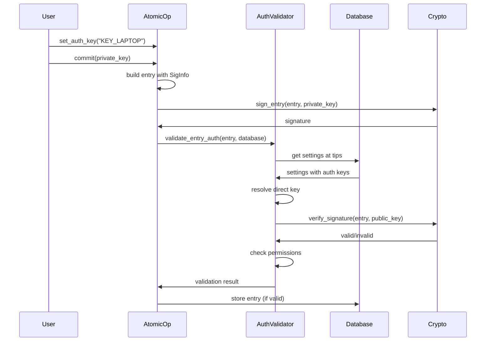

### Authentication

The authentication module provides mandatory cryptographic authentication for all Eidetica entries. Every entry must be signed with a valid Ed25519 key, ensuring data integrity and access control throughout the distributed system.

#### Architecture Overview

The authentication system is deeply integrated with Eidetica's core, validating every entry at creation time:

- **Mandatory Signing**: All entries require valid Ed25519 signatures
- **AuthValidator**: Central validation component with caching for performance
- **Permission Hierarchy**: Three-tier system with integrated priority levels
- **Key Management**: Stored in `_settings.auth` using Nested CRDT for conflict resolution
- **Direct Keys**: Fully implemented authentication via keys stored in tree settings
- **Delegated Trees**: Fully implemented with comprehensive test coverage

```mermaid
classDiagram
    class AuthValidator {
        +validate_entry_auth(entry: &Entry, database: &Database) Result<()>
        +resolve_direct_key(key_name: &str, settings_tips: &[EntryId]) Result<ResolvedAuth>
        +check_operation_permission(permission: &Permission, operation: &Operation) Result<()>
        -cache: HashMap<CacheKey, ResolvedAuth>
    }

    class SigInfo {
        +SigKey id
        +String signature
    }

    class SigKey {
        <<enumeration>>
        Direct(String)
        DelegatedTree {id, tips, key}
    }

    class ResolvedAuth {
        +VerifyingKey public_key
        +Permission effective_permission
        +KeyStatus key_status
        +u32 priority
    }

    class Permission {
        <<enumeration>>
        Admin(u32 priority)
        Write(u32 priority)
        Read
    }

    class KeyStatus {
        <<enumeration>>
        Active
        Revoked
    }

    class AuthKey {
        +String key
        +Permission permissions
        +KeyStatus status
    }

    class AuthSettings {
        +add_key(name: String, key: AuthKey)
        +update_key(name: String, key: AuthKey)
        +get_key(name: &str) Option<AuthKey>
        +validate_entry_auth(entry: &Entry) Result<()>
    }

    AuthValidator --> ResolvedAuth : produces
    SigInfo --> SigKey : contains
    ResolvedAuth --> Permission : contains
    ResolvedAuth --> KeyStatus : contains
    AuthKey --> Permission : contains
    AuthKey --> KeyStatus : contains
    AuthSettings --> AuthKey : manages
```

#### Authentication Flow

The authentication process is mandatory for all entries:

1. **Entry Building**: Create entry with `SigInfo` containing direct key name
2. **Signing**: Sign entry content hash with Ed25519 private key
3. **Validation**: `AuthValidator` resolves key from `_settings.auth` at specified tips
4. **Status Check**: Verify key is Active (not Revoked)
5. **Signature Verification**: Validate Ed25519 signature against entry content
6. **Permission Check**: Ensure key has required permissions for the operation



#### Permission System

The permission model integrates priority directly into Admin and Write levels:

- **Admin(priority: u32)**: Full access including settings and key management
  - Can modify keys with equal or lower priority (higher numbers)
  - Priority 0 is highest, typically the initial admin key
- **Write(priority: u32)**: Read/write data access, cannot modify settings
  - Priority included for future extensibility
- **Read**: Read-only access, no priority needed

**Important**: Priority only affects administrative operations (who can modify which keys). It does NOT influence CRDT merge conflict resolution, which uses Last Write Wins based on the DAG structure.

#### Key Storage Format

Authentication keys are stored in the `_settings.auth` subtree using the Nested CRDT:

```rust
// Rust representation
AuthKey {
    key: "ed25519:PExACKOW0L7bKAM9mK_mH3L5EDwszC437uRzTqAbxpk",
    permissions: Permission::Write(10),  // or Admin(0), Read
    status: KeyStatus::Active,          // or Revoked
}

// Serialized format in _settings.auth
{
  "KEY_LAPTOP": {
    "key": "ed25519:PExACKOW0L7bKAM9mK_mH3L5EDwszC437uRzTqAbxpk",
    "permissions": { "Write": 10 },
    "status": "Active"
  },
  "*": {  // Wildcard key for public read access
    "key": "*",
    "permissions": "Read",
    "status": "Active"
  }
}
```

#### Integration Points

Authentication is deeply integrated throughout Eidetica:

- **Entry Structure**: Mandatory `sig` field with signature in every entry
- **AtomicOp**: Handles entry signing during commit operations
- **Tree Creation**: Requires initial admin key for new trees
- **Database Storage**: Validates authentication before storing entries
- **Settings Management**: `_settings.auth` uses Nested CRDT with LWW conflict resolution
- **Validation Pipeline**: Every entry validated before acceptance

#### Implementation Status

**Phase 1 (Current) - Completed:**

- ✅ Mandatory authentication for all entries
- ✅ Ed25519 signature generation and verification
- ✅ Direct key authentication via `_settings.auth`
- ✅ Permission hierarchy with integrated priority
- ✅ Key lifecycle management (Active/Revoked)
- ✅ AuthValidator with caching for performance
- ✅ Integration with AtomicOp and entry creation
- ✅ Wildcard keys for public read access

**Fully Implemented:**

- ✅ Delegated tree authentication with comprehensive test coverage
- ✅ Permission clamping for delegation bounds
- ✅ Multi-level delegation chains with depth limits (MAX_DELEGATION_DEPTH=10)
- ✅ Cross-tree authentication references

**Future Phases:**

- ⏳ Additional key statuses (Ignore, Banned)
- ⏳ Advanced key rotation mechanisms
- ⏳ Performance optimizations for large key sets
