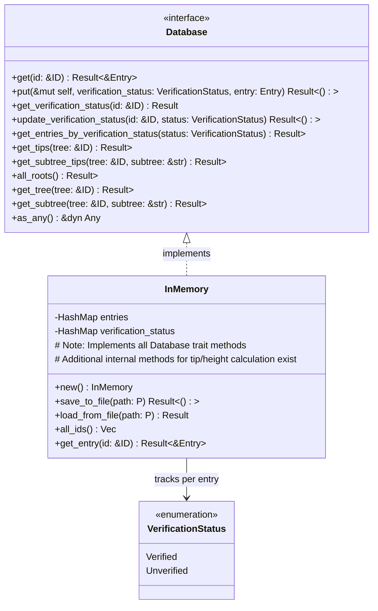

### Database Storage

The Database trait abstracts the underlying storage system, allowing for different storage implementations without changing the core database logic.

Currently, the only implementation is an `InMemory` database which stores entries in a `HashMap` along with their verification status. It includes functionality to save/load its state to/from a JSON file using `serde_json`.

**Entry Verification Status:**

The database now tracks verification status for each entry, supporting the authentication system:

- **`Verified`**: Entry has been cryptographically verified and authorized
- **`Unverified`**: Entry lacks authentication or failed verification (default for backward compatibility)
- Verification status is determined during entry commit based on signature validation and permission checking
- Status can be queried and updated independently of the entry content

**`InMemory` Persistence Format:**

- The `save_to_file` method serializes the entire `InMemory` struct (entries HashMap and verification_status HashMap) to a JSON string.
- The `load_from_file` method reads this JSON string and deserializes it back into an `InMemory` database.
- The format includes both entry data and their corresponding verification status for complete state preservation.

<!-- TODO: Add a section on how to implement a custom Database. -->

### Implementing a Custom Database

To create a custom storage database:

1.  Define a struct that will hold the backend's state (e.g., connection pools, file handles).
2.  Implement the [`Database`](../../src/backend/mod.rs) trait for your struct. This requires providing logic for all methods (`get`, `put`, `get_tips`, etc.) specific to your chosen storage.
3.  **Verification Status Support**: Implement verification status tracking methods to support authentication features.
4.  Ensure your struct implements `Send`, `Sync`, and `Any`.
5.  Consider performance implications, especially for graph traversal operations like `get_tips` and the topological sorting required by `get_tree`/`get_subtree`.
6.  Use your custom database when creating a `BaseDB` instance: `BaseDB::new(Box::new(MyCustomDatabase::new(...)))`.

Key Database features include:

- **Entry Storage**: Stores immutable entries with content-addressable IDs
- **Verification Status Tracking**: Associates authentication verification status with each entry
- **Tip Calculation**: Determines which entries are "tips" (have no children) in a tree or subtree
- **Height Calculation**: Computes topological heights for proper ordering of entries
- **Topological Sorting**: Orders entries based on their position in the DAG for consistent retrieval
