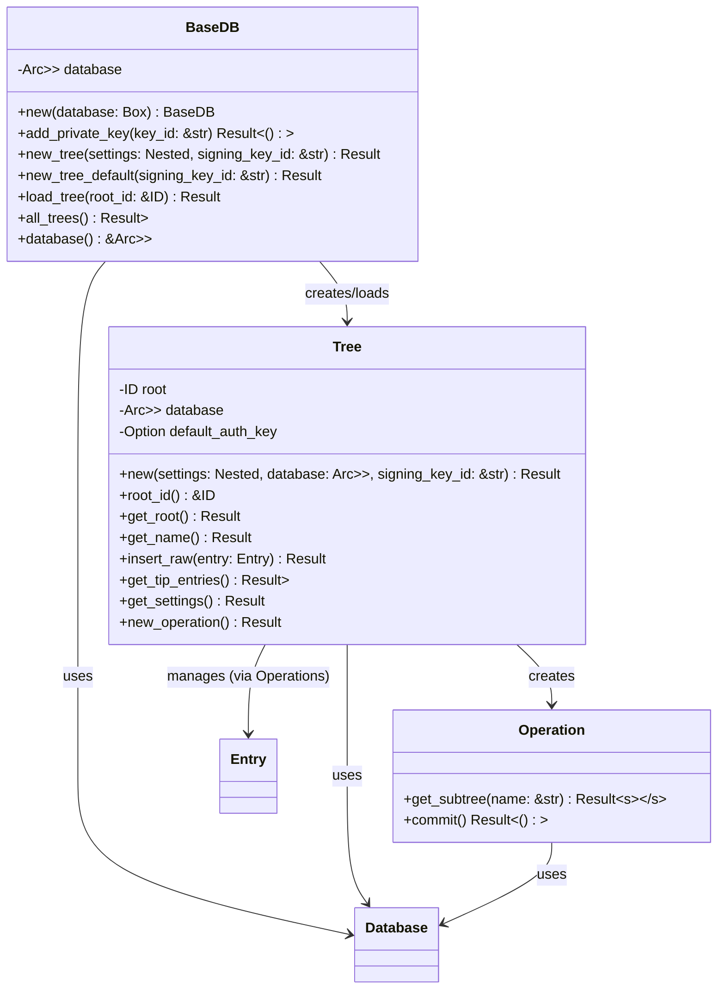

### BaseDB

BaseDB is the main database implementation that works with a database storage layer to store and retrieve entries. It manages trees, which are collections of related entries.

A `Tree` is analogous to a table in a traditional database. Each `Tree` is identified by its root `Entry`'s ID. The `new_tree` method uses `Nested` (a specific [CRDT implementation](crdt.md) for key-value data) for initial settings and requires a signing key ID for authentication. Alternatively, `new_tree_default()` creates a tree with empty default settings, also requiring authentication.

**Authentication**: All trees must be created with authentication. The `signing_key_id` parameter must reference a private key that has been added to the database via `add_private_key()`. This key becomes the tree's default authentication key for all operations.

**Tree Operations:** Interactions with a `Tree` (reading and writing data, especially subtrees) are typically performed through an `Operation` object obtained via `Tree::new_operation()`. This pattern facilitates atomic updates (multiple subtree changes within one commit) and provides access to typed [Subtree Implementations](subtrees.md). All operations are automatically authenticated using the tree's default signing key.

**Operation Lifecycle ([`AtomicOp`](../../src/atomicop.rs)):**

1.  **Creation (`Tree::new_operation()` -> `AtomicOp::new`):**
    - An `AtomicOp` is created, linked to the `Tree`.
    - An internal `Entry` is initialized to store changes.
    - The current tips of the main `Tree` are fetched and set as the `tree.parents` in the internal `Entry`.
2.  **Subtree Access (`AtomicOp::get_subtree<T>`):**
    - User requests a handle to a specific `SubTree` type (`T`) for a given `subtree_name`.
    - If accessed for the first time in this op, the current tips of that _specific subtree_ are fetched and set as `subtree_parents` in the internal `Entry`.
    - A `SubTree` handle (`T`) is returned, holding a reference to the `AtomicOp`.
3.  **Staging Changes (via `SubTree` handle methods):**
    - User calls methods on the `SubTree` handle (e.g., `KVStore::set`).
    - The handle serializes the data and calls `AtomicOp::update_subtree` internally.
    - `update_subtree` updates the `RawData` for the corresponding `SubTreeNode` within the `AtomicOp`'s internal `Entry`.
4.  **Commit (`AtomicOp::commit`):**
    - The operation takes ownership of the internal `Entry`.
    - Subtrees that were accessed but not modified (still have empty data) are removed.
    - The entry is cryptographically signed using the tree's default authentication key.
    - Authentication validation is performed to ensure the signing key has appropriate permissions.
    - The final `ID` of the internal `Entry` is calculated.
    - The finalized, authenticated `Entry` is `put` into the backend with `VerificationStatus::Verified`.
    - The new `Entry`'s `ID` is returned.
    - The `AtomicOp` is consumed.
