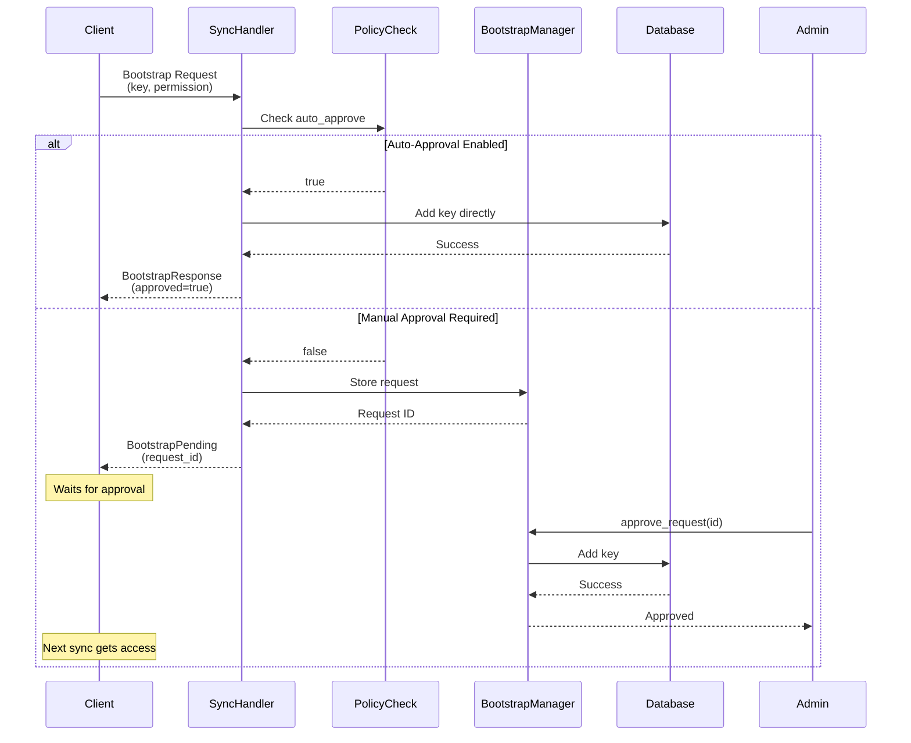

# Bootstrap System

Secure key management and access control for distributed Eidetica databases through a request-approval workflow integrated with the sync module.

## Architecture

### Storage Location

**Bootstrap Request Storage**: Requests are stored in the sync database (`_sync`), not target databases:

- Subtree: `bootstrap_requests`
- Structure: `Table<BootstrapRequest>` with UUID keys
- Persistence: Indefinite for audit trail purposes

**Policy Configuration**: Each database stores bootstrap policy in `_settings.auth.policy.bootstrap_auto_approve: bool` (default: `false`)

### Core Components

#### 1. Bootstrap Request Manager (`bootstrap_request_manager.rs`)

The `BootstrapRequestManager` handles storage and lifecycle of bootstrap requests within the sync database. Key responsibilities:

- **Request Storage**: Persists bootstrap requests as structured documents in the `bootstrap_requests` subtree
- **Status Tracking**: Manages request states (Pending, Approved, Rejected)
- **Request Retrieval**: Provides query APIs to list and filter requests

#### 2. Sync Handler Extensions

The `SyncHandlerImpl` processes bootstrap requests during sync operations:

- **Policy Evaluation**: Checks `_settings.auth.policy.bootstrap_auto_approve` flag
- **Auto-Approval**: Automatically adds keys when policy allows
- **Manual Queue**: Stores requests for manual review when auto-approval is disabled
- **Response Generation**: Returns appropriate sync responses (BootstrapPending, BootstrapResponse)

#### 3. Sync Module Public API (`sync/mod.rs`)

Request management methods on the `Sync` struct:

| Method                               | Description                     | Returns                              |
| ------------------------------------ | ------------------------------- | ------------------------------------ |
| `pending_bootstrap_requests()`       | Query pending requests          | `Vec<(String, BootstrapRequest)>`    |
| `approved_bootstrap_requests()`      | Query approved requests         | `Vec<(String, BootstrapRequest)>`    |
| `rejected_bootstrap_requests()`      | Query rejected requests         | `Vec<(String, BootstrapRequest)>`    |
| `get_bootstrap_request(id)`          | Retrieve specific request       | `Option<(String, BootstrapRequest)>` |
| `approve_bootstrap_request(id, key)` | Approve and add key to database | `Result<()>`                         |
| `reject_bootstrap_request(id, key)`  | Reject without adding key       | `Result<()>`                         |

### Data Flow



## Data Structures

### BootstrapRequest

Stored in sync database's `bootstrap_requests` subtree using `Table<BootstrapRequest>`.

**Key Structure**: Request ID (UUID string) is the table key, not a struct field.

<!-- Code block ignored: Internal data structure definition not meant for compilation -->

```rust,ignore
pub struct BootstrapRequest {
    /// Target database/tree ID
    pub tree_id: ID,

    /// Public key of requesting device (ed25519:...)
    pub requesting_pubkey: String,

    /// Key name for the requesting device
    pub requesting_key_name: String,

    /// Permission level requested (Admin, Write, Read)
    pub requested_permission: Permission,

    /// ISO 8601 timestamp of request
    pub timestamp: String,

    /// Current processing status
    pub status: RequestStatus,

    /// Network address for future notifications
    pub peer_address: Address,
}
```

### RequestStatus Enum

```rust,ignore
pub enum RequestStatus {
    Pending,
    Approved {
        approved_by: String,
        approval_time: String,
    },
    Rejected {
        rejected_by: String,
        rejection_time: String,
    },
}
```

## Implementation Details

### Request Lifecycle

#### 1. Request Creation

When a client attempts bootstrap with authentication:

- Sync handler checks if tree exists
- Evaluates bootstrap policy in database settings
- If auto-approval disabled, creates bootstrap request
- Stores request in sync database's `bootstrap_requests` subtree

#### 2. Manual Review

Admin query operations:

- `pending_bootstrap_requests()` - Filter by status enum discriminant
- `get_bootstrap_request(id)` - Direct table lookup
- Decision criteria: pubkey, permission level, timestamp, out-of-band verification

#### 3. Approval Process

When approving a request:

1. Load request from sync database
2. Validate request is still pending
3. Create transaction on target database
4. Add requesting key with specified permissions
5. Update request status to "Approved"
6. Record approver and timestamp

#### 4. Rejection Process

When rejecting a request:

1. Load request from sync database
2. Validate request is still pending
3. Update status to "Rejected"
4. Record rejector and timestamp
5. No keys added to target database

### Authentication Integration

**Key Addition Flow** (`handler.rs:add_key_to_database`):

1. Load target database via `Database::new_from_id()`
2. Create transaction with device key auth
3. Get `SettingsStore` and `AuthSettings`
4. Create `AuthKey::active()` with requested permission
5. Call `settings_store.set_auth_key()`
6. Commit transaction

**Policy Check** (`handler.rs:is_bootstrap_auto_approve_allowed`):

1. Load database settings via `SettingsStore`
2. Navigate to `auth.policy.bootstrap_auto_approve`
3. Read as JSON bool (defaults to `false`)

### Audit Trail

Request immutability provides forensic capability:

- Original request parameters preserved
- Approval/rejection metadata includes actor and timestamp
- Complete history of all bootstrap attempts maintained

### Concurrency and Persistence

**Persistence**: No automatic cleanup - requests remain indefinitely for audit trail

**Concurrency**:

- Multiple pending requests per database supported
- UUID keys prevent ID conflicts
- Status transitions use standard CRDT merge semantics

**Duplicate Detection**: Not currently implemented - identical requests from same client create separate entries. Future enhancement may consolidate by (tree_id, pubkey) tuple.

### Error Handling

Key error scenarios:

- `RequestNotFound`: Invalid request ID
- `RequestAlreadyExists`: Duplicate request ID
- `InvalidRequestState`: Request not in expected state
- `InsufficientPermissions`: Approver lacks required permissions
