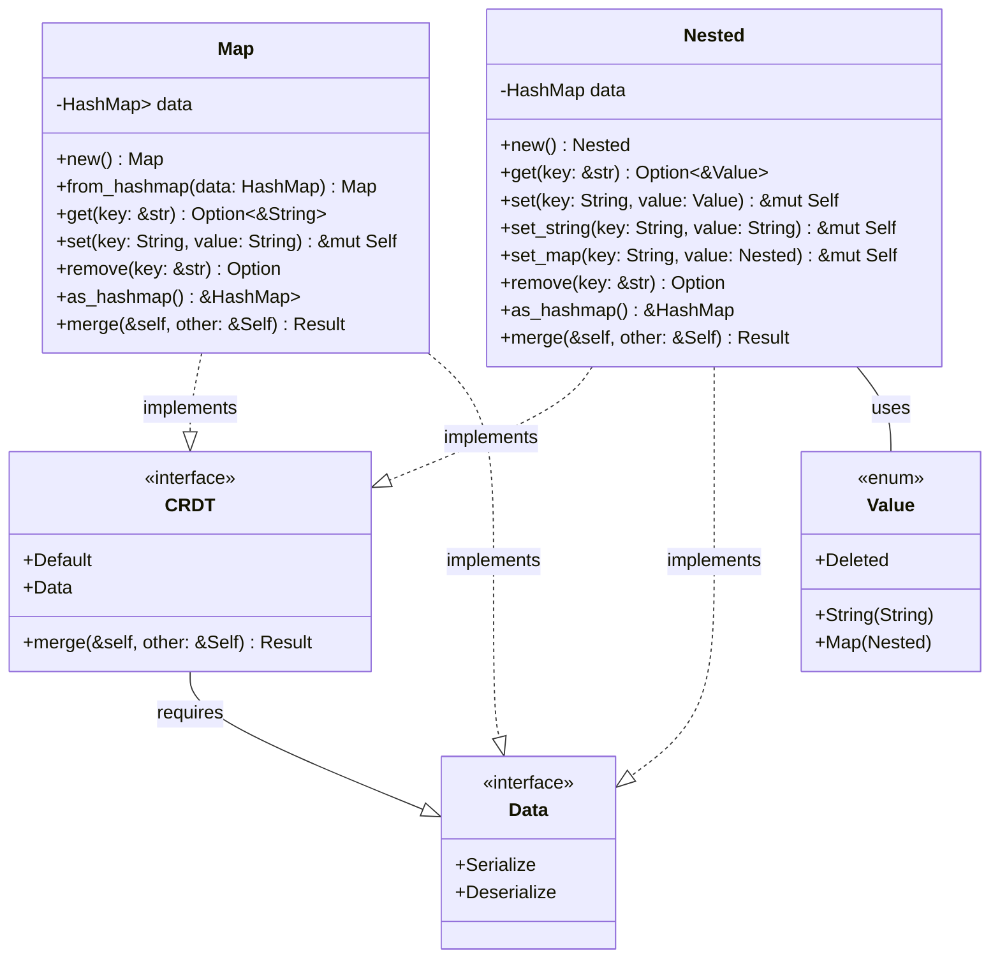

### CRDT Implementation

Eidetica includes a trait-based system for Conflict-free Replicated Data Types (CRDTs) that enables conflict resolution. These are typically accessed via [`Operation::get_subtree`](basedb_tree.md) similarly to [`RowStore`](subtrees.md), but implement the `CRDT` trait for merge capabilities.

The goal is to support [Merkle-CRDT principles](../crdt_principles.md) where the CRDT state is stored within an [Entry's](entry.md) `RawData` and can be deterministically merged.



- **CRDT Trait**: Defines a `merge` operation for resolving conflicts between divergent states. Implementors must also implement `Serialize`, `Deserialize`, and `Default`.

- **Map**: A simple key-value CRDT implementation using a last-write-wins strategy:

  - Uses a `HashMap<String, Option<String>>` to store data
  - Supports tombstones via `Option<String>` values where `None` represents a deleted key
  - `get()` returns only non-tombstone values, while `as_hashmap()` returns all keys including tombstones
  - `remove()` doesn't actually remove keys but sets them to `None` (a tombstone) to track deletions
  - During merge, if a key exists in both CRDTs, the `other` value always wins (last-write-wins)
  - Tombstones are preserved during merges to ensure proper deletion propagation

- **Nested**: A nested key-value CRDT implementation:

  - Supports arbitrary nesting of maps and string values via the `Value` enum
  - `Value` can be a `String`, another `Nested` map, or `Deleted` (tombstone)
  - Implements recursive merging for nested maps
  - Provides specific methods for setting string values (`set_string`) and map values (`set_map`)
  - Uses tombstones (`Value::Deleted`) to track deletions
  - During merges, if a key exists in both CRDTs:
    - If both have maps at that key, the maps are recursively merged
    - If types differ (map vs string) or one side has a tombstone, the `other` side's value wins
    - Tombstones are preserved during merges

- **Serialization**: CRDTs implementing the trait are serialized to/from JSON (by default) for storage in `Entry`'s `RawData`.
- **Multiple CRDT Support**: The design allows for different CRDT types (each implementing the `CRDT` trait) to be used for different subtrees within the same `Tree`.

### Implementing a Custom CRDT

To add a new CRDT type:

1.  Define your CRDT struct (e.g., `struct MySet { items: HashSet<String> }`).
2.  Implement `Default`, `serde::Serialize`, `serde::Deserialize` for your struct.
3.  Implement the marker trait: `impl Data for MySet {}`.
4.  Implement the `CRDT` trait:
    ```rust
    impl CRDT for MySet {
        fn merge(&self, other: &Self) -> Result<Self> {
            // Implement your deterministic merge logic here
            let merged_items = self.items.union(&other.items).cloned().collect();
            Ok(MySet { items: merged_items })
        }
    }
    ```
5.  **(Optional but Recommended)** Create a corresponding `SubTree` handle (e.g., `MySetHandle`) that implements the `SubTree` trait. This handle provides a user-friendly API and interacts with `AtomicOp` (`get_local_data`, `get_full_state`, `update_subtree`) to manage the CRDT state during operations.

### Using Tombstones

Tombstones are an important concept in CRDTs to ensure proper deletion propagation across distributed systems:

1. Instead of physically removing data, we mark it as deleted with a tombstone
2. Tombstones are retained and synchronized between replicas
3. This ensures that a deletion in one replica eventually propagates to all replicas
4. Both `Map` and `Nested` use tombstones to represent deleted entries

### CRDT Merge Algorithm Implementation

Eidetica uses a **recursive LCA-based merge algorithm** to compute CRDT states efficiently:

#### State Computation Process

When `AtomicOp::get_full_state<T>()` is called for a subtree:

1. **Parent Resolution**: Identifies parent entries (tips) for the subtree
2. **LCA-Based Computation**: If multiple parents, finds their LCA and computes state from there
3. **Path Merging**: Merges all entries from LCA to each parent tip into the LCA state

#### Individual Entry State Computation

Each entry's CRDT state is computed via `compute_single_entry_state_recursive()`:

```rust
fn compute_single_entry_state_recursive<T>(&self, subtree_name: &str, entry_id: &str) -> Result<T>
where T: CRDT + Clone
{
    // 1. Check cache first
    if let Some(cached_state) = backend.get_cached_crdt_state(entry_id, subtree_name)? {
        return Ok(serde_json::from_str(&cached_state)?);
    }

    // 2. Get LCA state recursively
    let lca_state = match parents.len() {
        0 => T::default(),                              // Root entry
        1 => self.compute_single_entry_state_recursive(subtree_name, &parents[0])?, // Single parent
        _ => {
            let lca_id = backend.find_lca(tree_root, subtree_name, &parents)?;
            self.compute_single_entry_state_recursive(subtree_name, &lca_id)?  // Multiple parents
        }
    };

    // 3. Merge all paths from LCA to all parents (deduplicated and sorted)
    let path_entries = backend.get_path_from_to(tree_root, subtree_name, &lca_id, &parents)?;
    let result = self.merge_path_entries(subtree_name, lca_state, &path_entries)?;

    // 4. Cache and return
    backend.cache_crdt_state(entry_id, subtree_name, serde_json::to_string(&result)?)?;
    Ok(result)
}
```

#### Caching Integration

- **Cache Keys**: `(Entry_ID, Subtree)` uniquely identify computed states
- **Automatic Caching**: Every computed state is automatically cached after calculation
- **Cache Validity**: Immutable entries ensure cached states never become invalid
- **Performance**: Dramatic performance improvement for repeated access patterns

#### Backend Methods

The algorithm relies on new backend methods:

- `find_lca()`: Finds Lowest Common Ancestor of multiple entries
- `get_path_from_to()`: Gets all entries from LCA to multiple target entries (deduplicated and sorted)
- `get_cached_crdt_state()`: Retrieves cached CRDT state if available
- `cache_crdt_state()`: Stores computed CRDT state for future use
- `clear_crdt_cache()`: Clears cache when needed (e.g., during testing)

This implementation ensures that CRDT merge operations are both **correct** (proper LCA-based computation) and **efficient** (automatic caching eliminates redundant work).
