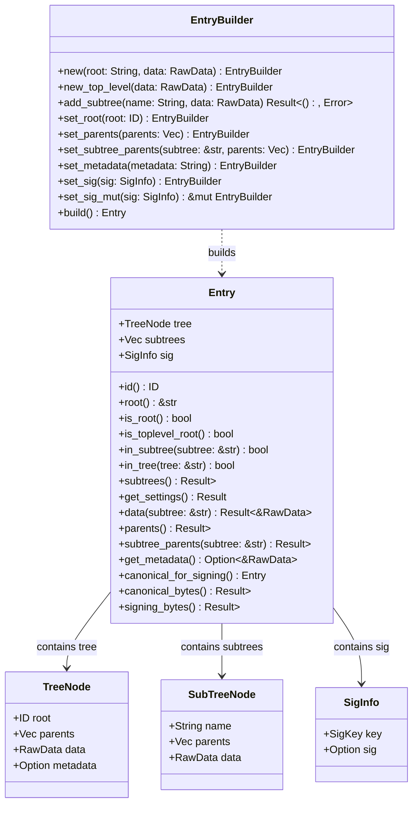

### Entry

Entries are the fundamental unit of data in Eidetica. Once created, an `Entry` is immutable. Entries are constructed using the `EntryBuilder`. Each entry contains:

- **Tree**: Contains the root ID, parent references, tree metadata, and optional entry metadata
- **Subtrees**: Vector of named subtrees (equivalent to tables), each with their own parents and data
- **Authentication**: Contains authentication information including key ID and cryptographic signature

Entries are identified by their **ID**: A unique content-addressable identifier.

The entry structure enables efficient validation of data integrity and forms the basis of the Merkle tree structure.

#### ID Type

The `ID` type is implemented as a newtype wrapper around `String` for simplicity and efficiency:

- **Simple and efficient**: Uses `String` for direct storage and manipulation without reference counting overhead
- **Ergonomic**: Supports automatic conversion from `&str` and `String` with `.into()`
- **Content-addressable**: Each ID is a hex-encoded SHA-256 hash ensuring uniqueness and integrity
- **Thread safe**: Can be safely shared across threads when needed

#### Entry Metadata

Entries may contain optional metadata that is not part of the main data model and is not merged between entries. This metadata is used to improve operation efficiency and for experimentation purposes.

Currently, entries that don't modify the reserved `_settings` subtree (identified by `constants::SETTINGS`) include metadata containing references to the current settings subtree tips. This allows for efficient verification of settings in sparse checkout scenarios without requiring traversal of the entire history graph.

#### Authentication Integration

All entries require authentication information that specifies which key was used to sign the entry. The authentication system is tightly integrated with the Entry structure to ensure every entry can be validated against the current authentication configuration stored in `_settings.auth`.

- **`RawData`**: Defined as `type RawData = String;`. It holds serialized data (typically intended to be JSON, but not enforced) provided by the user.
- **CRDT Handling**: While the design aims for CRDT principles, the `Entry` itself stores serialized data as `RawData`. Specific CRDT logic (like merging) is handled by types that implement the `CRDT` trait (e.g., `Map` used for settings in `BaseDB`), which are then serialized into/deserialized from `RawData`. This data is provided to the `EntryBuilder` during construction.
- **ID Type and Generation**: Entry IDs are represented as a `String` type for simplicity and efficiency. IDs are deterministic based upon the data stored in `Entry`. The entire `Entry` struct (including the `tree: TreeNode` and `subtrees: Vec<SubTreeNode>`) is serialized to a JSON string using `serde_json`. Before serialization, the `parents` vectors within `tree` and each `SubTreeNode`, along with the `subtrees` vector itself (all configured via the `EntryBuilder`), are sorted alphabetically. This ensures the JSON string is canonical regardless of insertion order. The canonical JSON string is then hashed using SHA-256, and the resulting hash bytes are formatted as a hexadecimal string to produce the final `ID`. See [`EntryBuilder::build()`](../../src/entry.rs) and [`Entry::id()`](../../src/entry.rs) (you might need to adjust the link paths based on your source layout).
- **Parent References**: Each entry maintains parent references (`Vec<ID>`) for both the main tree (`tree.parents`) and optionally for each subtree (`SubTreeNode::parents`). These are set using the `EntryBuilder` (e.g., `EntryBuilder::set_parents()`, `EntryBuilder::set_subtree_parents()`) before the `Entry` is built. These lists are always kept sorted alphabetically by the builder. When a new entry is typically created (e.g., via an `AtomicOp` commit, which uses an `EntryBuilder`), the parents are usually set to the ID(s) of the current tip(s) of the tree/subtree being modified. This forms the links in the DAG.
- **Authentication**: Each entry contains `SigInfo` with an authentication key reference and optional signature. The signature is computed over the canonical bytes of the entry (without the signature field). Authentication validation occurs during entry processing and verifies both the signature and that the signing key has appropriate permissions for the operation.
