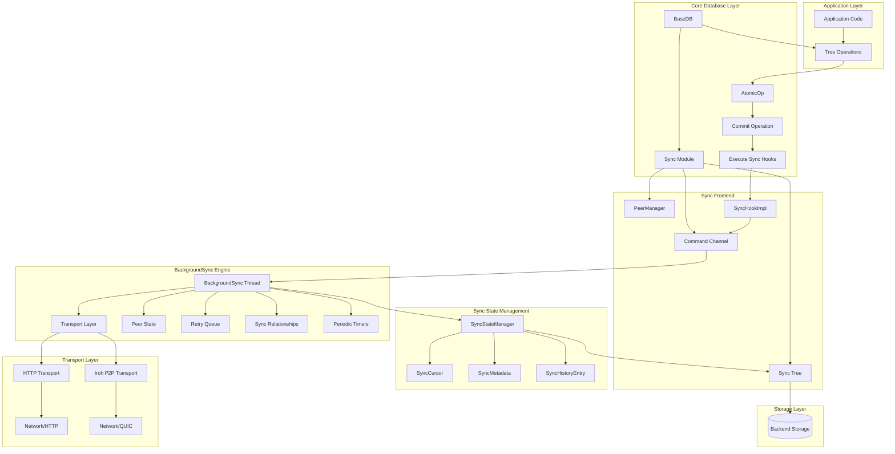
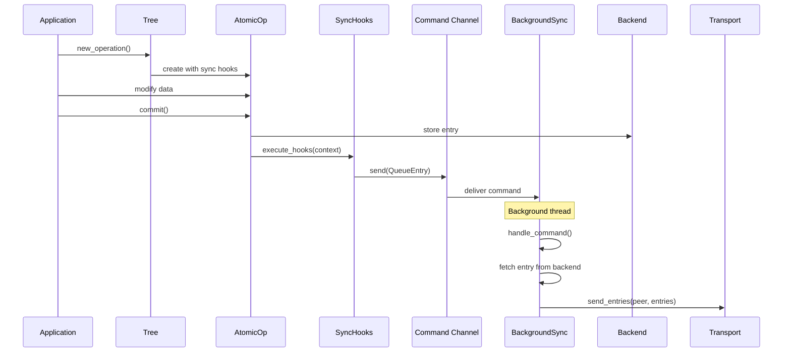
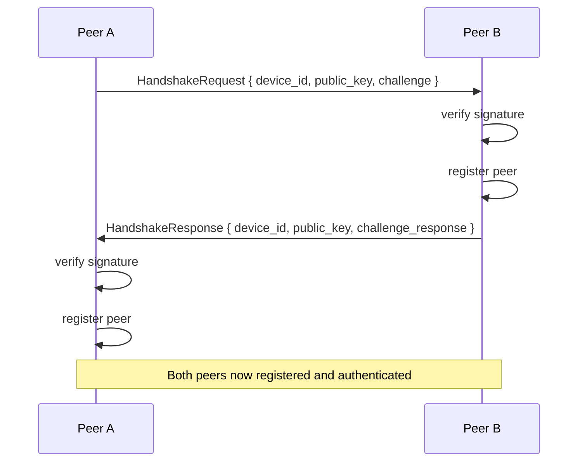

# Synchronization Architecture

This document describes the internal architecture of Eidetica's synchronization system, including design decisions, data structures, and implementation details.

## Architecture Overview

The synchronization system uses a **BackgroundSync architecture** with command-pattern communication:

1. **Single background thread** handling all sync operations
2. **Command channel communication** between frontend and background
3. **Merkle-CRDT** synchronization for conflict-free replication
4. **Modular transport layer** supporting HTTP and Iroh P2P protocols
5. **Hook-based change detection** for automatic sync triggering
6. **Persistent state tracking** in sync tree using DocStore



## Core Components

### 1. Sync Module (`sync/mod.rs`)

The main `Sync` struct is now a **thin frontend** that communicates with a background sync engine:

```rust,ignore
pub struct Sync {
    /// Communication channel to the background sync engine
    command_tx: mpsc::Sender<SyncCommand>,
    /// The backend for read operations and tree management
    backend: Arc<dyn Database>,
    /// The tree containing synchronization settings
    sync_tree: Tree,
    /// Track if transport has been enabled
    transport_enabled: bool,
}
```

**Key responsibilities:**

- Provides public API methods
- Sends commands to background thread
- Manages sync tree for peer/relationship storage
- Creates hooks that send commands to background

### 2. BackgroundSync Engine (`sync/background.rs`)

The `BackgroundSync` struct **owns all sync state** and handles operations in a single background thread:

```rust,ignore
pub struct BackgroundSync {
    // Core components - owns everything
    transport: Box<dyn SyncTransport>,
    backend: Arc<dyn Database>,

    // Server state
    server_address: Option<String>,

    // State management - simple, not Arc/RwLock
    peers: HashMap<String, PeerInfo>,
    relationships: HashMap<String, SyncRelationship>,

    // Retry queue for failed sends
    retry_queue: Vec<RetryEntry>,

    // Communication
    command_rx: mpsc::Receiver<SyncCommand>,
}
```

**Command types:**

```rust,ignore
pub enum SyncCommand {
    // Entry operations
    SendEntries { peer: String, entries: Vec<Entry> },
    QueueEntry { peer: String, entry_id: ID, tree_id: ID },

    // Peer management
    AddPeer { peer: PeerInfo },
    RemovePeer { pubkey: String },

    // Relationship management
    CreateRelationship { peer_pubkey: String, tree_id: ID },
    RemoveRelationship { peer_pubkey: String, tree_id: ID },

    // Server operations (with response channels)
    StartServer { addr: String, response: oneshot::Sender<Result<()>> },
    StopServer { response: oneshot::Sender<Result<()>> },

    // Peer operations
    ConnectToPeer { address: Address, response: oneshot::Sender<Result<String>> },
    SendRequest { address: Address, request: SyncRequest, response: oneshot::Sender<Result<SyncResponse>> },

    // Control
    SyncWithPeer { peer: String },
    Shutdown,
}
```

**Event loop architecture:**

The BackgroundSync engine runs a tokio select loop that handles:

1. **Command processing:** Immediate handling of frontend commands
2. **Periodic sync:** Every 5 minutes, sync with all registered peers
3. **Retry processing:** Every 30 seconds, attempt to resend failed entries
4. **Connection checks:** Every 60 seconds, verify peer connectivity

All operations are non-blocking and handled concurrently within the single background thread.

**Server initialization:**

When starting a server, BackgroundSync creates a `SyncHandlerImpl` with database access:

```rust,ignore
// Inside handle_start_server()
let handler = Arc::new(SyncHandlerImpl::new(
    self.backend.clone(),
    DEVICE_KEY_NAME,
));
self.transport.start_server(addr, handler).await?;
```

This enables the transport layer to process incoming sync requests and store received entries.

### 3. Command Pattern Benefits

The command pattern architecture eliminates circular dependencies and provides:

- **Clean separation**: Frontend and background have distinct responsibilities
- **Async handling**: All sync operations happen asynchronously
- **Fire-and-forget**: Most operations don't need response handling
- **Request-response**: Operations needing responses use oneshot channels
- **Graceful shutdown**: Clean startup/shutdown in both async and sync contexts

### 4. Change Detection Hooks (`sync/hooks.rs`)

The hook system automatically detects when entries need synchronization:

```rust,ignore
pub trait SyncHook: Send + Sync {
    fn on_entry_committed(&self, context: &SyncHookContext) -> Result<()>;
}

pub struct SyncHookContext {
    pub tree_id: ID,
    pub entry: Entry,
    pub is_root_entry: bool,
}
```

**Integration flow:**

1. AtomicOp detects entry commit
2. Executes registered sync hooks with entry context
3. SyncHookImpl creates QueueEntry command
4. Command sent to BackgroundSync via channel
5. Background thread fetches and sends entry immediately

The hook implementation is per-peer, allowing targeted synchronization. Commands are fire-and-forget to avoid blocking the commit operation.

### 5. Peer Management (`sync/peer_manager.rs`)

The `PeerManager` handles peer registration and relationship management:

```rust,ignore
impl PeerManager {
    /// Register a new peer
    pub fn register_peer(&self, pubkey: &str, display_name: Option<&str>) -> Result<()>;

    /// Add tree sync relationship
    pub fn add_tree_sync(&self, peer_pubkey: &str, tree_root_id: &str) -> Result<()>;

    /// Get peers that sync a specific tree
    pub fn get_tree_peers(&self, tree_root_id: &str) -> Result<Vec<String>>;
}
```

**Data storage:**

- Peers stored in `peers.{pubkey}` paths in sync tree
- Tree relationships in `peers.{pubkey}.sync_trees` arrays
- Addresses in `peers.{pubkey}.addresses` arrays

### 6. Sync State Tracking (`sync/state.rs`)

Persistent state tracking for synchronization progress:

```rust,ignore
pub struct SyncCursor {
    pub peer_pubkey: String,
    pub tree_id: ID,
    pub last_synced_entry: Option<ID>,
    pub last_sync_time: String,
    pub total_synced_count: u64,
}

pub struct SyncMetadata {
    pub peer_pubkey: String,
    pub successful_sync_count: u64,
    pub failed_sync_count: u64,
    pub total_entries_synced: u64,
    pub average_sync_duration_ms: f64,
}
```

**Storage organization:**

```text
sync_state/
├── cursors/{peer_pubkey}/{tree_id}     -> SyncCursor
├── metadata/{peer_pubkey}              -> SyncMetadata
└── history/{sync_id}                   -> SyncHistoryEntry
```

### 7. Transport Layer (`sync/transports/`)

Modular transport system supporting multiple protocols with **SyncHandler architecture**:

```rust,ignore
pub trait SyncTransport: Send + Sync {
    /// Start server with handler for processing requests
    async fn start_server(&mut self, addr: &str, handler: Arc<dyn SyncHandler>) -> Result<()>;

    /// Send entries to peer
    async fn send_entries(&self, address: &Address, entries: &[Entry]) -> Result<()>;

    /// Send sync request and get response
    async fn send_request(&self, address: &Address, request: &SyncRequest) -> Result<SyncResponse>;
}
```

**SyncHandler Architecture:**

The transport layer uses a callback-based handler pattern to enable database access:

```rust,ignore
pub trait SyncHandler: Send + Sync {
    /// Handle incoming sync requests with database access
    async fn handle_request(&self, request: &SyncRequest) -> SyncResponse;
}
```

This architecture solves the fundamental problem of received data storage by:

- Providing database backend access to transport servers
- Enabling stateful request processing (GetTips, GetEntries, SendEntries)
- Maintaining clean separation between networking and sync logic
- Supporting both HTTP and Iroh transports with identical handler interface

**HTTP Transport:**

- REST API endpoint at `/api/v0` for sync operations
- JSON serialization for wire format
- Axum-based server with handler state injection
- Standard HTTP error codes

**Iroh P2P Transport:**

- QUIC-based direct peer connections with handler integration
- Built-in NAT traversal
- Efficient binary protocol with JsonHandler serialization
- Bidirectional streams for request/response pattern

## Data Flow

### 1. Entry Commit Flow



### 2. BackgroundSync Processing

The background thread processes commands immediately upon receipt:

- **SendEntries:** Transmit entries to peer, retry on failure
- **QueueEntry:** Fetch entry from backend and send immediately
- **SyncWithPeer:** Initiate bidirectional synchronization
- **AddPeer/RemovePeer:** Update peer registry
- **CreateRelationship:** Establish tree-peer sync mapping
- **Server operations:** Start/stop transport server

Failed operations are automatically added to the retry queue with exponential backoff timing.

### 3. Handshake Protocol

Peer connection establishment:



## Performance Characteristics

### Memory Usage

**BackgroundSync state:** Minimal memory footprint

- Single background thread with owned state
- Retry queue: O(n) where n = failed entries pending retry
- Peer state: ~1KB per registered peer
- Relationships: ~100 bytes per peer-tree relationship

**Persistent state:** Stored in sync tree

- Sync cursors: ~200 bytes per peer-tree relationship
- Metadata: ~500 bytes per peer
- History: ~300 bytes per sync operation (with cleanup)
- Sent entries tracking: ~50 bytes per entry-peer pair

### Network Efficiency

**Immediate processing:**

- Commands processed as received (no batching delay)
- Failed sends added to retry queue with exponential backoff
- Automatic compression in transport layer

**Background timers:**

- Periodic sync: Every 5 minutes (configurable)
- Retry processing: Every 30 seconds
- Connection checks: Every 60 seconds

### Concurrency

**Single-threaded design:**

- One background thread handles all sync operations
- No lock contention or race conditions
- Commands queued via channel (non-blocking)

**Async integration:**

- Tokio-based event loop
- Non-blocking transport operations
- Works in both async and sync contexts

## Architecture Benefits

### Command Pattern Advantages

**Clean separation of concerns:**

- Frontend handles API and tree management
- Background owns transport and sync state
- No circular dependencies

**Flexible communication:**

- Fire-and-forget for most operations
- Request-response with oneshot channels when needed
- Graceful degradation if channel full

### Reliability Features

**Retry mechanism:**

- Automatic retry queue for failed operations
- Exponential backoff prevents network flooding
- Configurable maximum retry attempts
- Per-entry failure tracking

**State persistence:**

- Sync state stored in database via DocStore subtree
- Tracks sent entries to prevent duplicates
- Survives restarts and crashes
- Provides complete audit trail of sync operations

**Handshake security:**

- Ed25519 signature verification
- Challenge-response protocol prevents replay attacks
- Device key management integrated with backend
- Mutual authentication between peers

## Error Handling

### Retry Queue Management

The BackgroundSync engine maintains a retry queue for failed send operations:

- **Exponential backoff:** 2^attempts seconds delay (max 64 seconds)
- **Attempt tracking:** Failed sends increment attempt counter
- **Maximum retries:** Entries dropped after configurable max attempts
- **Periodic processing:** Retry timer checks queue every 30 seconds

Each retry entry tracks the peer, entries to send, attempt count, and last attempt timestamp.

### Transport Error Handling

- **Network failures:** Added to retry queue with exponential backoff
- **Protocol errors:** Logged and skipped
- **Peer unavailable:** Entries remain in retry queue

### State Consistency

- **Command channel full:** Commands dropped (fire-and-forget)
- **Hook failures:** Don't prevent commit, logged as warnings
- **Transport errors:** Don't affect local data integrity

## Testing Architecture

### Current Test Coverage

The sync module maintains comprehensive test coverage across multiple test suites:

**Unit Tests (6 passing):**

- Hook collection execution and error handling
- Sync cursor and metadata operations
- State manager functionality

**Integration Tests (78 passing):**

- Basic sync operations and persistence
- HTTP and Iroh transport lifecycles
- Peer management and relationships
- DAG synchronization algorithms
- Protocol handshake and authentication
- Bidirectional sync flows
- Transport polymorphism and isolation

### Test Categories

**Transport Tests:**

- Server lifecycle management for both HTTP and Iroh
- Client-server communication patterns
- Error handling and recovery
- Address management and peer discovery

**Protocol Tests:**

- Handshake with signature verification
- Version compatibility checking
- Request/response message handling
- Entry synchronization protocols

**DAG Sync Tests:**

- Linear chain synchronization
- Branching structure handling
- Partial overlap resolution
- Bidirectional sync flows

## Implementation Status

### Completed Features ✅

**Architecture:**

- BackgroundSync engine with command pattern
- Single background thread ownership model
- Channel-based frontend/backend communication
- Automatic runtime detection (async/sync contexts)

**Core Functionality:**

- HTTP and Iroh transport implementations with SyncHandler architecture
- SyncHandler trait enabling database access in transport layer
- Full protocol support (GetTips, GetEntries, SendEntries)
- Ed25519 handshake protocol with signatures
- Persistent sync state via DocStore
- Per-peer sync hook creation
- Retry queue with exponential backoff
- Periodic sync timers (5 min intervals)

**State Management:**

- Sync relationships tracking
- Peer registration and management
- Transport address handling
- Server lifecycle control

### In Progress 🔄

**High Priority:**

- Complete bidirectional sync algorithm in `sync_with_peer()`
- Implement full retry queue processing logic

**Medium Priority:**

- Device ID management (currently hardcoded)
- Connection health monitoring
- Update remaining test modules for new architecture

### Future Enhancements 📋

**Performance:**

- Entry batching for large sync operations
- Compression for network transfers
- Bandwidth throttling controls
- Connection pooling

**Reliability:**

- Circuit breaker for problematic peers
- Advanced retry strategies
- Connection state tracking
- Automatic reconnection logic

**Monitoring:**

- Sync metrics collection
- Health check endpoints
- Performance dashboards
- Sync status visualization
