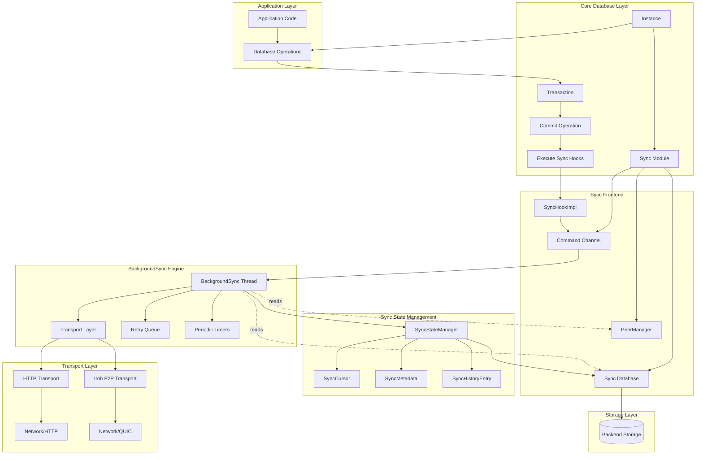
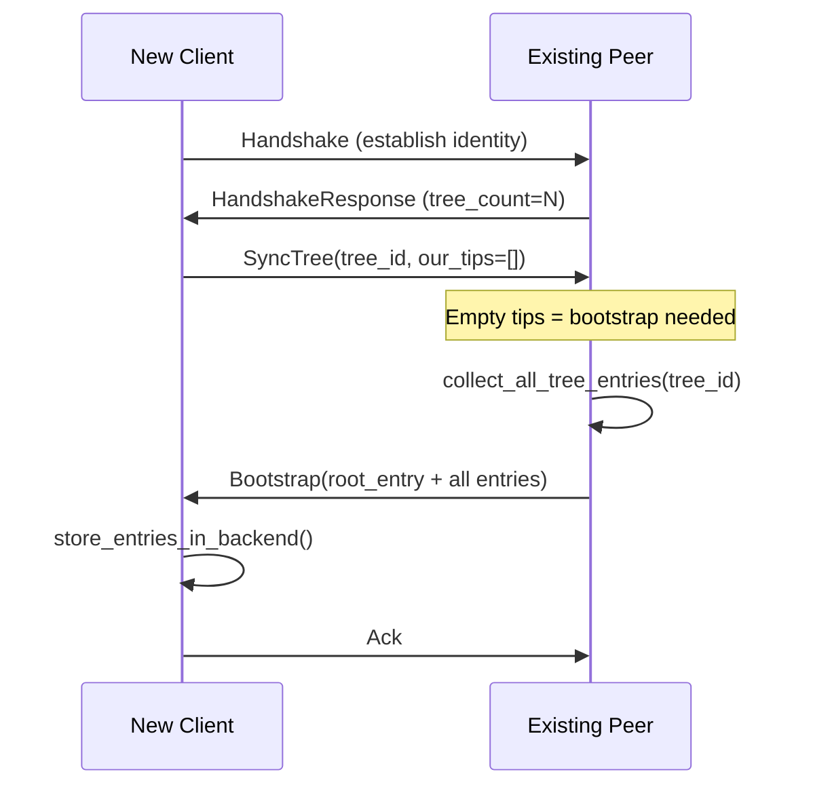
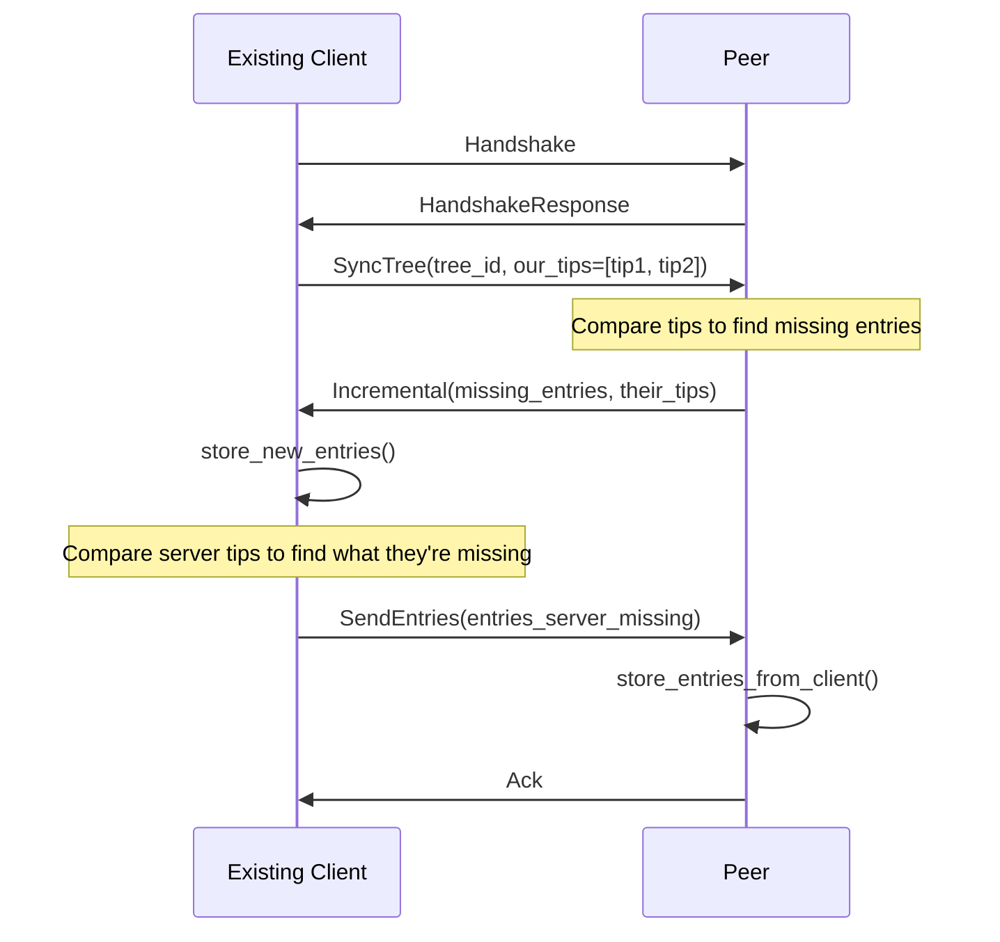
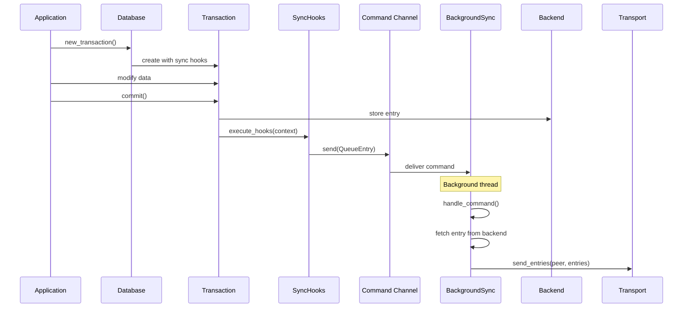
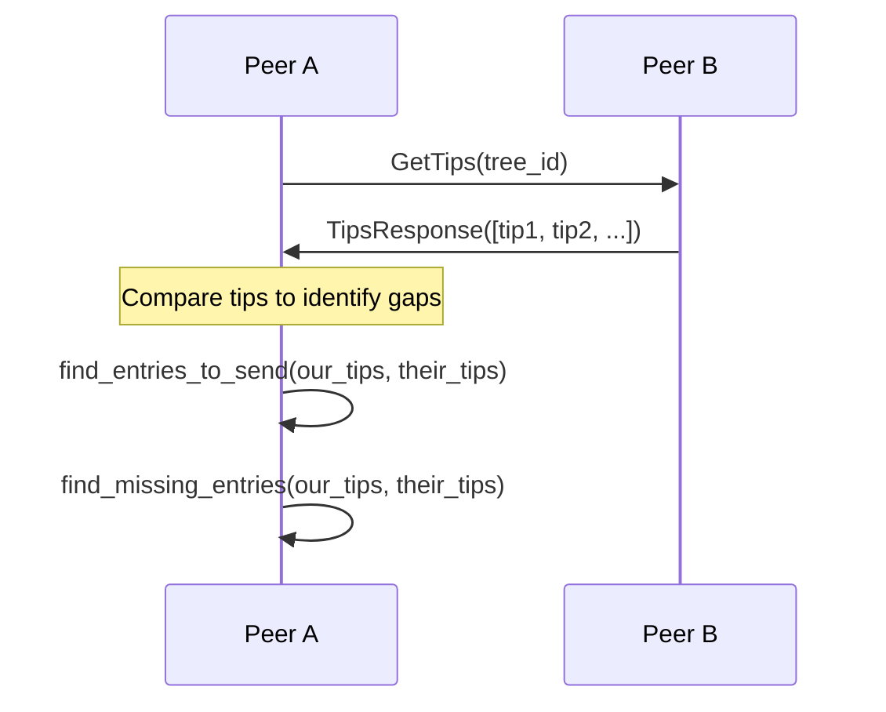
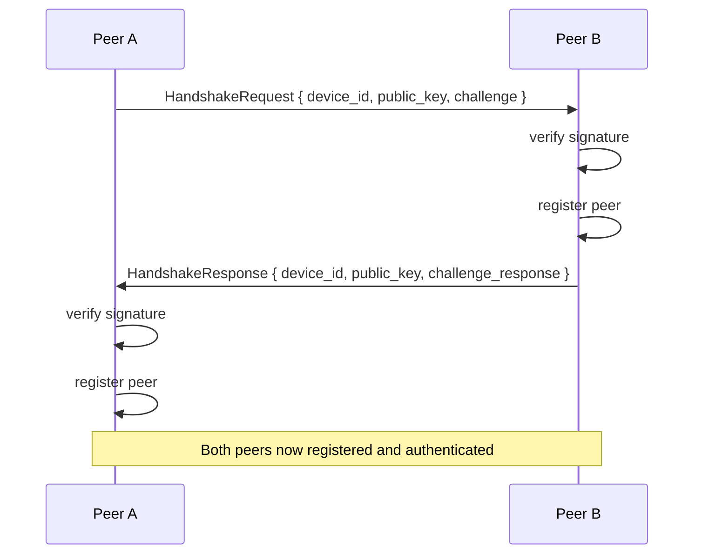
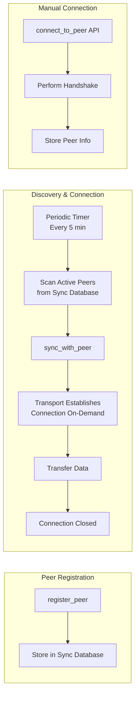

# Synchronization Architecture

This document describes the internal architecture of Eidetica's synchronization system, including design decisions, data structures, and implementation details.

## Architecture Overview

The synchronization system uses a **BackgroundSync architecture** with command-pattern communication:

1. **Single background thread** handling all sync operations
2. **Command channel communication** between frontend and background
3. **Merkle-CRDT** synchronization for conflict-free replication
4. **Modular transport layer** supporting HTTP and Iroh P2P protocols
5. **Hook-based change detection** for automatic sync triggering
6. **Persistent state tracking** in sync database using DocStore



## Core Components

### 1. Sync Module (`sync/mod.rs`)

The main `Sync` struct is now a **thin frontend** that communicates with a background sync engine:

```rust,ignore
pub struct Sync {
    /// Communication channel to the background sync engine
    command_tx: mpsc::Sender<SyncCommand>,
    /// The backend for read operations and database management
    backend: Arc<dyn Database>,
    /// The database containing synchronization settings
    sync_tree: Database,
    /// Track if transport has been enabled
    transport_enabled: bool,
}
```

**Key responsibilities:**

- Provides public API methods
- Sends commands to background thread
- Manages sync database for peer/relationship storage
- Creates hooks that send commands to background

### 2. BackgroundSync Engine (`sync/background.rs`)

The `BackgroundSync` struct handles all sync operations in a single background thread and **accesses peer state directly from the sync database**:

```rust,ignore
pub struct BackgroundSync {
    // Core components
    transport: Box<dyn SyncTransport>,
    backend: Arc<dyn Database>,

    // Reference to sync database for peer/relationship management
    sync_tree_id: ID,

    // Server state
    server_address: Option<String>,

    // Retry queue for failed sends
    retry_queue: Vec<RetryEntry>,

    // Communication
    command_rx: mpsc::Receiver<SyncCommand>,
}
```

BackgroundSync accesses peer and relationship data directly from the sync database:

- All peer data is stored persistently in the sync database via `PeerManager`
- Peer information is read on-demand when needed for sync operations
- Peer data automatically survives application restarts
- Single source of truth eliminates state synchronization issues

**Command types:**

```rust,ignore
pub enum SyncCommand {
    // Entry operations
    SendEntries { peer: String, entries: Vec<Entry> },
    QueueEntry { peer: String, entry_id: ID, tree_id: ID },

    // Sync control
    SyncWithPeer { peer: String },
    Shutdown,

    // Server operations (with response channels)
    StartServer { addr: String, response: oneshot::Sender<Result<()>> },
    StopServer { response: oneshot::Sender<Result<()>> },
    GetServerAddress { response: oneshot::Sender<Result<String>> },

    // Peer connection operations
    ConnectToPeer { address: Address, response: oneshot::Sender<Result<String>> },
    SendRequest { address: Address, request: SyncRequest, response: oneshot::Sender<Result<SyncResponse>> },
}
```

**Event loop architecture:**

The BackgroundSync engine runs a tokio select loop that handles:

1. **Command processing:** Immediate handling of frontend commands
2. **Periodic sync:** Every 5 minutes, sync with all registered peers
3. **Retry processing:** Every 30 seconds, attempt to resend failed entries
4. **Connection checks:** Every 60 seconds, verify peer connectivity

All operations are non-blocking and handled concurrently within the single background thread.

**Server initialization:**

When starting a server, BackgroundSync creates a `SyncHandlerImpl` with database access:

```rust,ignore
// Inside handle_start_server()
let handler = Arc::new(SyncHandlerImpl::new(
    self.backend.clone(),
    DEVICE_KEY_NAME,
));
self.transport.start_server(addr, handler).await?;
```

This enables the transport layer to process incoming sync requests and store received entries.

### 3. Command Pattern Architecture

The command pattern provides clean separation between the frontend and background sync engine:

**Command categories:**

- **Entry operations**: `SendEntries`, `QueueEntry` - Handle network I/O for entry transmission
- **Server management**: `StartServer`, `StopServer`, `GetServerAddress` - Manage transport server state
- **Network operations**: `ConnectToPeer`, `SendRequest` - Perform async network operations
- **Control**: `SyncWithPeer`, `Shutdown` - Coordinate background sync operations

**Data access pattern:**

- **Peer and relationship data**: Written directly to sync database by frontend, read on-demand by background
- **Network operations**: Handled via commands to maintain async boundaries
- **Transport state**: Owned and managed by background sync engine

This architecture:

- **Eliminates circular dependencies**: Clear ownership boundaries
- **Maintains async separation**: Network operations stay in background thread
- **Enables direct data access**: Both components access sync database directly for peer data
- **Provides clean shutdown**: Graceful handling in both async and sync contexts

### 4. Change Detection Hooks (`sync/hooks.rs`)

The hook system automatically detects when entries need synchronization:

```rust,ignore
pub trait SyncHook: Send + Sync {
    fn on_entry_committed(&self, context: &SyncHookContext) -> Result<()>;
}

pub struct SyncHookContext {
    pub tree_id: ID,
    pub entry: Entry,
    pub is_root_entry: bool,
}
```

**Integration flow:**

1. Transaction detects entry commit
2. Executes registered sync hooks with entry context
3. SyncHookImpl creates QueueEntry command
4. Command sent to BackgroundSync via channel
5. Background thread fetches and sends entry immediately

The hook implementation is per-peer, allowing targeted synchronization. Commands are fire-and-forget to avoid blocking the commit operation.

### 5. Peer Management (`sync/peer_manager.rs`)

The `PeerManager` handles peer registration and relationship management:

```rust,ignore
impl PeerManager {
    /// Register a new peer
    pub fn register_peer(&self, pubkey: &str, display_name: Option<&str>) -> Result<()>;

    /// Add database sync relationship
    pub fn add_tree_sync(&self, peer_pubkey: &str, tree_root_id: &str) -> Result<()>;

    /// Get peers that sync a specific database
    pub fn get_tree_peers(&self, tree_root_id: &str) -> Result<Vec<String>>;
}
```

**Data storage:**

- Peers stored in `peers.{pubkey}` paths in sync database
- Database relationships in `peers.{pubkey}.sync_trees` arrays
- Addresses in `peers.{pubkey}.addresses` arrays

### 6. Sync State Tracking (`sync/state.rs`)

Persistent state tracking for synchronization progress:

```rust,ignore
pub struct SyncCursor {
    pub peer_pubkey: String,
    pub tree_id: ID,
    pub last_synced_entry: Option<ID>,
    pub last_sync_time: String,
    pub total_synced_count: u64,
}

pub struct SyncMetadata {
    pub peer_pubkey: String,
    pub successful_sync_count: u64,
    pub failed_sync_count: u64,
    pub total_entries_synced: u64,
    pub average_sync_duration_ms: f64,
}
```

**Storage organization:**

```text
sync_state/
├── cursors/{peer_pubkey}/{tree_id}     -> SyncCursor
├── metadata/{peer_pubkey}              -> SyncMetadata
└── history/{sync_id}                   -> SyncHistoryEntry
```

### 7. Transport Layer (`sync/transports/`)

Modular transport system supporting multiple protocols with **SyncHandler architecture**:

```rust,ignore
pub trait SyncTransport: Send + Sync {
    /// Start server with handler for processing requests
    async fn start_server(&mut self, addr: &str, handler: Arc<dyn SyncHandler>) -> Result<()>;

    /// Send entries to peer
    async fn send_entries(&self, address: &Address, entries: &[Entry]) -> Result<()>;

    /// Send sync request and get response
    async fn send_request(&self, address: &Address, request: &SyncRequest) -> Result<SyncResponse>;
}
```

**SyncHandler Architecture:**

The transport layer uses a callback-based handler pattern to enable database access:

```rust,ignore
pub trait SyncHandler: Send + Sync {
    /// Handle incoming sync requests with database access
    async fn handle_request(&self, request: &SyncRequest) -> SyncResponse;
}
```

This architecture solves the fundamental problem of received data storage by:

- Providing database backend access to transport servers
- Enabling stateful request processing (GetTips, GetEntries, SendEntries)
- Maintaining clean separation between networking and sync logic
- Supporting both HTTP and Iroh transports with identical handler interface

**HTTP Transport:**

- REST API endpoint at `/api/v0` for sync operations
- JSON serialization for wire format
- Axum-based server with handler state injection
- Standard HTTP error codes

**Iroh P2P Transport:**

- QUIC-based direct peer connections with handler integration
- Built-in NAT traversal
- Efficient binary protocol with JsonHandler serialization
- Bidirectional streams for request/response pattern

## Bootstrap-First Sync Protocol

Eidetica implements a **bootstrap-first sync protocol** that enables devices to join existing databases without prior local state.

### Protocol Architecture

**Unified SyncTree Protocol:** Replaced multiple request/response types with single `SyncTreeRequest`:

```rust,ignore
pub struct SyncTreeRequest {
    pub tree_id: ID,
    pub our_tips: Vec<ID>, // Empty = bootstrap needed
}

pub enum SyncResponse {
    Bootstrap(BootstrapResponse),
    Incremental(IncrementalResponse),
    Error(String),
}

pub struct IncrementalResponse {
    pub tree_id: ID,
    pub missing_entries: Vec<Entry>,
    pub their_tips: Vec<ID>, // Enable bidirectional sync
}
```

**Auto-Detection Logic:** Server automatically determines sync type:

```rust,ignore
async fn handle_sync_tree(&self, request: &SyncTreeRequest) -> SyncResponse {
    if request.our_tips.is_empty() {
        // Client has no local state - send full bootstrap
        return self.handle_bootstrap_request(&request.tree_id).await;
    }
    // Client has tips - send incremental updates
    self.handle_incremental_sync(&request.tree_id, &request.our_tips).await
}
```

### Bootstrap Flow



### Incremental Flow (Bidirectional)



### API Integration

**New Simplified API:**

```rust,ignore
// Single method handles both bootstrap and incremental
pub async fn sync_with_peer(&mut self, peer_address: &str, tree_id: Option<&ID>) -> Result<()> {
    let peer_pubkey = self.connect_to_peer(&address).await?;
    if let Some(tree_id) = tree_id {
        self.sync_tree_with_peer(&peer_pubkey, tree_id).await?;
    }
}

// Tree discovery for bootstrap scenarios
pub async fn discover_peer_trees(&mut self, peer_address: &str) -> Result<Vec<TreeInfo>> {
    // Returns list of available databases on peer
}
```

**Legacy API Still Supported:**

The old manual peer management API (`register_peer`, `add_tree_sync`, etc.) still works for advanced use cases.

## Data Flow

### 1. Entry Commit Flow



### 2. BackgroundSync Processing

The background thread processes commands immediately upon receipt:

- **SendEntries:** Transmit entries to peer, retry on failure
- **QueueEntry:** Fetch entry from backend and send immediately
- **SyncWithPeer:** Initiate bidirectional synchronization
- **AddPeer/RemovePeer:** Update peer registry
- **CreateRelationship:** Establish database-peer sync mapping
- **Server operations:** Start/stop transport server

Failed operations are automatically added to the retry queue with exponential backoff timing.

### 3. Smart Duplicate Prevention

Eidetica implements **semantic duplicate prevention** through Merkle-CRDT tip comparison, eliminating the need for simple "sent entry" tracking.

#### How It Works

**Database Synchronization Process:**

1. **Tip Exchange**: Both peers share their current database tips (frontier entries)
2. **Gap Analysis**: Compare local and remote tips to identify missing entries
3. **Smart Filtering**: Only send entries the peer doesn't have (based on DAG analysis)
4. **Ancestor Inclusion**: Automatically include necessary parent entries

```rust,ignore
// Background sync's smart duplicate prevention
async fn sync_tree_with_peer(&self, peer_pubkey: &str, tree_id: &ID, address: &Address) -> Result<()> {
    // Step 1: Get our tips for this database
    let our_tips = self.backend.get_tips(tree_id)?;

    // Step 2: Get peer's tips via network request
    let their_tips = self.get_peer_tips(tree_id, address).await?;

    // Step 3: Smart filtering - only send what they're missing
    let entries_to_send = self.find_entries_to_send(&our_tips, &their_tips)?;
    if !entries_to_send.is_empty() {
        self.transport.send_entries(address, &entries_to_send).await?;
    }

    // Step 4: Fetch what we're missing from them
    let missing_entries = self.find_missing_entries(&our_tips, &their_tips)?;
    if !missing_entries.is_empty() {
        let entries = self.fetch_entries_from_peer(address, &missing_entries).await?;
        self.store_received_entries(entries).await?;
    }
}
```

**Benefits over Simple Tracking:**

| Approach                | Duplicate Prevention      | Correctness         | Network Efficiency             |
| ----------------------- | ------------------------- | ------------------- | ------------------------------ |
| **Tip-Based (Current)** | ✅ Semantic understanding | ✅ Always correct   | ✅ Optimal - only sends needed |
| **Simple Tracking**     | ❌ Can get out of sync    | ❌ May miss updates | ❌ May send unnecessary data   |

#### Merkle-CRDT Synchronization Algorithm

**Phase 1: Tip Discovery**



**Phase 2: Gap Analysis**

The `find_entries_to_send` method performs sophisticated DAG analysis:

```rust,ignore
fn find_entries_to_send(&self, our_tips: &[ID], their_tips: &[ID]) -> Result<Vec<Entry>> {
    // Find tips that peer doesn't have
    let tips_to_send: Vec<ID> = our_tips
        .iter()
        .filter(|tip_id| !their_tips.contains(tip_id))
        .cloned()
        .collect();

    if tips_to_send.is_empty() {
        return Ok(Vec::new()); // Peer already has everything
    }

    // Use DAG traversal to collect all necessary ancestors
    self.collect_ancestors_to_send(&tips_to_send, their_tips)
}
```

**Phase 3: Efficient Transfer**

Only entries that are genuinely missing are transferred:

- **No duplicates**: Tips comparison guarantees no redundant sends
- **Complete data**: DAG traversal ensures all dependencies included
- **Bidirectional**: Both peers send and receive simultaneously
- **Incremental**: Only new changes since last sync

#### Integration with Command Pattern

The smart duplicate prevention integrates seamlessly with the command architecture:

**Direct Entry Sends:**

```rust,ignore
// Via SendEntries command - caller determines what to send
self.command_tx.send(SyncCommand::SendEntries {
    peer: peer_pubkey.to_string(),
    entries // No filtering - trust caller
}).await?;
```

**Database Synchronization:**

```rust,ignore
// Via SyncWithPeer command - background sync determines what to send
self.command_tx.send(SyncCommand::SyncWithPeer {
    peer: peer_pubkey.to_string()
}).await?;
// Background sync performs tip comparison and smart filtering
```

#### Performance Characteristics

**Network Efficiency:**

- **O(tip_count)** network requests for tip discovery
- **O(missing_entries)** data transfer (minimal)
- **Zero redundancy** in steady state

**Computational Complexity:**

- **O(n log n)** tip comparison where n = tip count
- **O(m)** DAG traversal where m = missing entries
- **Constant memory** per sync operation

**State Requirements:**

- **No persistent tracking** of individual sends needed
- **Stateless operation** - each sync is independent
- **Self-correcting** - any missed entries caught in next sync

### 4. Handshake Protocol

Peer connection establishment:



## Performance Characteristics

### Memory Usage

**BackgroundSync state:** Minimal memory footprint

- Single background thread with owned state
- Retry queue: O(n) where n = failed entries pending retry
- Peer state: ~1KB per registered peer
- Relationships: ~100 bytes per peer-database relationship

**Persistent state:** Stored in sync database

- Sync cursors: ~200 bytes per peer-database relationship
- Metadata: ~500 bytes per peer
- History: ~300 bytes per sync operation (with cleanup)
- Sent entries tracking: ~50 bytes per entry-peer pair

### Network Efficiency

**Immediate processing:**

- Commands processed as received (no batching delay)
- Failed sends added to retry queue with exponential backoff
- Automatic compression in transport layer

**Background timers:**

- Periodic sync: Every 5 minutes (configurable)
- Retry processing: Every 30 seconds
- Connection checks: Every 60 seconds

### Concurrency

**Single-threaded design:**

- One background thread handles all sync operations
- No lock contention or race conditions
- Commands queued via channel (non-blocking)

**Async integration:**

- Tokio-based event loop
- Non-blocking transport operations
- Works in both async and sync contexts

## Connection Management

### Lazy Connection Establishment

Eidetica uses a **lazy connection strategy** where connections are established on-demand rather than immediately when peers are registered:

**Key Design Principles:**

1. **No Persistent Connections**: Connections are not maintained between sync operations
2. **Transport-Layer Handling**: Connection establishment is delegated to the transport layer
3. **Automatic Discovery**: Background sync periodically discovers and syncs with all registered peers
4. **On-Demand Establishment**: Connections are created when sync operations occur

**Connection Lifecycle:**



**Benefits of Lazy Connection:**

- **Resource Efficient**: No idle connections consuming resources
- **Resilient**: Network issues don't affect registered peer state
- **Scalable**: Can handle many peers without connection overhead
- **Self-Healing**: Failed connections automatically retried on next sync cycle

**Connection Triggers:**

1. **Periodic Sync** (every 5 minutes):
   - BackgroundSync scans all active peers from sync database
   - Attempts to sync with each peer's registered databases
   - Connections established as needed during sync

2. **Manual Sync Commands**:
   - `SyncWithPeer` command triggers immediate connection
   - `SendEntries` command establishes connection for data transfer

3. **Explicit Connection**:
   - `connect_to_peer()` API for manual connection establishment
   - Performs handshake and stores peer information

**No Alert on Registration:**

When `register_peer()` or `add_peer_address()` is called:

- Peer information is stored in the sync database
- No command is sent to BackgroundSync
- No immediate connection attempt is made
- Peer will be discovered in next periodic sync cycle (within 5 minutes)

This design ensures that peer registration is a lightweight operation that doesn't block or trigger network activity.

## Transport Implementations

### Iroh Transport

The Iroh transport provides peer-to-peer connectivity using QUIC with automatic NAT traversal.

**Key Components:**

- **Relay Servers**: Intermediary servers that help establish P2P connections
- **Hole Punching**: Direct connection establishment through NATs (~90% success rate)
- **NodeAddr**: Contains node ID and direct socket addresses for connectivity
- **QUIC Protocol**: Provides reliable, encrypted communication

**Configuration via Builder Pattern:**

The `IrohTransportBuilder` allows configuring:

- `RelayMode`: Controls relay server usage
  - `Default`: Uses n0's production relay servers
  - `Staging`: Uses n0's staging infrastructure
  - `Disabled`: Direct P2P only (for local testing)
  - `Custom(RelayMap)`: User-provided relay servers
- `enable_local_discovery`: mDNS for local network discovery (future feature)

**Address Serialization:**

When `get_server_address()` is called, Iroh returns a JSON-serialized `NodeAddrInfo` containing:

- `node_id`: The peer's cryptographic identity
- `direct_addresses`: Socket addresses where the peer can be reached

This allows peers to connect using either relay servers or direct connections, whichever succeeds first.

**Connection Flow:**

1. Endpoint initialization with configured relay mode
2. Relay servers help peers discover each other
3. Attempt direct connection via hole punching
4. Fall back to relay if direct connection fails
5. Upgrade to direct connection when possible

### HTTP Transport

The HTTP transport provides traditional client-server connectivity using REST endpoints.

**Features:**

- Simple JSON API at `/api/v0`
- Axum server with Tokio runtime
- Request/response pattern
- No special NAT traversal needed

## Architecture Benefits

### Command Pattern Advantages

**Clean separation of concerns:**

- Frontend handles API and database management
- Background owns transport and sync state
- No circular dependencies

**Flexible communication:**

- Fire-and-forget for most operations
- Request-response with oneshot channels when needed
- Graceful degradation if channel full

### Reliability Features

**Retry mechanism:**

- Automatic retry queue for failed operations
- Exponential backoff prevents network flooding
- Configurable maximum retry attempts
- Per-entry failure tracking

**State persistence:**

- Sync state stored in database via DocStore store
- Tracks sent entries to prevent duplicates
- Survives restarts and crashes
- Provides complete audit trail of sync operations

**Handshake security:**

- Ed25519 signature verification
- Challenge-response protocol prevents replay attacks
- Device key management integrated with backend
- Mutual authentication between peers

## Error Handling

### Retry Queue Management

The BackgroundSync engine maintains a retry queue for failed send operations:

- **Exponential backoff:** 2^attempts seconds delay (max 64 seconds)
- **Attempt tracking:** Failed sends increment attempt counter
- **Maximum retries:** Entries dropped after configurable max attempts
- **Periodic processing:** Retry timer checks queue every 30 seconds

Each retry entry tracks the peer, entries to send, attempt count, and last attempt timestamp.

### Transport Error Handling

- **Network failures:** Added to retry queue with exponential backoff
- **Protocol errors:** Logged and skipped
- **Peer unavailable:** Entries remain in retry queue

### State Consistency

- **Command channel full:** Commands dropped (fire-and-forget)
- **Hook failures:** Don't prevent commit, logged as warnings
- **Transport errors:** Don't affect local data integrity

## Testing Architecture

### Current Test Coverage

The sync module maintains comprehensive test coverage across multiple test suites:

**Unit Tests (6 passing):**

- Hook collection execution and error handling
- Sync cursor and metadata operations
- State manager functionality

**Integration Tests (78 passing):**

- Basic sync operations and persistence
- HTTP and Iroh transport lifecycles
- Peer management and relationships
- DAG synchronization algorithms
- Protocol handshake and authentication
- Bidirectional sync flows
- Transport polymorphism and isolation

### Test Categories

**Transport Tests:**

- Server lifecycle management for both HTTP and Iroh
- Client-server communication patterns
- Error handling and recovery
- Address management and peer discovery

**Protocol Tests:**

- Handshake with signature verification
- Version compatibility checking
- Request/response message handling
- Entry synchronization protocols

**DAG Sync Tests:**

- Linear chain synchronization
- Branching structure handling
- Partial overlap resolution
- Bidirectional sync flows

## Implementation Status

### Completed Features ✅

**Architecture:**

- BackgroundSync engine with command pattern
- Single background thread ownership model
- Channel-based frontend/backend communication
- Automatic runtime detection (async/sync contexts)

**Bootstrap-First Sync Protocol:**

- Unified `SyncTreeRequest`/`SyncResponse` protocol
- Automatic bootstrap vs incremental detection
- Complete database transfer for zero-state clients
- Simplified `sync_with_peer()` API
- Peer discovery via `discover_peer_trees()`
- Graceful peer registration (handles `PeerAlreadyExists`)

**Core Functionality:**

- HTTP and Iroh transport implementations with SyncHandler architecture
- SyncHandler trait enabling database access in transport layer
- Full protocol support (bootstrap and incremental sync)
- Ed25519 handshake protocol with signatures
- Persistent sync state via DocStore
- Per-peer sync hook creation
- Retry queue with exponential backoff
- Periodic sync timers (5 min intervals)

**State Management:**

- Sync relationships tracking
- Peer registration and management
- Transport address handling
- Server lifecycle control

**Testing:**

- Comprehensive integration tests for bootstrap protocol
- Zero-state bootstrap verification
- Incremental sync after bootstrap
- Complex DAG synchronization scenarios
- All 490 integration tests passing

### Completed Recent Work 🎉

**Bootstrap-First Protocol Implementation:**

- Full bootstrap sync from zero local state ✅
- Automatic protocol detection (empty tips = bootstrap needed) ✅
- Unified sync handler with `SyncTreeRequest` processing ✅
- Background sync integration with bootstrap response handling ✅
- Peer registration robustness (`PeerAlreadyExists` handling) ✅
- Integration test suite validation ✅

### Future Enhancements 📋

**Performance:**

- Entry batching for large sync operations
- Compression for network transfers
- Bandwidth throttling controls
- Connection pooling

**Reliability:**

- Circuit breaker for problematic peers
- Advanced retry strategies
- Connection state tracking
- Automatic reconnection logic

**Bootstrap Protocol Extensions:**

- Selective bootstrap (partial tree sync)
- Progress tracking for large bootstraps
- Resume interrupted bootstrap operations
- Bandwidth-aware bootstrap scheduling

**Monitoring:**

- Sync metrics collection
- Health check endpoints
- Performance dashboards
- Sync status visualization
- Bootstrap completion tracking
