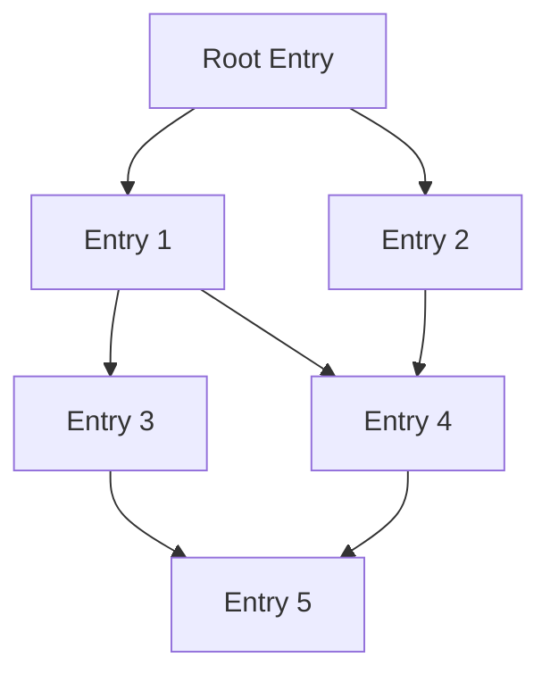
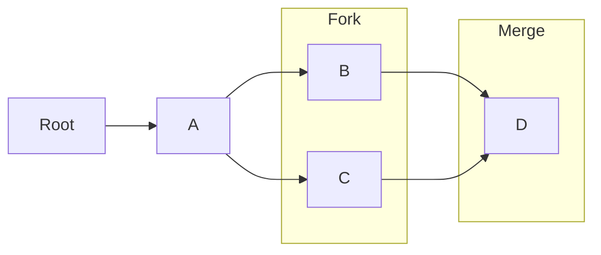
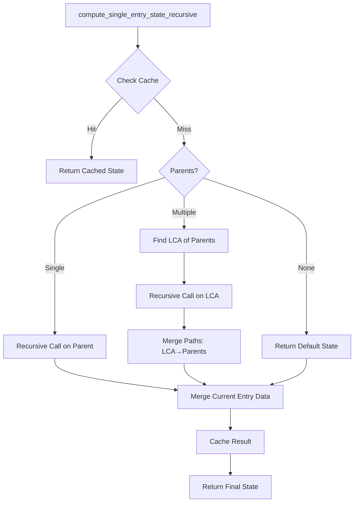

## CRDT Principles

Eidetica implements a form of Merkle-CRDT, which uses Merkle trees built from content-addressable [Entries](core_components/entry.md) to efficiently synchronize distributed data. Key aspects include:

- Content-addressable entries (`Entry` struct) forming a Merkle DAG (Directed Acyclic Graph).
- Entries store data as `RawData` (serialized strings), but specific operations (like settings management or `get_subtree_data`) utilize types implementing the [`CRDT` trait](core_components/crdt.md) for deterministic merging.
- Tree structure ([`BaseDB`](core_components/basedb_tree.md), [`Tree`](core_components/basedb_tree.md)) supports efficient synchronization primitives like finding tips (`get_tips`, `get_subtree_tips`).
- Parent references (`parents` fields in `TreeNode` and `SubTreeNode`) maintain history and define the DAG structure.

### Fork and Merge Support

Eidetica supports branching (forking) and merging of data histories:

- **Forking**: Multiple entries can share the same parent(s), creating divergent branches of history.
- **Merging**: An entry can have multiple parents, merging separate branches. Merges occur implicitly when an [`AtomicOp`](../core_components/basedb_tree.md#operation-lifecycle-atomicopsrcatomicoprs) creates a new `Entry` whose parents are the current tips of the tree/subtree. When historical data is read (e.g., via `AtomicOp::get_full_state`), the system uses a **recursive LCA-based merge algorithm** to compute the final CRDT state. Conflict resolution logic is entirely contained within the CRDT's `merge` implementation; Eidetica applies the merge function but does not resolve conflicts between different CRDT types or interpret their state.
- **Parent-Child Relationships**: Maintained through parent reference lists in entries.
- **Tips**: Repository heads (entries with no children in a specific tree/subtree) are tracked as "tips" by the backend (`get_tips`, `get_subtree_tips`). These are used primarily to set the parent references for new entries created via `AtomicOp`. **Assumption:** For synchronization between replicas, peers likely exchange tips. A receiving peer would identify unknown tips, request the corresponding entries and their ancestors until a common history is found, and merge the new entries into their local backend. This process would rely heavily on the deterministic `CRDT::merge` implementations.
- **Deterministic Ordering**: The `InMemory` database sorts entries topologically primarily by height (longest path from a DAG root) and secondarily by ID. Height is calculated using a BFS approach (similar to Kahn's algorithm) starting from nodes with an in-degree of 0 within the relevant context (tree or subtree). See `InMemory::calculate_heights` and related sorting methods in [`src/backend/database/in_memory/mod.rs`](../../src/backend/database/in_memory/mod.rs).

### Recursive LCA-Based Merge Algorithm

Eidetica implements a sophisticated **recursive LCA-based merge algorithm** for computing CRDT states that ensures correctness and performance:

#### Algorithm Steps

1. **Cache Check**: First checks if the state for `(entry_id, subtree)` is already cached
2. **LCA Computation**: For entries with multiple parents, finds the Lowest Common Ancestor (LCA)
3. **Recursive State Building**: Recursively computes the LCA state using the same algorithm
4. **Path Merging**: Gets all entries from LCA to all parents in a single operation (deduplicated and sorted), then merges them maintaining deterministic ordering
5. **Local Data Integration**: Merges the current entry's local data
6. **Automatic Caching**: Caches the computed state for future use

#### Key Benefits

- **Correctness**: Ensures consistent CRDT state computation regardless of access patterns
- **Performance**: Automatic caching eliminates redundant computation
- **Scalability**: Recursive approach handles complex DAG structures efficiently
- **Deterministic**: Maintains ordering semantics through proper LCA-based computation

#### Caching Strategy

The system uses `(Entry_ID, Subtree)` as cache keys because:

- Entry + Subtree combination uniquely defines the computation context
- Entries are immutable, so cached states never become invalid
- Cache grows monotonically as new entries are committed
- No cache invalidation is needed

This algorithm replaces the previous parent-state reuse approach, which had correctness issues when parent states were computed with different ancestor orderings.
