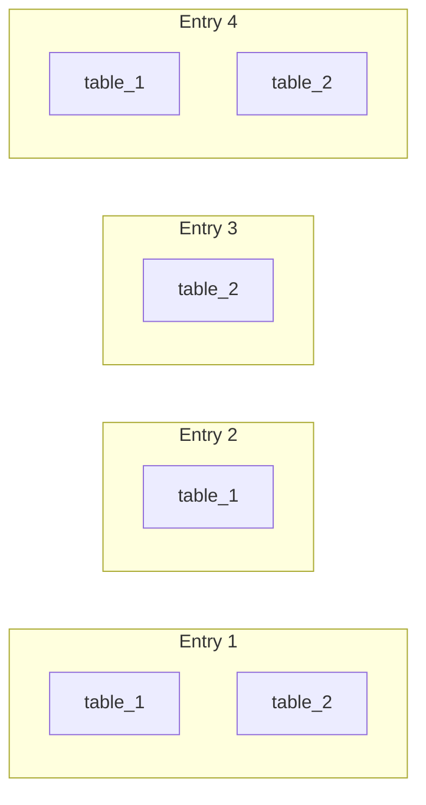
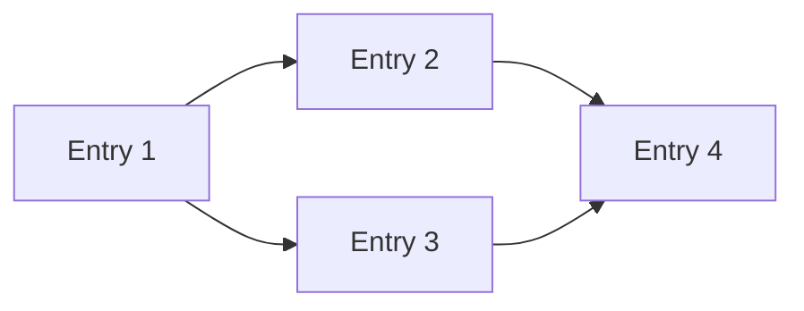
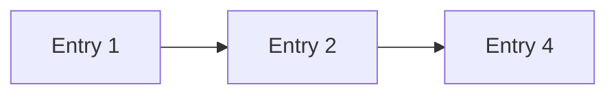

# DAG Structure

Eidetica organizes data in a layered Merkle-DAG called a **Tree**. A Tree consists of Entries that form the main DAG, and each Entry can contain data for multiple subtrees. Each subtree forms its own independent DAG across the Entries.

Each Entry is **immutable** and **content-addressable** - its ID is a cryptographic hash of its contents. Parent references are these secure hashes, forming the Merkle structure.

For simplicity, let's walk through an example Tree with 4 Entries.

## Entries Contain Subtrees

An Entry is the atomic unit. Each Entry can contain data for zero or more named subtrees:

Entry 1 and Entry 4 contain data for both subtrees. Entry 2 only modifies `table_1`. Entry 3 only modifies `table_2`.

## Main Tree DAG

The Tree DAG connects Entries through parent references (hashes of parent Entries). Entry 2 and Entry 3 are created in parallel (both reference Entry 1's hash as their parent). Entry 4 merges the branches by listing both Entry 2 and Entry 3's hashes as parents:

This shows the branching and merging capability of the DAG structure.

## Subtree DAGs

Each subtree forms its own DAG by following subtree-specific parent references. These can skip Entries that didn't modify that subtree.

**table_1 DAG** - Entry 3 is skipped (no table_1 data):

**table_2 DAG** - Entry 2 is skipped (no table_2 data):

The main tree branches and merges, but each subtree DAG remains linear because E2 and E3 modified different subtrees.

## Atomic Cross-Subtree Edits

A Transaction creates a single Entry. This makes it the primitive for synchronized edits across multiple subtrees within a Tree.

In the example above, Entry 1 and Entry 4 modify both `table_1` and `table_2` in a single Entry. Because an Entry is atomic, you always see both edits or neither - there's no state where only one subtree's changes are visible. This enables reliable cross-subtree operations where related data must stay consistent.

## Sparse Verified Checkouts

Because subtree DAGs are independent, you can sync and verify just one subtree without the full tree data.

To verify `table_1`:

1. Fetch only Entries that contain `table_1` data (E1, E2, E4)
2. Follow `table_1`'s parent chain to verify the complete history
3. Entry 3 is not needed - it has no `table_1` data

This enables efficient partial sync while maintaining full cryptographic verification of the synced data.

## Settings Example

An example of how this is used effectively is the design of settings for the Tree.

The settings, including authentication, is stored in the `_settings` subtree. Each Entry in the Tree points to the latest tips of the `_settings` subtree.

What this means is that you can fully verify the authentication for any Entry only by syncing the `_settings` subtree, and without needing to download any other data from the Tree.
