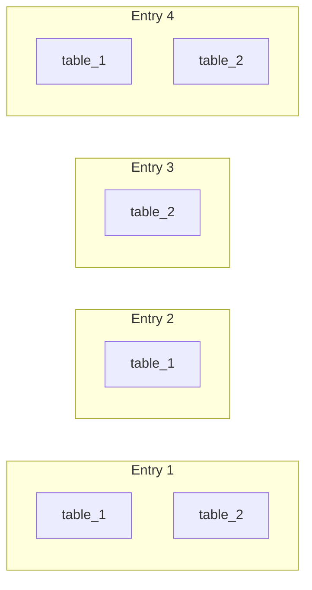
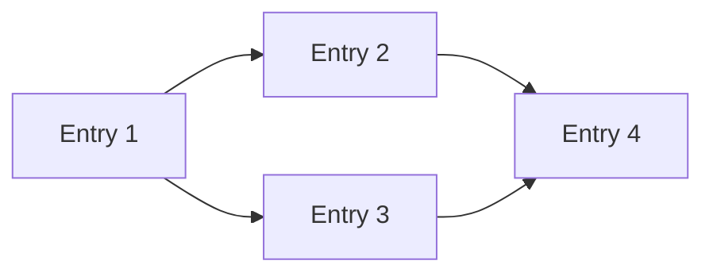
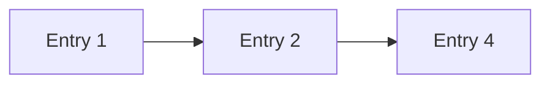

# DAG Structure

Eidetica organizes data in a layered Merkle-DAG called a **Tree**. A Tree consists of Entries that form the main DAG, and each Entry can contain data for multiple subtrees. Each subtree forms its own independent DAG across the Entries.

Each Entry is **immutable** and **content-addressable**. Its ID is a [CID](https://docs.ipfs.tech/concepts/content-addressing/) (Content Identifier) computed by serializing the entry to DAG-CBOR and creating a CID pointing to that deterministic representation. Parent references use these CIDs, forming the Merkle structure.

For simplicity, let's walk through an example Tree with 4 Entries.

## Entries Contain Subtrees

An Entry is the atomic unit. Each Entry can contain data for zero or more named subtrees:

```mermaid
graph LR
    subgraph E1[Entry 1]
        E1_t1[table_1]
        E1_t2[table_2]
    end

    subgraph E2[Entry 2]
        E2_t1[table_1]
    end

    subgraph E3[Entry 3]
        E3_t2[table_2]
    end

    subgraph E4[Entry 4]
        E4_t1[table_1]
        E4_t2[table_2]
    end
```

Entry 1 and Entry 4 contain data for both subtrees. Entry 2 only modifies `table_1`. Entry 3 only modifies `table_2`.

## Main Tree DAG

The Tree DAG connects Entries through parent references (hashes of parent Entries). Entry 2 and Entry 3 are created in parallel (both reference Entry 1's hash as their parent). Entry 4 merges the branches by listing both Entry 2 and Entry 3's hashes as parents:

```mermaid
graph LR
    E1[Entry 1] --> E2[Entry 2]
    E1 --> E3[Entry 3]
    E2 --> E4[Entry 4]
    E3 --> E4
```

This shows the branching and merging capability of the DAG structure.

## Subtree DAGs

Each subtree forms its own DAG by following subtree-specific parent references. These can skip Entries that didn't modify that subtree.

**table_1 DAG** - Entry 3 is skipped (no table_1 data):

```mermaid
graph LR
    E1[Entry 1] --> E2[Entry 2] --> E4[Entry 4]
```

**table_2 DAG** - Entry 2 is skipped (no table_2 data):

```mermaid
graph LR
    E1[Entry 1] --> E3[Entry 3] --> E4[Entry 4]
```

The main tree branches and merges, but each subtree DAG remains linear because E2 and E3 modified different subtrees.

## Atomic Cross-Subtree Edits

A Transaction creates a single Entry. This makes it the primitive for synchronized edits across multiple subtrees within a Tree.

In the example above, Entry 1 and Entry 4 modify both `table_1` and `table_2` in a single Entry. Because an Entry is atomic, you always see both edits or neither - there's no state where only one subtree's changes are visible. This enables reliable cross-subtree operations where related data must stay consistent.

## Sparse Verified Checkouts

Because subtree DAGs are independent, you can sync and verify just one subtree without the full tree data.

To verify `table_1`:

1. Fetch only Entries that contain `table_1` data (E1, E2, E4)
2. Follow `table_1`'s parent chain to verify the complete history
3. Entry 3 is not needed - it has no `table_1` data

This enables efficient partial sync while maintaining full cryptographic verification of the synced data.

> **Two senses of "verify".** Here "verify" means _cryptographically check the
> integrity and signatures of a synced history_. That is distinct from an
> entry's stored **`VerificationStatus`** (`Unverified` / `Verified` /
> `Failed`), which records whether _this node has run that check and accepted
> the result_. Synced entries arrive `Unverified`; `Database::verify()` (or
> the access-time hook) performs the check above against the `_settings` each
> entry pins and promotes accordingly, prefix-closed. See
> [Core Concepts](../user_guide/core_concepts.md) and the
> [authentication design](../design/authentication.md).

## Settings Example

An example of how this is used effectively is the design of settings for the Tree.

The settings, including authentication, is stored in the `_settings` subtree. Each Entry in the Tree points to the latest tips of the `_settings` subtree.

What this means is that you can fully verify the authentication for any Entry only by syncing the `_settings` subtree, and without needing to download any other data from the Tree.

## Traversals Require a Complete Ancestry

A subtree's state is the CRDT fold of every Entry from the subtree root up to
the tips being read, in a deterministic order. That is only the right answer if
the walk sees the **whole** ancestor closure of those tips.

Under partial sync it may not. Entries arrive in whatever order a peer sends
them, so a node can hold a child while its parents are still in flight — the
DAG on disk is legitimately incomplete, and that is a normal, transient state
(see [Verification](../design/verification.md)). A walk that follows parent
pointers into that gap simply stops, because there is no Entry to continue
from, and the gap looks exactly like a root.

The result is not merely a smaller answer. The fold silently omits every
contribution below the gap, and materialized states are cached per Entry, so
the wrong state persists after the missing Entries arrive.

Storage therefore does not enforce parents-before-children on ingest —
out-of-order arrival is how sync works — and traversals do not paper over a
gap. **A traversal that cannot reach the full ancestry of its tips reports
`IncompleteHistory` naming the Entries it is missing**, rather than returning
the part it can reach. Callers that legitimately tolerate an incomplete DAG
(the verification pass, sync) treat it as "cannot decide yet" and retry once
the gap closes; callers that are computing a state get an error instead of a
wrong value.

Reads that stay on the **Verified frontier** never see this: verification is
prefix-closed, so the set of `Verified` Entries is ancestor-closed by
construction and a walk within it cannot run off the end. `IncompleteHistory`
is what a read that opted into `allow_unverified` — or a store still filling in
from sync — gets instead of a plausible wrong answer.
