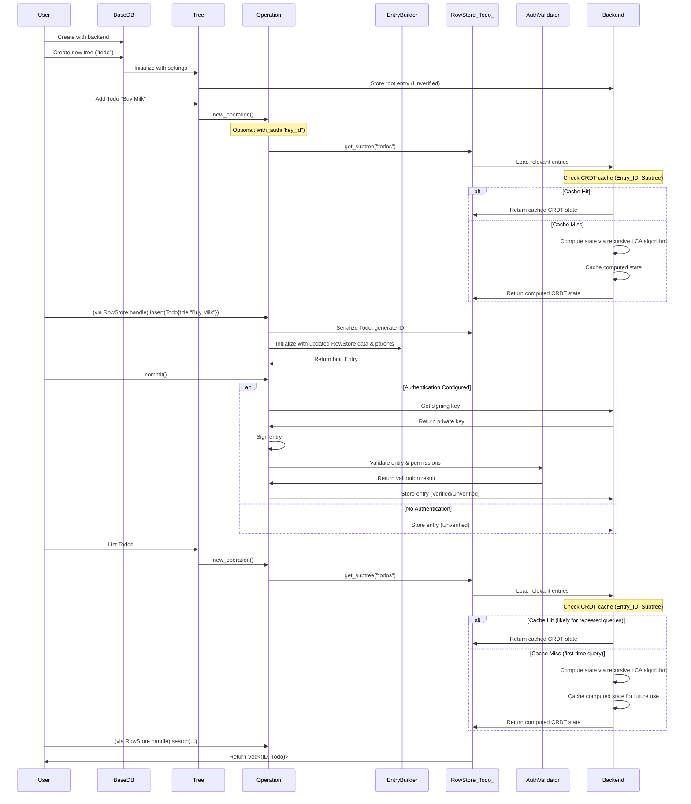

## Data Flow

This section illustrates a typical sequence of interactions between the user and the [core components](core_components/index.md).

1. User creates a BaseDB with a specific backend implementation
2. User creates one or more Trees within the database
3. Operations on the database involve an `EntryBuilder` to construct new, immutable `Entry` objects, which are then added to the appropriate Tree.
4. Each new Entry references its parent entries, forming a directed acyclic graph
5. Entries are stored and retrieved through the Backend interface
6. Authentication (if configured) validates and signs entries before storage

### Authentication Flow Details

When authentication is enabled, the commit process includes additional steps:

1. **Entry Signing**: If a key ID is configured, the entry is cryptographically signed
2. **Permission Validation**: The system validates that the signing key has appropriate permissions for the operation type
3. **Bootstrap Handling**: First authenticated operation automatically configures the signing key as an admin
4. **Verification Status**: Entries are stored with a verification status (Verified/Unverified) based on validation results

This ensures data integrity and access control while maintaining backward compatibility with unsigned entries.

### CRDT Caching Flow

The recursive LCA-based merge algorithm introduces an efficient caching layer:

1. **Cache Lookup**: Every CRDT state computation first checks the cache using `(Entry_ID, Subtree)` as the key
2. **Cache Miss Handling**: If no cached state exists, the recursive LCA algorithm computes the state:
   - Finds Lowest Common Ancestor (LCA) of parent entries
   - Recursively computes LCA state (which may itself hit the cache)
   - Merges path from LCA to target entry
   - Automatically caches the result
3. **Cache Hit Benefits**: Subsequent queries for the same `(Entry_ID, Subtree)` return instantly from cache
4. **Performance Impact**: Dramatic reduction in computation for repeated queries, especially beneficial for complex DAG structures

The caching system scales particularly well because:

- Cache keys are precise and never become invalid (entries are immutable)
- Cache hit rates approach 100% for repeated access patterns
- Memory usage is controlled (only computed states are cached)
