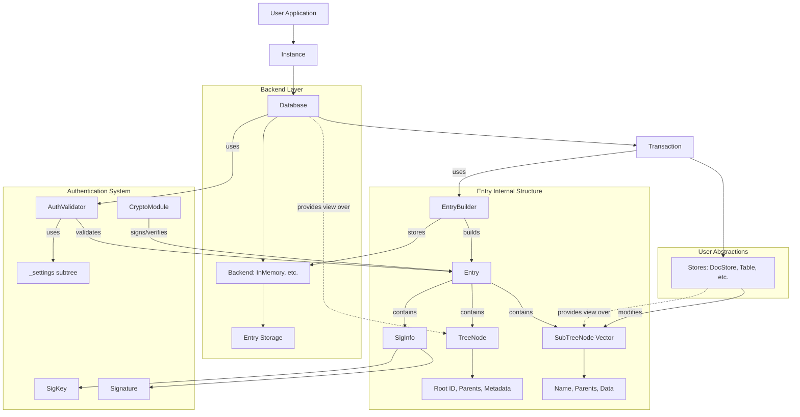

# Internal Documentation

This section contains documentation for developers and those who want to understand the full system and technology behind Eidetica. It covers architecture, internals, and development practices.

**If you want to contribute**, start with the [Contributing guide](contributing.md) for development environment setup and workflow.

## Architecture Overview

Eidetica is a decentralized database designed to "Remember Everything."

The system is built on a foundation of content-addressable entries organized in databases, with a pluggable backend system for storage. `Entry` objects are immutable and contain Tree/SubTree structures that form the Merkle-DAG, with integrated authentication using Ed25519 digital signatures to verify the integrity of the data and its history. Database and Store abstractions over these internal structures help to translate those concepts into something more familiar to developers.

See [Core Components](core_components/index.md) for details on the key building blocks.

## API Reference

For detailed API documentation, see the [rustdoc API reference](../rustdoc/eidetica/index.html) (development version) or [docs.rs/eidetica](https://docs.rs/eidetica) (stable releases).

