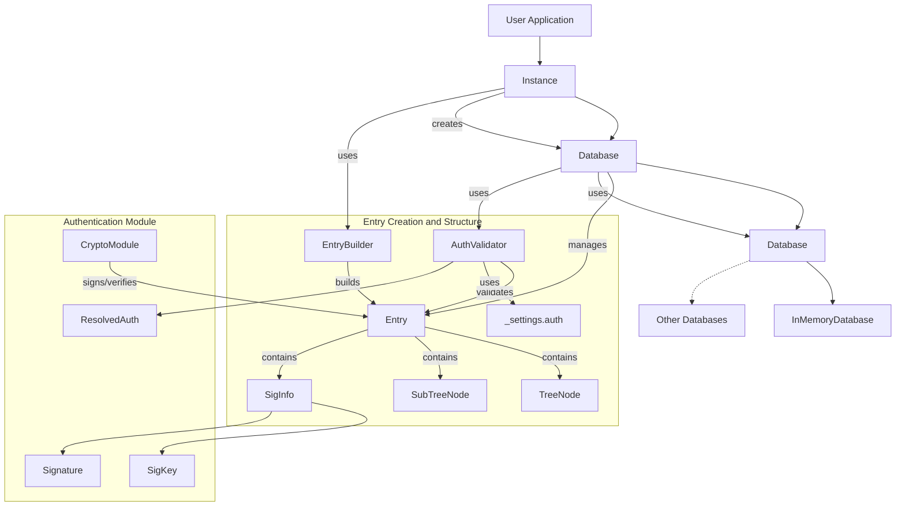

# Eidetica Architecture Overview

Eidetica is a decentralized database designed to "Remember Everything." This document outlines the architecture and how different components interact with each other.

Eidetica is built on a foundation of content-addressable entries organized in databases, with a pluggable backend system for storage. `Entry` objects are immutable and include integrated authentication using Ed25519 digital signatures. The database is designed with concepts from Merkle-CRDTs to enable efficient merging and synchronization of distributed data.

See the [Core Components](core_components/index.md) section for details on the key building blocks.

