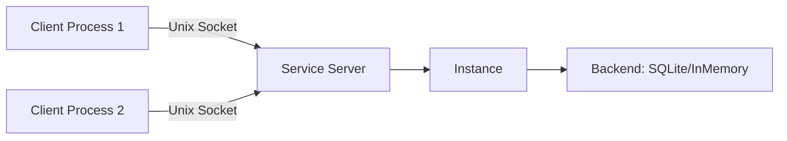
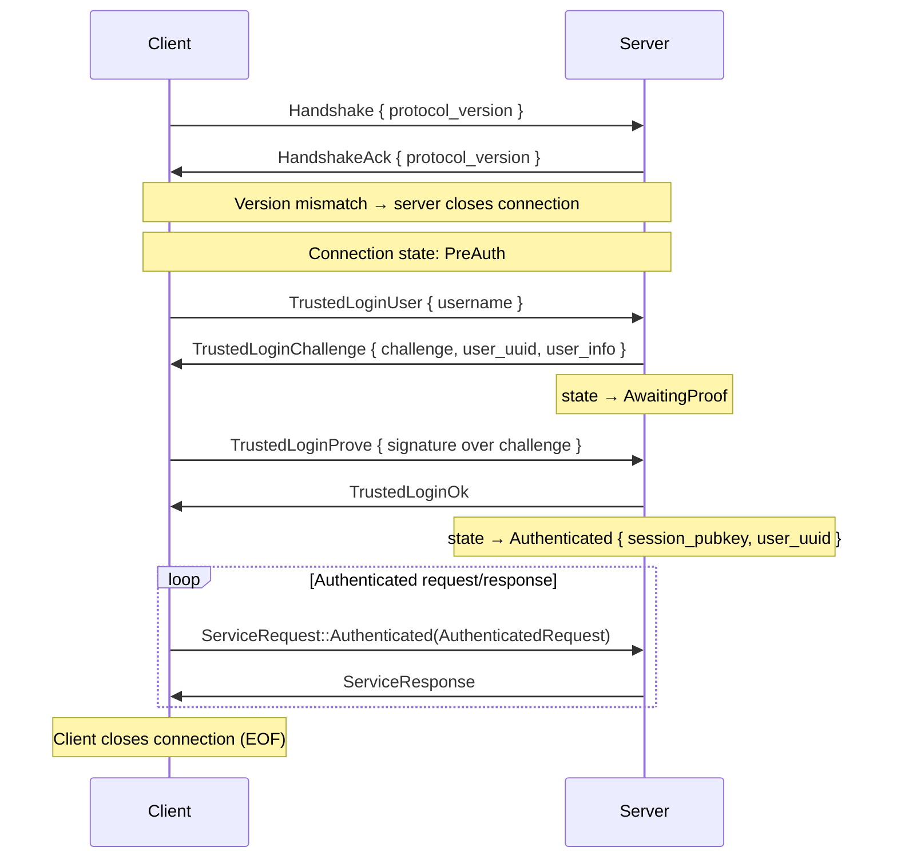

# Service (Daemon) Architecture

The service module (`crate::service`) enables running Eidetica as a local daemon over a Unix domain socket. The RPC boundary sits at the storage-operation level: a `RemoteConnection` forwards a curated set of backend operations to the daemon, wrapped in the `Backend::Remote` enum variant, so higher-level abstractions (`Database`, stores, sync) work transparently against a remote Instance.

## Architecture Overview



The server wraps a full `Instance` (not just a backend) so it can handle both storage operations and write notifications. A client calls `Instance::connect(path)`, which establishes a `RemoteConnection`, wraps it as `Backend::Remote(conn)`, fetches `InstanceMetadata` over the wire, and constructs an Instance with **no local secrets** (`secrets: None`) — signing keys are derived client-side after login, never held by the constructed Instance until a user logs in.

### Module Structure

| Module              | Role                                                                       |
| ------------------- | -------------------------------------------------------------------------- |
| `service::protocol` | Wire types: `Handshake`, `ServiceRequest`, `ServiceResponse`, `BackendOp`, frame I/O |
| `service::error`    | `ServiceError` wire format and error reconstruction                        |
| `service::server`   | `ServiceServer` — accepts connections, runs the auth state machine, gates and dispatches requests |
| `service::client`   | `RemoteConnection` — the `Backend::Remote` transport + `trusted_login`     |
| `service::cache`    | `ServiceCache` — daemon-local, per-user CRDT-state cache (crate-private)    |

## Wire Protocol

The protocol uses **length-prefixed JSON frames** over a Unix domain socket.

### Frame Format

```text
┌──────────────────┬──────────────────────┐
│ Length (4 bytes) │ JSON payload         │
│ big-endian u32   │ (up to 64 MiB)       │
└──────────────────┴──────────────────────┘
```

Each frame is a 4-byte big-endian length prefix followed by a JSON-serialized payload. Maximum frame size is 64 MiB (`MAX_FRAME_SIZE`); frames exceeding this are rejected on both read and write. `write_frame`/`read_frame` handle serialization and framing; `read_frame` returns `None` on clean EOF.

`PROTOCOL_VERSION` is currently `0`, indicating an unstable protocol that may change without notice.

### Connection Lifecycle



1. **Handshake**: client sends `Handshake { protocol_version }`; server validates and acks. On mismatch the server acks with its own version and closes the connection.
2. **Trusted login** (see Security Model below): a challenge-response over the user's root key. `GetInstanceMetadata` is the only other request permitted before login.
3. **Authenticated request loop**: every backend operation travels inside `ServiceRequest::Authenticated`. One response per request, strictly sequential per connection (`RemoteConnection` serializes all I/O through a mutex).
4. **Termination**: client closes its write half (EOF); the server detects EOF and cleans up.

## Security Model

Client-side signing. The daemon stores and serves encrypted key material and signed entries but **never holds plaintext user signing keys or passwords**.

- **User keys stay client-side**: `TrustedLoginUser` returns the user's full record (`user_info`, including the encrypted `UserCredentials`) in the same round-trip as the challenge. The client derives the key-encryption-key locally (Argon2id over the password), decrypts the root signing key in-process, signs the challenge, and builds its `User` session from the already-returned record — no second wire read of `_users`. The signing key never crosses the socket.
- **Authentication via challenge-response**: the daemon issues fresh random challenge bytes per login attempt. Successful decryption of the user's signing key on the client *is* password verification; the daemon verifies the returned signature against the user's stored public key. No password is sent over the wire.
- **`TrustedLogin` naming is load-bearing**: the flow assumes the caller is already trusted by the socket's filesystem permissions. Over a network transport this would need a PAKE instead — the name flags that gap deliberately.
- **Encrypted stores remain opaque to the daemon**: per-database encrypted CRDTs merge as `Vec<EncryptedBlob>`; the daemon participates in storage and sync without ever holding a content encryption key.
- **Filesystem permissions**: the socket's parent directory is created mode `0700` and the socket itself is set to `0600` as an additional access-control layer.

See the `crate::service` module rustdoc for the full design rationale, including why daemon-side signing (the earlier draft) was rejected.

## Request / Response Types

### ServiceRequest

The top-level request enum is intentionally flat, keeping the pre-auth surface visible at a glance:

| Variant                          | When                                                       |
| -------------------------------- | ---------------------------------------------------------- |
| `TrustedLoginUser { username }`  | Pre-auth step 1 — request a challenge                      |
| `TrustedLoginProve { signature }`| Pre-auth step 2 — return the signed challenge              |
| `GetInstanceMetadata`            | Pre-auth — fetch server identity (used by `Instance::connect`) |
| `Authenticated(Box<AuthenticatedRequest>)` | Every backend operation, post-login                |

`AuthenticatedRequest` bundles the scope and identity claim with the op:

```rust,ignore
pub struct AuthenticatedRequest {
    pub root_id: ID,      // database whose auth_settings gate this op
    pub identity: SigKey, // claim, cross-checked against the connection's session pubkey
    pub request: BackendOp,
}
```

### BackendOp — the curated wire surface

The original design mirrored the entire storage trait onto the socket, one variant per method, exposing unauthenticated internal primitives. The wire is now a deliberately curated, gated subset:

| Category             | Variants                                                                                       |
| -------------------- | ---------------------------------------------------------------------------------------------- |
| Entry operations     | `Get`, `Put`                                                                                   |
| Tips                 | `GetTips`, `GetStoreTips`, `GetStoreTipsUpToEntries`                                            |
| Tree/Store traversal | `FindMergeBase`, `GetTree`, `GetStore`, `GetTreeFromTips`, `GetStoreFromTips`                   |
| CRDT cache           | `GetCachedCrdtState`, `CacheCrdtState`                                                          |
| Path operations      | `GetPathFromTo`                                                                                 |
| Instance metadata    | `SetInstanceMetadata`                                                                           |
| Write coordination   | `NotifyEntryWritten`                                                                            |

Operations deliberately **not** exposed over the wire — `update_verification_status`, `get_instance_secrets`, `all_roots`, and the verification/enumeration queries — return `InstanceError::OperationNotSupported` on a `Backend::Remote`, rather than a silent wrong answer. `enable_sync()` on a remote Instance likewise returns `OperationNotSupported` instead of building a client-side sync engine that would race the daemon's.

Two helpers drive the per-tree gate:

- `BackendOp::tree_id() -> Option<&ID>` — the op's scope when it carries one inline. Returns `None` for entry-id-keyed ops (`Get`, `Put`, `GetCachedCrdtState`, `CacheCrdtState`) and for `SetInstanceMetadata` (which has its own admin gate).
- `BackendOp::required_permission() -> Permission` — `Write(0)` for `Put`/`CacheCrdtState`/`NotifyEntryWritten`, `Read` otherwise. Compared via `Permission::can_write`/`can_admin`, not ordering.

### ServiceResponse

| Variant                                       | Payload                                            |
| --------------------------------------------- | -------------------------------------------------- |
| `Entry(Entry)` / `Entries(Vec<Entry>)`        | One or many entries                                |
| `Id(ID)` / `Ids(Vec<ID>)`                     | One or many IDs                                    |
| `Ok`                                          | Success with no data                               |
| `CachedCrdtState(Option<Vec<u8>>)`            | Optional cached CRDT state                         |
| `InstanceMetadata(Option<InstanceMetadata>)`  | Optional instance metadata                         |
| `TrustedLoginChallenge { challenge, user_uuid, user_info }` | Challenge bytes + the user's full record |
| `TrustedLoginOk`                              | Login succeeded; connection now authenticated      |
| `Error(ServiceError)`                         | Error response                                     |

## Access Control: the three gates

`ServiceServer` tracks per-connection `ConnectionState`: `PreAuth` → `AwaitingProof { challenge, expected_pubkey, .. }` → `Authenticated { session_pubkey, user_uuid, .. }`. No `ConnectionState` variant holds a `PrivateKey` (enforced by a structural test).

Authenticated requests pass three gates before dispatch:

1. **Gate 1 — connection state**: the connection must be `Authenticated`, and the `AuthenticatedRequest::identity` claim must match the connection's verified `session_pubkey`. Unauthenticated backend ops fail here, at the dispatch point.
2. **Gate 2 — per-tree permission**: if `tree_id().is_some()`, the server loads that database's `auth_settings`, resolves the session pubkey's permission, and rejects the op unless it covers `required_permission()`. `Get` carries no inline tree id, so it is instead gated *post-fetch* (`gate_entry_read`): the fetched entry's owning tree is resolved and `Read` is required before content is returned. System databases (`_users`, `_databases`, `_sync`, `_instance`) are exempt from the per-tree read gate because the login flow itself must read them; writes still go through the relevant gate.
3. **Gate 3 — cross-tree admin**: `SetInstanceMetadata` carries no tree id, so it is gated explicitly against `_databases.auth_settings` requiring `Admin`. It fails closed if `_databases` is unreadable (D8).

Authorization for entry-id-keyed writes is being hardened separately (tracked as D1); see V1 Limitations.

## Error Handling Across the Wire

Errors serialize as `ServiceError { module, kind, message }`.

**Server side**: `dispatch` catches any `crate::Error`, extracting the error's module name, discriminant name, and display message.

**Client side**: `service_error_to_eidetica_error()` reconstructs the appropriate `crate::Error` from the `(module, kind)` pair:

| Module     | Kind                       | Reconstructed Error                       |
| ---------- | -------------------------- | ----------------------------------------- |
| `backend`  | `EntryNotFound`            | `BackendError::EntryNotFound`             |
| `backend`  | `VerificationStatusNotFound` | `BackendError::VerificationStatusNotFound` |
| `backend`  | `EntryNotInTree`           | `BackendError::EntryNotInTree`            |
| `backend`  | `NoCommonAncestor`         | `BackendError::NoCommonAncestor`          |
| `backend`  | `EmptyEntryList`           | `BackendError::EmptyEntryList`            |
| `instance` | `DatabaseNotFound`         | `InstanceError::DatabaseNotFound`         |
| `instance` | `EntryNotFound`            | `InstanceError::EntryNotFound`            |
| `instance` | `InstanceAlreadyExists`    | `InstanceError::InstanceAlreadyExists`    |
| `instance` | `DeviceKeyNotFound`        | `InstanceError::DeviceKeyNotFound`        |
| `instance` | `AuthenticationRequired`   | `InstanceError::AuthenticationRequired`   |
| (other)    | (other)                    | `Error::Io` with the original message     |

Unrecognized combinations fall back to an `Io` error carrying the original message, so callers use the same error-handling patterns (e.g. `err.is_not_found()`) regardless of local vs. remote. A compile-time exhaustive match over `crate::Error` forces a wire-mapping decision whenever a new variant is added, and a round-trip test asserts every mapped pair survives without hitting the fallback.

## Write Coordination

`Instance::put_entry()` notifies the backend after storing an entry. For local backends this is a no-op; `Backend::Remote` sends a `NotifyEntryWritten` RPC. On the server, `NotifyEntryWritten` calls `Instance::dispatch_write_callbacks()` to fire sync triggers etc. **without re-storing** the entry (the preceding `Put` already stored it). This ensures client writes drive server-side sync from day one.

> Note: `dispatch_write_callbacks` currently *approximates* `previous_tips` (current tips minus the new entry id) because the `NotifyEntryWritten` RPC does not yet carry the pre-write tips. A future protocol revision should send them explicitly.

## CRDT Cache

Service-mode CRDT-cache ops are served from a daemon-local `ServiceCache` keyed by `(user_uuid, entry_id, store)` rather than the backend's global cache, closing the cross-user poisoning vector. The cache is content-addressable underneath: identical bytes uploaded by N users are stored once and refcounted. The backend's own cache machinery is unchanged and still serves local (non-service) flows; the two caches are independent by design.

## Feature Gate

```rust,ignore
#[cfg(all(unix, feature = "service"))]
pub mod service;
```

The `service` feature is in the default `full` set; the `unix` gate restricts it to platforms with Unix domain sockets.

## Testing

Two complementary layers:

- **`tests/it/service.rs`** — dedicated integration tests for the service layer: handshake, the TrustedLogin challenge-response, the three gates (unauthenticated rejection, per-tree allow/deny, cross-tree denial), per-user cache isolation, concurrent clients, and the user lifecycle.
- **`TEST_BACKEND=service`** — runs the full integration suite through the socket, exercising the RPC layer, serialization, and error reconstruction against every test that passes with `inmemory`:

```bash
TEST_BACKEND=service cargo nextest run --workspace --all-features
just test service
nix build .#test.service
```

## V1 Limitations

This is a **single trusted local client** v1. The following are deferred with tracked follow-ups:

- **Lock-poisoning panics**: the `Arc`-shared `ServiceCache` mutex and the per-connection session `RwLock` use `lock().unwrap()`; a panic in one handler can cascade. Documented at the lock sites; must be fixed before serving multiple or untrusted clients.
- **Entry-id-keyed write authorization (D1)**: hardening of write-path authorization for ops that key by entry id rather than carrying a tree scope is tracked and in progress. Specifics are intentionally kept out of this published doc until the work lands; see the internal review notes and the D1 follow-up.
- **No server-push notifications**: clients see the latest state on each request but are not notified of entries arriving from sync peers. A future bidirectional protocol would add a `Notification` frame type and a client-side background reader.
- **No sync delegation**: `enable_sync()`/`sync()` on a remote Instance return `OperationNotSupported`. A future `EnableSync` RPC would delegate sync management to the server's Instance.

## Future Work

- **PAKE for network transport**: `TrustedLogin` is safe only because the socket is filesystem-gated. A network transport must replace it with a password-authenticated key exchange.
- **Server-push + sync delegation**: as above.
- **Derived-key caching**: cache the Argon2id-derived encryption key in an OS secret store with a TTL, evolving the daemon into an ssh-agent-like key agent to eliminate repeated password prompts for CLI tools.
