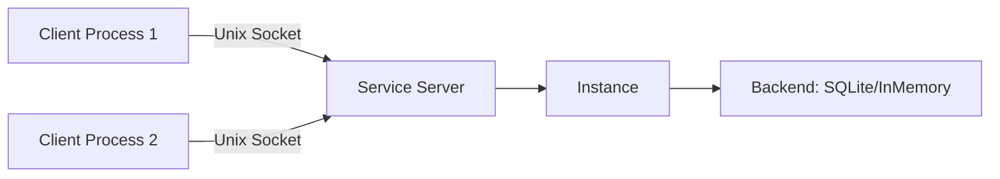
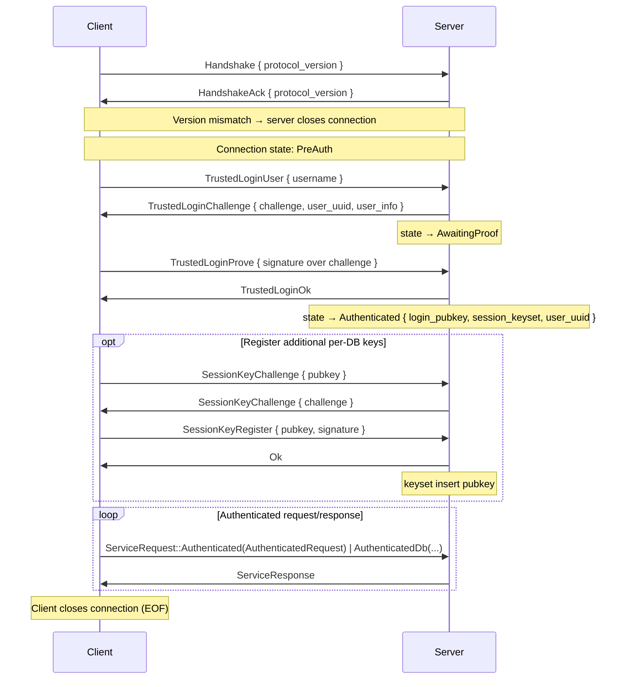

# Service (Daemon) Architecture

The service module (`crate::service`) enables running Eidetica as a local daemon over a Unix domain socket. The RPC boundary sits at the storage-operation level: a `RemoteConnection` forwards a curated set of backend operations to the daemon, wrapped in the `Backend::Remote` enum variant, so higher-level abstractions (`Database`, stores, sync) work transparently against a remote Instance.

## Architecture Overview



The server wraps a full `Instance` (not just a backend) so it can handle both storage operations and write notifications. A client calls `Instance::connect(path)`, which establishes a `RemoteConnection`, wraps it as `Backend::Remote(conn)`, fetches `InstanceMetadata` over the wire, and constructs an Instance with **no local secrets** (`secrets: None`) — signing keys are derived client-side after login, never held by the constructed Instance until a user logs in.

### Module Structure

| Module              | Role                                                                       |
| ------------------- | -------------------------------------------------------------------------- |
| `service::protocol` | Wire types: `Handshake`, `ServiceRequest`, `ServiceResponse`, `BackendOp`, frame I/O |
| `service::error`    | `ServiceError` wire format and error reconstruction                        |
| `service::server`   | `ServiceServer` — accepts connections, runs the auth state machine, gates and dispatches requests |
| `service::client`   | `RemoteConnection` — the `Backend::Remote` transport + `trusted_login`     |
| `service::cache`    | `ServiceCache` — daemon-local, per-user CRDT-state cache (crate-private)    |

## Wire Protocol

The protocol uses **length-prefixed JSON frames** over a Unix domain socket.

### Frame Format

```text
┌──────────────────┬──────────────────────┐
│ Length (4 bytes) │ JSON payload         │
│ big-endian u32   │ (up to 64 MiB)       │
└──────────────────┴──────────────────────┘
```

Each frame is a 4-byte big-endian length prefix followed by a JSON-serialized payload. Maximum frame size is 64 MiB (`MAX_FRAME_SIZE`); frames exceeding this are rejected on both read and write. `write_frame`/`read_frame` handle serialization and framing; `read_frame` returns `None` on clean EOF.

`PROTOCOL_VERSION` is currently `0`, indicating an unstable protocol that may change without notice.

### Connection Lifecycle



1. **Handshake**: client sends `Handshake { protocol_version }`; server validates and acks. On mismatch the server acks with its own version and closes the connection.
2. **Trusted login** (see Security Model below): a challenge-response over the user's root key. `GetInstanceMetadata` is the only other request permitted before login.
3. **Optional session-key registration**: once authenticated, the client may prove possession of additional pubkeys via `SessionKeyChallenge`/`SessionKeyRegister`. Each successfully proven pubkey joins the connection's `session_keyset` and can then act as the identity on subsequent ops. See [Session Keyset](#session-keyset) below.
4. **Authenticated request loop**: every backend operation travels inside `ServiceRequest::Authenticated` or `ServiceRequest::AuthenticatedDb`. One response per request, strictly sequential per connection (`RemoteConnection` serializes all I/O through a mutex).
5. **Termination**: client closes its write half (EOF); the server detects EOF and cleans up.

## Security Model

Client-side signing. The daemon stores and serves encrypted key material and signed entries but **never holds plaintext user signing keys or passwords**.

- **User keys stay client-side**: `TrustedLoginUser` returns the user's full record (`user_info`, including the encrypted `UserCredentials`) in the same round-trip as the challenge. The client derives the key-encryption-key locally (Argon2id over the password), decrypts the root signing key in-process, signs the challenge, and builds its `User` session from the already-returned record — no second wire read of `_users`. The signing key never crosses the socket.
- **Authentication via challenge-response**: the daemon issues fresh random challenge bytes per login attempt. Successful decryption of the user's signing key on the client *is* password verification; the daemon verifies the returned signature against the user's stored public key. No password is sent over the wire.
- **`TrustedLogin` naming is load-bearing**: the flow assumes the caller is already trusted by the socket's filesystem permissions. Over a network transport this would need a PAKE instead — the name flags that gap deliberately.
- **Encrypted stores remain opaque to the daemon**: per-database encrypted CRDTs merge as `Vec<EncryptedBlob>`; the daemon participates in storage and sync without ever holding a content encryption key.
- **Filesystem permissions**: the socket's parent directory is created mode `0700` and the socket itself is set to `0600` as an additional access-control layer.

See the `crate::service` module rustdoc for the full design rationale, including why daemon-side signing (the earlier draft) was rejected.

## Request / Response Types

### ServiceRequest

The top-level request enum is intentionally flat, keeping the pre-auth surface visible at a glance:

| Variant                                              | When                                                       |
| ---------------------------------------------------- | ---------------------------------------------------------- |
| `TrustedLoginUser { username }`                      | Pre-auth step 1 — request a login challenge                |
| `TrustedLoginProve { signature }`                    | Pre-auth step 2 — return the signed login challenge        |
| `GetInstanceMetadata`                                | Pre-auth — fetch server identity (used by `Instance::connect`) |
| `SessionKeyChallenge { pubkey }`                     | Post-auth — request a challenge bound to `pubkey` so the client can prove possession |
| `SessionKeyRegister { pubkey, signature }`           | Post-auth — return the signed challenge; on success `pubkey` joins the connection's session keyset |
| `Authenticated(Box<AuthenticatedRequest>)`           | A `BackendOp` (today: `Get` or `SetInstanceMetadata`)      |
| `AuthenticatedDb(Box<AuthenticatedDbRequest>)`       | A `DatabaseOp` — the primary surface for every Database read/write |

Both authenticated envelopes carry an identity claim that the server validates against the connection's session keyset before dispatch:

```rust,ignore
pub struct AuthenticatedRequest {
    pub root_id: ID,      // database whose auth_settings gate this op
    pub identity: SigKey, // claim; hint pubkey must be in session_keyset
    pub request: BackendOp,
}

pub struct AuthenticatedDbRequest {
    pub root_id: ID,      // database whose auth_settings gate this op
    pub identity: SigKey, // claim; hint pubkey must be in session_keyset
    pub op: DatabaseOp,   // tree-scoped by construction
}
```

### BackendOp — the curated wire surface

The original design mirrored the entire storage trait onto the socket, one variant per method, exposing unauthenticated internal primitives. With the Database-level wire API (`DatabaseOp` / `AuthenticatedDb`) carrying every Database read/write, `BackendOp` is now reduced to two variants that don't have a natural Database-level home:

| Variant                            | Purpose                                                                                  |
| ---------------------------------- | ---------------------------------------------------------------------------------------- |
| `Get { id }`                       | Fetch a single entry by id (gated post-fetch against the entry's owning tree).           |
| `SetInstanceMetadata { metadata }` | Rewrite daemon-level pointers to its own system DBs. Gated against `_databases` Admin.   |

See [BackendOp surface reduction](#backendop-surface-reduction) below for the full list of operations that *used* to ride here and where each one moved.

Operations deliberately **not** exposed over the wire — `update_verification_status`, `get_instance_secrets`, `all_roots`, and the verification/enumeration queries — return `InstanceError::OperationNotSupported` on a `Backend::Remote`, rather than a silent wrong answer.

`update_verification_status` is off-wire **by design, not just for tidiness**: verification is a local trust decision. If a client could set it over the socket, a client (or anything that reached the socket) could assert "this entry is `Verified`" without the server having validated it — exactly the caller-asserted-status hole the storage API was hardened to close. So the daemon's Instance owns verification: it stores everything `Unverified` and runs `Database::verify()` itself. The frontier/`allow_unverified` distinction is applied by the daemon-side `Database`, and every client connected to the same daemon therefore observes the same verified view.

Two helpers drive the per-tree gate:

- `BackendOp::tree_id() -> Option<&ID>` — the op's scope when it carries one inline. Returns `None` for both surviving variants (`Get` is gated post-fetch from the entry's owning tree; `SetInstanceMetadata` is gated explicitly against `_databases`).
- `BackendOp::required_permission() -> Permission` — `Admin(0)` for `SetInstanceMetadata`, `Read` for `Get`.

### ServiceResponse

| Variant                                                     | Payload                                                          |
| ----------------------------------------------------------- | ---------------------------------------------------------------- |
| `Entry(Entry)` / `Entries(Vec<Entry>)`                      | One or many entries                                              |
| `Ids(Vec<ID>)`                                              | One or many IDs                                                  |
| `Ok`                                                        | Success with no data                                             |
| `TransactionContext(TransactionContext)`                    | Parent tips + settings, response to `DatabaseOp::BeginTransaction` |
| `CrdtValue(WireCrdtValue)`                                  | Materialized merged state, response to `DatabaseOp::GetStoreState` |
| `MergeState(MergeState)`                                    | LCA + path, response to `DatabaseOp::ComputeMergeState`          |
| `InstanceMetadata(Option<InstanceMetadata>)`                | Optional instance metadata                                       |
| `TrustedLoginChallenge { challenge, user_uuid, user_info }` | Challenge bytes + the user's full record (login)                 |
| `TrustedLoginOk`                                            | Login succeeded; connection now authenticated                    |
| `SessionKeyChallenge { challenge }`                         | Challenge bytes the client signs to register an additional key   |
| `Error(ServiceError)`                                       | Error response                                                   |

## Session Keyset

A connection's cryptographic identity is **a set of pubkeys, not a single pubkey**. The set is seeded at login with the pubkey that proved `TrustedLoginProve` (the user's *root* pubkey, called `login_pubkey`) and grows as the client proves possession of additional keys via the registration handshake.

```rust,ignore
// In service::server
enum ConnectionState {
    PreAuth,
    AwaitingProof { challenge: Vec<u8>, expected_pubkey: PublicKey, .. },
    Authenticated {
        login_pubkey: PublicKey,
        session_keyset: HashSet<PublicKey>,           // includes login_pubkey
        pending_key_challenges: HashMap<PublicKey, Vec<u8>>,
        user_uuid: String,
        ..
    },
}
```

No `ConnectionState` variant holds a `PrivateKey` (enforced by a structural test).

### Why a keyset, not a single pubkey?

A `User` has many pubkeys — a root key, a device key, per-DB keys created via `User::add_private_key`, etc. Writes signed by a per-DB key produce entries whose tree auth grants that key, not the login key. With a single-pubkey session, reads of those trees would be denied (the login key isn't a member of the tree the per-DB key authored). The keyset model lets the same connection drive ops on every tree the user actually has a key for, without forcing one connection per key.

### Registration handshake

Adding a pubkey to the keyset is a two-step PoP:

1. Client → server: `SessionKeyChallenge { pubkey }`. Server generates a single-use, pubkey-bound random challenge, stores it in `pending_key_challenges[pubkey]`, returns it.
2. Client signs the challenge with `pubkey`'s private key, sends `SessionKeyRegister { pubkey, signature }`. Server verifies, removes the challenge (consumed on success or failure), inserts `pubkey` into `session_keyset` on verify, returns `Ok`.

Each `RemoteConnection` caches successful registrations in a `Mutex<HashSet<PublicKey>>` so `register_session_key(signing_key)` is idempotent — a repeat call for the same key short-circuits without touching the wire. The login pubkey is pre-cached on `trusted_login` success.

The handle constructors that need per-DB identities register on the caller's behalf, so most client code never touches the registration API directly:

- `Database::create(instance, signing_key, settings)` registers `signing_key` before constructing the returned `RemoteDatabaseOps` handle.
- `Database::open_remote(.., identity)` is paired by `Instance::open_system_db_for_session(root, signing_key)`, which registers `signing_key` before opening.
- `User::open_database_with_key(root, key_id)` registers the user-held signing key for `key_id` before routing through `Database::open_remote` on a connected instance.

## Access Control: the three gates

Authenticated requests pass three gates before dispatch:

1. **Gate 1 — connection state**: the connection must be `Authenticated`. The identity hint, if any, must have its `pubkey` field present in the connection's `session_keyset` (proof of possession registered earlier). The resolved value becomes the **acting pubkey** for this op; an absent hint defaults to `login_pubkey`. The cross-check rejects identity claims for keys the client never proved — an attacker that hijacks an authenticated session still can't act as a key whose private material isn't on the client. **Submit (`DatabaseOp::SubmitSignedEntry`) is exempt** from this check: an admin transporting a user-signed entry legitimately carries a non-keyset identity, and the verification gate downstream is the real boundary (see [Verification-gated submit](#verification-gated-submit)).
2. **Gate 2 — per-tree permission**: if `tree_id().is_some()`, the server loads that database's `auth_settings`, resolves the **acting** pubkey's permission, and rejects the op unless it covers `required_permission()`. Resolution tries direct membership first; on miss it falls back to the wildcard (`*`) slot, so a tree's global grant actually applies to any keyset member that isn't otherwise listed. `Get` carries no inline tree id, so it is gated *post-fetch* (`gate_entry_read`): the fetched entry's owning tree is resolved and `Read` is required before content is returned.
3. **Gate 3 — cross-tree admin**: `SetInstanceMetadata` carries no tree id, so it is gated explicitly against `_databases.auth_settings` requiring `Admin`. It fails closed if `_databases` is unreadable (D8).

Authorization for entry-id-keyed writes is being hardened separately (tracked as D1); see V1 Limitations.

### Verification-gated submit

`SubmitSignedEntry` is **verification-gated, not session-gated**. The submit handler stores the incoming entry `Unverified` and runs the server's own verification pass against the tree's *pinned* auth lineage. An attacker without a key the tree's auth grants cannot produce a `Verified` entry, and unverified junk is excluded from every default read by the frontier cut — so the per-tree session gate would add no correctness or isolation property here, and would only block legitimate transporters (e.g. an admin session carrying a user-signed genesis).

The core rule for the wire surface: **reads are session-gated (confidentiality boundary); submits are verification-gated (integrity boundary)**.

## Error Handling Across the Wire

Errors serialize as `ServiceError { module, kind, message }`.

**Server side**: `dispatch` catches any `crate::Error`, extracting the error's module name, discriminant name, and display message.

**Client side**: `service_error_to_eidetica_error()` reconstructs the appropriate `crate::Error` from the `(module, kind)` pair:

| Module     | Kind                       | Reconstructed Error                       |
| ---------- | -------------------------- | ----------------------------------------- |
| `backend`  | `EntryNotFound`            | `BackendError::EntryNotFound`             |
| `backend`  | `VerificationStatusNotFound` | `BackendError::VerificationStatusNotFound` |
| `backend`  | `EntryNotInTree`           | `BackendError::EntryNotInTree`            |
| `backend`  | `NoCommonAncestor`         | `BackendError::NoCommonAncestor`          |
| `backend`  | `EmptyEntryList`           | `BackendError::EmptyEntryList`            |
| `instance` | `DatabaseNotFound`         | `InstanceError::DatabaseNotFound`         |
| `instance` | `EntryNotFound`            | `InstanceError::EntryNotFound`            |
| `instance` | `InstanceAlreadyExists`    | `InstanceError::InstanceAlreadyExists`    |
| `instance` | `DeviceKeyNotFound`        | `InstanceError::DeviceKeyNotFound`        |
| `instance` | `AuthenticationRequired`   | `InstanceError::AuthenticationRequired`   |
| (other)    | (other)                    | `Error::Io` with the original message     |

Unrecognized combinations fall back to an `Io` error carrying the original message, so callers use the same error-handling patterns (e.g. `err.is_not_found()`) regardless of local vs. remote. A compile-time exhaustive match over `crate::Error` forces a wire-mapping decision whenever a new variant is added, and a round-trip test asserts every mapped pair survives without hitting the fallback.

## Write Coordination

`Instance::put_entry()` stores an entry through the backend and fires client-side write callbacks. On a local backend it also captures pre-write tips so callbacks see what changed; on a connected (`Backend::Remote`) instance the local backend has no data — the daemon owns the canonical DAG — so the pre-write `get_tips` call is skipped, and client-side callbacks get an empty `previous_tips`. The actual `Put` travels as `DatabaseOp::SubmitSignedEntry` (verification-gated, see [above](#verification-gated-submit)).

Server-side write notifications drive sync triggers in the daemon's own callback path; the legacy `NotifyEntryWritten` RPC is gone — the submit handler does the notification itself in-process. The client-side `dispatch_write_callbacks` retains its `previous_tips` approximation for the local-instance case and a documented empty-set for remote callbacks.

## CRDT Cache

Service-mode CRDT-cache ops are served from a daemon-local `ServiceCache` keyed by `(user_uuid, entry_id, store)` rather than the backend's global cache, closing the cross-user poisoning vector. The cache is content-addressable underneath: identical bytes uploaded by N users are stored once and refcounted. The backend's own cache machinery is unchanged and still serves local (non-service) flows; the two caches are independent by design.

## Database-Level Wire API

The `BackendOp`/`ServiceRequest::Authenticated` path mirrors the low-level storage trait: auth, verification, and CRDT merge run client-side over raw storage primitives. This places the security model *above* the wire boundary — the daemon is a passive key-value store.

The `DatabaseOp`/`ServiceRequest::AuthenticatedDb` path (added in Phase 4/5) inverts this: the server runs its own `Database` on a local `Instance`, so verification-on-read, the Verified frontier, and CRDT state materialization become server-side by construction. Every op is intrinsically tree-scoped through the containing `AuthenticatedDbRequest`.

### DatabaseOps trait seam

`Database` no longer calls `Instance::backend()` directly. Instead it holds an `Arc<dyn DatabaseOps>`, a narrow trait mirroring the backend-read paths that `Transaction` and `Store` types depend on:

| Method | Purpose |
| ------ | ------- |
| `get(id)` | Fetch a single entry |
| `get_tips(tree)` / `get_store_tips(tree, store)` | Raw DAG tips, no Verified-frontier filtering |
| `get_store_tips_up_to_entries(tree, store, up_to)` | Tips reachable from given entries |
| `find_merge_base(tree, store, ids)` | Lowest common ancestor within a store |
| `get_path_from_to(...)` / `get_store_from_tips(...)` | Entry traversal and store reconstruction |
| `get_cached_crdt_state` / `cache_crdt_state` | CRDT merge cache (local merge-materialization fast-path) |
| `put(entry)` | Persist a (client-signed) entry |

`Transaction` and all `Store` types are unchanged — they already funnel I/O through their `Database` handle, so the seam is invisible below the `Database` level. Two implementations exist:

- **`LocalDatabaseOps`** — forwards every call to the owning `Instance`'s `Backend` (the pre-seam path). Created from a `WeakInstance` so a `Database` rebuilt via `with_key`/`allow_unverified` (using `..self`) keeps a correct ops handle.
- **`RemoteDatabaseOps`** — translates each method to a wire RPC through the shared `RemoteConnection`. Methods with a `DatabaseOp` variant (`get` → `GetEntry`, `get_store_from_tips` → `GetStoreEntries`, `put` → `SubmitSignedEntry`, etc.) use the authenticated-DB RPC path. Methods without a wire equivalent (`find_merge_base`, `get_path_from_to`) return `OperationNotSupported`. The CRDT merge cache (`get_cached_crdt_state`/`cache_crdt_state`) is local in-memory (a `Mutex<HashMap<(ID, String), Vec<u8>>>`) — no round-trip for repeated subtree-state materialization during a transaction.

`Database` chooses the implementor at construction time:

```rust,ignore
// Local
ops: Arc::new(LocalDatabaseOps::new(instance.downgrade())),

// Remote (service)
ops: Arc::new(RemoteDatabaseOps::new(conn, root_id, identity)),
```

### Encrypted-store split

Encrypted stores (wrapped in `PasswordStore`) are opaque to the daemon — the daemon stores and syncs `EncryptedBlob` entries without ever holding a content encryption key. The `DatabaseOp` surface handles the encryption boundary with two complementary primitives:

- **`GetStoreState { store }`** — the **unencrypted fast path** (Doc/Table stores). The server loads the store's entries, CRDT-merges them locally, materializes the merged state, and returns a `WireCrdtValue` (`serde_json::Value`). No decryption; the server works with plaintext because the underlying data is unencrypted.

- **`GetStoreEntries { store, tips, scope }`** — the **universal primitive** for encrypted stores. Returns opaque `Entry` objects reachable from `tips`, ordered by subtree height, already verified against the server's Verified frontier. The client receives encrypted entries it can decrypt and CRDT-merge locally. This works identically for encrypted and unencrypted stores — the server never touches content.

- **`GetCachedCrdtState`/`CacheCrdtState`** (retained from the `BackendOp` surface, also forwarded through `RemoteDatabaseOps`'s in-memory cache) provide a per-session CRDT-merge fast-path that avoids re-fetching entries whose merged state is already cached. The daemon's per-user `ServiceCache` (keyed `(user_uuid, entry_id, store)`) serves the cross-session path; the `RemoteDatabaseOps` local cache serves intra-session repeated materialization.

The encrypted-store-over-service test (`test_database_encrypted_store_roundtrip`) exercises the full path: writes encrypted data server-side via a local `Database`, then reads entries via `RemoteConnection::get_store_entries` and confirms the opaque entries carry the correct subtree markers. Decryption and local merge are client-only.

### Read scope

`ReadScope` controls the DAG projection exposed over the wire:

- **`Verified`** (default) — only the maximal all-`Verified` ancestor-closed prefix of the DAG (the "Verified frontier"). Tips that are still `Unverified` are replaced by their nearest `Verified` ancestors; `Failed` entries are always dropped.
- **`AllowUnverified`** — open against the raw DAG (only `Failed` dropped). The caller must explicitly opt in via `Database::allow_unverified()`.

`BeginTransaction` carries the caller's `ReadScope`: write parents are drawn from the *same* projection the caller reads, so a write built under `AllowUnverified` uses unverified tips as parents and a write built under the `Verified` default uses only verified ancestors. This ensures the write's parent projection is self-consistent with the caller's read posture.

### Gate scope for `AuthenticatedDb`

Every `DatabaseOp` variant is intrinsically tree-scoped via `root_id` — there are no tree-less operations to gate. Permission follows the `required_permission()` pattern: `Read` for queries (`GetVerifiedTips`, `GetStoreState`, `GetStoreEntries`, `GetEntry`, `BeginTransaction`, `GetStoreTipsUpToEntries`, `ComputeMergeState`), `Write` for mutation. The per-tree permission gate (Gate 2) always fires for non-submit `AuthenticatedDb` requests because the tree identity is known before dispatch.

`SubmitSignedEntry` is the exception — verification-gated, not session-gated, as covered in [Access Control](#access-control-the-three-gates) above.

### BackendOp surface reduction

The original design mirrored every storage trait method onto a `BackendOp` variant. With the `DatabaseOp` path covering every Database-level read and write, the legacy surface was reduced to just `Get` and `SetInstanceMetadata`. The mapping for the removed variants:

| Removed variant | New home |
| --------------- | -------- |
| `Put` | `DatabaseOp::SubmitSignedEntry` (verification-gated) |
| `GetTips` | `DatabaseOp::GetVerifiedTips` (server-side Verified frontier) |
| `GetStoreTips`, `GetStoreTipsUpToEntries` | `DatabaseOp::GetStoreTipsUpToEntries` (store-specific) |
| `FindMergeBase`, `GetPathFromTo` | `DatabaseOp::ComputeMergeState` (LCA + path in one RPC) |
| `GetTree`, `GetStore`, `GetTreeFromTips`, `GetStoreFromTips` | `DatabaseOp::GetStoreEntries` (universal opaque-entry primitive) and `DatabaseOp::GetStoreState` (unencrypted fast path) |
| `GetCachedCrdtState`, `CacheCrdtState` | `RemoteDatabaseOps`' local `Mutex<HashMap>` cache (no wire round-trip) |
| `NotifyEntryWritten` | Removed; the server's `SubmitSignedEntry` handler fires its own write callbacks in-process |

## Feature Gate

```rust,ignore
#[cfg(all(unix, feature = "service"))]
pub mod service;
```

The `service` feature is in the default `full` set; the `unix` gate restricts it to platforms with Unix domain sockets.

## Testing

Two complementary layers:

- **`tests/it/service.rs`** — dedicated integration tests for the service layer: handshake, the TrustedLogin challenge-response, the three gates (unauthenticated rejection, per-tree allow/deny, cross-tree denial), per-user cache isolation, concurrent clients, and the user lifecycle.
- **`TEST_BACKEND=service`** — runs the full integration suite through the socket, exercising the RPC layer, serialization, and error reconstruction:

```bash
TEST_BACKEND=service cargo nextest run --workspace --all-features
just test service
nix build .#test.service
```

The full suite passes 1:1 against the service backend. Tests that exercise *process-local* subsystems — `Sync::new` (needs the local device key), `backend.all_roots` / `backend.get_verification_status` (raw-backend listings that have no wire equivalent), client-side delegation validation that reads delegated trees via `backend.get_tree`, the CRDT merge cache, and multi-`User`-on-one-`Instance` patterns that would all wedge against a single wire-mode session pubkey — go through always-local helpers regardless of `TEST_BACKEND`:

- `test_local_instance()` — like `test_instance()` but always builds an in-memory local `Instance`.
- `test_local_instance_with_user(username)` and `test_local_instance_with_user_and_key(username, key_name)` — counterparts to the wire-aware versions.
- `setup_tree_with_user_key_local()` and `TestContext::with_local_database()` — for tests that poke at local-only backend state.

The architectural seam — wire-path tests vs. subsystem tests — is explicit at the helper level. The harness logs in as the bootstrapped `admin`/`admin` user (admin login works over the wire), so user-count assertions match local mode without a synthetic `test_bootstrap` user.

## V1 Limitations

This is a **single trusted local client** v1. The following are deferred with tracked follow-ups:

- **Lock-poisoning panics**: the `Arc`-shared `ServiceCache` mutex and the per-connection session `RwLock` use `lock().unwrap()`; a panic in one handler can cascade. Documented at the lock sites; must be fixed before serving multiple or untrusted clients.
- **Verification status is never asserted over the wire**: the service protocol carries no way for a client to assert a verification status; entries arriving over the wire are stored `Unverified` and earn `Verified` only via the daemon's own validation pass. The status model, the pinned-settings validation that makes it staleness-free, the disclosure posture, and the unbuilt authority-*reduction* (revocation) gap are documented in the [Verification Model](../design/verification.md) design doc.
- **`get_tips()` on a remote Database delegates to `self.ops()`**: handles built via `Database::create` or `Database::open_remote` carry a `RemoteDatabaseOps` with a per-DB identity; reads use that identity (not the connection's login pubkey). Handles built via plain `Database::open` on a connected instance use `LocalDatabaseOps` over `Backend::Remote`, which still reads with the login pubkey — appropriate for code that wants the connection's default identity. The previous heuristic remote-detection in `Database::get_tips` was replaced with an explicit ops delegation.
- **No server-push notifications**: clients see the latest state on each request but are not notified of entries arriving from sync peers. A future bidirectional protocol would add a `Notification` frame type and a client-side background reader.
- **No sync delegation**: `enable_sync()` on a remote Instance is a silent no-op (sync runs daemon-side; the client can't enable it from over the wire). A future admin-gated `EnableSync` RPC would let a client ask the daemon to enable its sync subsystem, parallel to how `InstanceAdmin::create_user` reaches `_users` today.

## Future Work

- **PAKE for network transport**: `TrustedLogin` is safe only because the socket is filesystem-gated. A network transport must replace it with a password-authenticated key exchange.
- **Server-push + sync delegation**: as above.
- **Derived-key caching**: cache the Argon2id-derived encryption key in an OS secret store with a TTL, evolving the daemon into an ssh-agent-like key agent to eliminate repeated password prompts for CLI tools.
