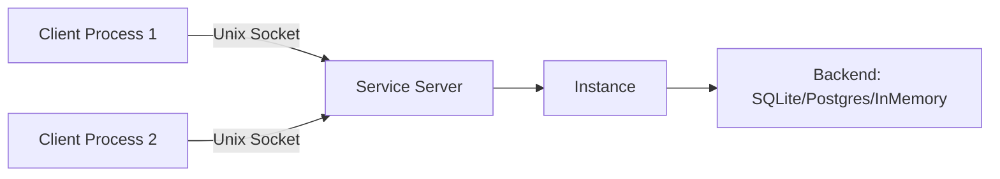
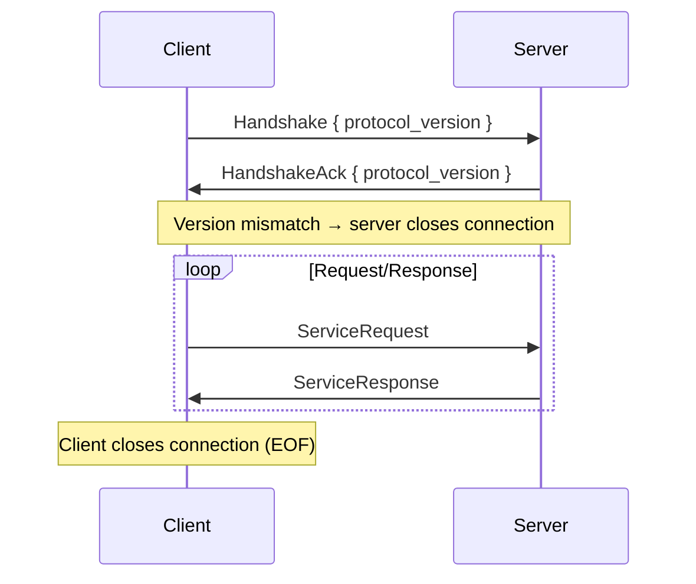

# Service (Daemon) Architecture

The service module (`crate::service`) enables running Eidetica as a local daemon over a Unix domain socket. The RPC boundary sits at the `BackendImpl` trait level, making it transparent to all higher-level abstractions.

## Architecture Overview



The server wraps a full `Instance` (not just a backend) so it can handle both storage operations and write notifications. Each client creates a `RemoteBackend` that implements `BackendImpl` by forwarding operations as RPCs. `Instance::open(Box::new(RemoteBackend))` works because `open()` loads `InstanceMetadata` from the backend -- which transparently fetches it from the server.

### Module Structure

| Module              | Role                                                         |
| ------------------- | ------------------------------------------------------------ |
| `service::protocol` | Wire types: `ServiceRequest`, `ServiceResponse`, frame I/O   |
| `service::error`    | `ServiceError` wire format and error reconstruction          |
| `service::server`   | `ServiceServer` -- accepts connections, dispatches requests  |
| `service::client`   | `RemoteBackend` -- `BackendImpl` over Unix socket            |

## Wire Protocol

The protocol uses **length-prefixed JSON frames** over a Unix domain socket.

### Frame Format

```text
┌──────────────────┬──────────────────────┐
│ Length (4 bytes)  │ JSON payload         │
│ big-endian u32   │ (up to 64 MiB)       │
└──────────────────┴──────────────────────┘
```

Each frame is a 4-byte big-endian length prefix followed by a JSON-serialized payload. Maximum frame size is 64 MiB (`MAX_FRAME_SIZE`). Frames exceeding this limit are rejected on both read and write.

The `write_frame` and `read_frame` functions handle serialization and framing:

```rust,ignore
pub async fn write_frame<W: AsyncWrite + Unpin, T: Serialize>(
    writer: &mut W, value: &T,
) -> Result<()>;

pub async fn read_frame<R: AsyncRead + Unpin, T: DeserializeOwned>(
    reader: &mut R,
) -> Result<Option<T>>;
```

`read_frame` returns `None` on clean EOF (connection closed).

### Connection Lifecycle



1. **Handshake**: Client sends `Handshake { protocol_version }`. Server validates the version. On mismatch, the server sends an ack with its own version and closes the connection.
2. **Request loop**: Client sends `ServiceRequest` frames, server responds with `ServiceResponse` frames. One response per request, strictly sequential per connection.
3. **Termination**: Client closes its write half (EOF). Server detects EOF and cleans up.

Protocol version is currently `0`, indicating an unstable protocol that may change without notice.

## Request/Response Types

### ServiceRequest

One variant per `BackendImpl` method, plus `NotifyEntryWritten` for write coordination:

| Category             | Variants                                                                                                         |
| -------------------- | ---------------------------------------------------------------------------------------------------------------- |
| Entry operations     | `Get`, `Put`                                                                                                     |
| Verification         | `GetVerificationStatus`, `UpdateVerificationStatus`, `GetEntriesByVerificationStatus`                            |
| Tips                 | `GetTips`, `GetStoreTips`, `GetStoreTipsUpToEntries`                                                             |
| Tree/Store traversal | `AllRoots`, `FindMergeBase`, `CollectRootToTarget`, `GetTree`, `GetStore`, `GetTreeFromTips`, `GetStoreFromTips` |
| CRDT cache           | `GetCachedCrdtState`, `CacheCrdtState`, `ClearCrdtCache`                                                         |
| Path operations      | `GetSortedStoreParents`, `GetPathFromTo`                                                                         |
| Instance metadata    | `GetInstanceMetadata`, `SetInstanceMetadata`                                                                     |
| Write coordination   | `NotifyEntryWritten`                                                                                             |

### ServiceResponse

Typed response variants:

| Variant                                      | Payload                    |
| -------------------------------------------- | -------------------------- |
| `Entry(Entry)`                               | Single entry               |
| `Entries(Vec<Entry>)`                        | Multiple entries           |
| `Id(ID)`                                     | Single ID                  |
| `Ids(Vec<ID>)`                               | Multiple IDs               |
| `Ok`                                         | Success with no data       |
| `VerificationStatus(VerificationStatus)`     | Verification status        |
| `CachedCrdtState(Option<String>)`            | Optional cached CRDT state |
| `InstanceMetadata(Option<InstanceMetadata>)` | Optional instance metadata |
| `Error(ServiceError)`                        | Error response             |

## Error Handling Across the Wire

Errors are serialized as `ServiceError`:

```rust,ignore
pub struct ServiceError {
    pub module: String,  // e.g. "backend", "instance"
    pub kind: String,    // e.g. "EntryNotFound", "DeviceKeyNotFound"
    pub message: String, // Display message
}
```

**Server side**: `dispatch()` catches any `crate::Error` from backend operations and converts it to `ServiceResponse::Error(ServiceError::from(&e))`. The conversion extracts the error's module name, discriminant name, and display message.

**Client side**: `RemoteBackend::request_ok()` checks for `ServiceResponse::Error` and calls `service_error_to_eidetica_error()` to reconstruct the appropriate `crate::Error` variant. The reconstruction matches on `(module, kind)` pairs:

| Module     | Kind                     | Reconstructed Error                     |
| ---------- | ------------------------ | --------------------------------------- |
| `backend`  | `EntryNotFound`          | `BackendError::EntryNotFound`           |
| `backend`  | `EntryNotInTree`         | `BackendError::EntryNotInTree`          |
| `backend`  | `NoCommonAncestor`       | `BackendError::NoCommonAncestor`        |
| `backend`  | `EmptyEntryList`         | `BackendError::EmptyEntryList`          |
| `instance` | `DatabaseNotFound`       | `InstanceError::DatabaseNotFound`       |
| `instance` | `EntryNotFound`          | `InstanceError::EntryNotFound`          |
| `instance` | `InstanceAlreadyExists`  | `InstanceError::InstanceAlreadyExists`  |
| `instance` | `DeviceKeyNotFound`      | `InstanceError::DeviceKeyNotFound`      |
| `instance` | `AuthenticationRequired` | `InstanceError::AuthenticationRequired` |
| (other)    | (other)                  | `Error::Io` with original message       |

Unrecognized error combinations fall back to an `Io` error carrying the original message. This means callers can use the same error-handling patterns (e.g., `err.is_not_found()`) regardless of whether the Instance is local or remote.

## Write Coordination

The `BackendImpl` trait includes a default-noop method:

```rust,ignore
async fn notify_entry_written(
    &self, _tree_id: &ID, _entry_id: &ID, _source: WriteSource,
) -> Result<()> {
    Ok(())  // no-op for local backends
}
```

`Instance::put_entry()` calls `backend.notify_entry_written()` after storing the entry. For local backends this is a no-op. `RemoteBackend` overrides it to send a `NotifyEntryWritten` RPC.

On the server side, `NotifyEntryWritten` dispatches the Instance's write callbacks (sync triggers, etc.) via `instance.dispatch_write_callbacks()` without re-storing the entry (which was already stored by the preceding `Put` RPC).

This ensures that client writes trigger server-side sync from day one.

## Server Implementation

`ServiceServer` wraps an `Instance` and a socket path:

- **`run(shutdown)`**: Removes stale socket files, creates parent directories, binds a `UnixListener`, and loops accepting connections with `tokio::select!` on the shutdown signal. Each connection is handled in a spawned task.
- **Shutdown**: Uses a `tokio::sync::watch` channel. The caller creates `let (tx, rx) = watch::channel(())` and drops `tx` to signal shutdown. The server cleans up the socket file on exit.
- **Connection handling**: Each connection performs the handshake, then enters a request/response loop. The `dispatch()` function maps each `ServiceRequest` variant to the appropriate `Instance`/`Backend` method.

## Client Implementation

`RemoteBackend` holds a `Mutex<(ReadHalf<UnixStream>, WriteHalf<UnixStream>)>`:

- **`connect(path)`**: Establishes a Unix socket connection, performs the handshake, and returns a `RemoteBackend`.
- **`request()`**: Acquires the mutex, writes a request frame, reads a response frame, and releases the mutex. All operations on a single connection are serialized through this mutex.
- **`BackendImpl` implementation**: Each trait method builds the corresponding `ServiceRequest`, calls `request_ok()`, and extracts the expected `ServiceResponse` variant.

## Feature Gate

The service module is gated behind:

```rust,ignore
#[cfg(all(unix, feature = "service"))]
pub mod service;
```

The `service` feature is included in the default `full` feature set. The `unix` gate ensures it is only compiled on Unix-like systems where Unix domain sockets are available.

## Testing

The full integration test suite can be run through the service layer using `TEST_BACKEND=service`. This starts a shared in-process daemon with an InMemory backend and routes all `BackendImpl` operations through the Unix socket RPC layer:

```bash
TEST_BACKEND=service cargo nextest run --workspace --all-features
just test service
nix build .#test.service
```

This provides comprehensive coverage of the service module without dedicated tests -- any test that passes with `inmemory` should also pass with `service`. Failures indicate bugs in the RPC layer, serialization, or error reconstruction.

## Future Work

### Server-Push Notifications

Clients currently poll for changes. A future bidirectional protocol would allow the server to send unsolicited `Notification` frames alongside responses. The frame envelope would gain a type tag (`Request | Response | Notification`), and the client would need a background reader task that routes responses to pending requests and notifications to callbacks.

### Sync Delegation

`enable_sync()` on a remote Instance creates a client-side sync module, which is not useful for daemon-managed sync. A future `EnableSync` RPC would delegate sync management to the server's Instance, along with `sync()`, `flush_sync()`, and related operations.

### Derived Key Caching

For fast CLI sessions, the Argon2id-derived encryption key could be cached in the OS secret store (Linux kernel keyring, macOS Keychain) with a TTL. The natural evolution is to integrate this cache into the daemon itself, acting as a key agent similar to ssh-agent, eliminating password prompts for CLI tools connecting to a running daemon.
