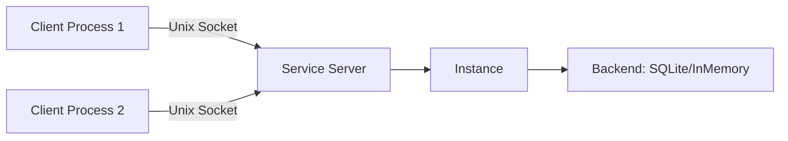
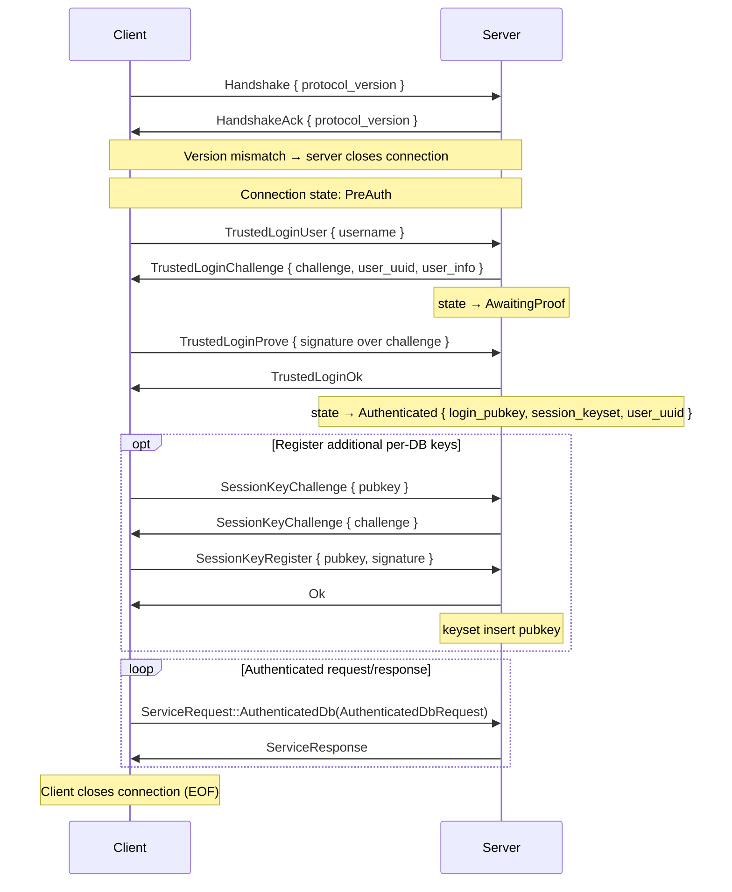

# Service (Daemon) Architecture

The service module (`crate::service`) enables running Eidetica as a local daemon over a Unix domain socket. The RPC boundary sits at the storage-operation level: a `RemoteConnection` forwards every Database-level storage operation to the daemon. Higher-level code (`Database`, stores, `Transaction`, `Instance`) drives I/O through a single `Backend` trait whose remote implementation (`RemoteBackend`) wraps the connection, so the call sites are identical for local and connected instances.

## Architecture Overview



The server wraps a full `Instance` (not just a backend) so it can handle both storage operations and write notifications. A client calls `Instance::connect("unix://...")`, which establishes a `RemoteConnection`, wraps it as a `RemoteBackend`, fetches `InstanceMetadata` over the wire, and constructs an Instance with **no local secrets** (`secrets: None`) — signing keys are derived client-side after login, never held by the constructed Instance until a user logs in.

### Module Structure

| Module              | Role                                                                                              |
| ------------------- | ------------------------------------------------------------------------------------------------- |
| `service::protocol` | Wire types: `Handshake`, `ServiceRequest`, `ServiceResponse`, `DatabaseOp`, frame I/O             |
| `service::error`    | `ServiceError` wire format and error reconstruction                                               |
| `service::server`   | `ServiceServer` — accepts connections, runs the auth state machine, gates and dispatches requests |
| `service::client`   | `RemoteConnection` — the `RemoteBackend` transport + `trusted_login`                              |

The daemon-side, per-user CRDT-state cache lives on the backend engine itself (`backend::BackendImpl`, keyed by [`CacheScope`](#crdt-cache)) rather than in a separate service-layer cache module.

## Wire Protocol

The protocol uses **length-prefixed JSON frames** over a Unix domain socket.

### Frame Format

```text
┌──────────────────┬──────────────────────┐
│ Length (4 bytes) │ JSON payload         │
│ big-endian u32   │ (up to 64 MiB)       │
└──────────────────┴──────────────────────┘
```

Each frame is a 4-byte big-endian length prefix followed by a JSON-serialized payload. Maximum frame size is 64 MiB (`MAX_FRAME_SIZE`); frames exceeding this are rejected on both read and write. `write_frame`/`read_frame` handle serialization and framing; `read_frame` returns `None` on clean EOF.

`PROTOCOL_VERSION` is currently `0`, indicating an unstable protocol that may change without notice.

### Connection Lifecycle



1. **Handshake**: client sends `Handshake { protocol_version }`; server validates and acks. On mismatch the server acks with its own version and closes the connection.
2. **Trusted login** (see Security Model below): a challenge-response over the user's root key. `GetInstanceMetadata` is the only other request permitted before login.
3. **Optional session-key registration**: once authenticated, the client may prove possession of additional pubkeys via `SessionKeyChallenge`/`SessionKeyRegister`. Each successfully proven pubkey joins the connection's `session_keyset` and can then act as the identity on subsequent ops. See [Session Keyset](#session-keyset) below.
4. **Authenticated request loop**: every storage operation travels inside `ServiceRequest::AuthenticatedDb`. One response per request, strictly sequential per connection (`RemoteConnection` serializes all I/O through a mutex).
5. **Termination**: client closes its write half (EOF); the server detects EOF and cleans up.

## Security Model

Client-side signing. The daemon stores and serves encrypted key material and signed entries but **never holds plaintext user signing keys or passwords**.

- **User keys stay client-side**: `TrustedLoginUser` returns the user's full record (`user_info`, including the encrypted `UserCredentials`) in the same round-trip as the challenge. The client derives the key-encryption-key locally (Argon2id over the password), decrypts the root signing key in-process, signs the challenge, and builds its `User` session from the already-returned record — no second wire read of `_users`. The signing key never crosses the socket.
- **Authentication via challenge-response**: the daemon issues fresh random challenge bytes per login attempt. Successful decryption of the user's signing key on the client _is_ password verification; the daemon verifies the returned signature against the user's stored public key. No password is sent over the wire.
- **`TrustedLogin` naming is load-bearing**: the flow assumes the caller is already trusted by the socket's filesystem permissions. Over a network transport this would need a PAKE instead — the name flags that gap deliberately.
- **Encrypted stores remain opaque to the daemon**: per-database encrypted CRDTs merge as `Vec<EncryptedBlob>`; the daemon participates in storage and sync without ever holding a content encryption key.
- **Filesystem permissions**: the socket's parent directory is created mode `0700` and the socket itself is set to `0600` as an additional access-control layer.

See the `crate::service` module rustdoc for the full design rationale, including why daemon-side signing (the earlier draft) was rejected.

## Request / Response Types

### ServiceRequest

The top-level request enum is intentionally flat, keeping the pre-auth surface visible at a glance:

| Variant                                        | When                                                                                               |
| ---------------------------------------------- | -------------------------------------------------------------------------------------------------- |
| `TrustedLoginUser { username }`                | Pre-auth step 1 — request a login challenge                                                        |
| `TrustedLoginProve { signature }`              | Pre-auth step 2 — return the signed login challenge                                                |
| `GetInstanceMetadata`                          | Pre-auth — fetch server identity (used by `Instance::connect`)                                     |
| `SessionKeyChallenge { pubkey }`               | Post-auth — request a challenge bound to `pubkey` so the client can prove possession               |
| `SessionKeyRegister { pubkey, signature }`     | Post-auth — return the signed challenge; on success `pubkey` joins the connection's session keyset |
| `AuthenticatedDb(Box<AuthenticatedDbRequest>)` | A `DatabaseOp` — the single envelope for every storage operation                                   |

`AuthenticatedDbRequest` carries an identity claim that the server validates against the connection's session keyset before dispatch:

```rust,ignore
pub struct AuthenticatedDbRequest {
    pub root_id: ID,      // database whose auth_settings gate this op
    pub identity: SigKey, // claim; hint pubkey must be in session_keyset
    pub op: DatabaseOp,   // tree-scoped by construction
}
```

### DatabaseOp — the wire surface

Every storage operation rides a single `DatabaseOp` enum carried in `AuthenticatedDbRequest`. The server runs its own `Database` on its local `Instance`, so verification-on-read, the Verified frontier, and CRDT-state materialization happen server-side by construction. Each variant is tree-scoped through the containing request's `root_id`.

| Variant                                  | Purpose                                                                                                                                                                          |
| ---------------------------------------- | -------------------------------------------------------------------------------------------------------------------------------------------------------------------------------- |
| `BeginTransaction { stores, scope }`     | Acquire parent tips, settings tips, and merged settings needed to build+sign a transaction locally for `stores`, parents drawn from `scope`'s projection. Read.                  |
| `SubmitSignedEntry { entry }`            | Submit a finished, client-signed entry. Server stores it `Unverified` and runs its own verification pass. **Verification-gated, not session-gated** (see below).                 |
| `GetVerifiedTips`                        | Database's Verified-frontier tips. Read.                                                                                                                                         |
| `GetStoreState { store }`                | Server-materialized merged state of an **unencrypted** store, against the server's Verified frontier. Returns a `WireCrdtValue`. Read.                                           |
| `GetStoreEntries { store, tips, scope }` | Ordered (by subtree height), verified, opaque store entries reachable from `tips` in `scope` — the universal primitive, including encrypted stores. Read.                        |
| `GetStoreTipsUpToEntries { store, .. }`  | Store tips reachable from given main-tree entry IDs. Read.                                                                                                                       |
| `ComputeMergeState { store, .. }`        | Lowest common ancestor + path to tip entries in a store DAG, fused into one RPC. Read.                                                                                           |
| `GetEntry { id }`                        | Fetch a single entry by id (gating tree resolved server-side post-fetch). Read.                                                                                                  |
| `GetCachedCrdtState { store, key }`      | Look up a previously cached materialized CRDT state for `(session user, root_id, key, store)`. Read.                                                                             |
| `CacheCrdtState { store, key, blob }`    | Stash a client-computed materialized CRDT state. The blob is opaque to the daemon and scoped to the authenticated user. Read.                                                    |
| `SetInstanceMetadata { metadata }`       | Rewrite daemon-level pointers to its own system DBs. Special-cased server-side to gate `Admin` on `_databases` (a daemon-global system tree) instead of the request's `root_id`. |

Operations deliberately **not** exposed over the wire — `update_verification_status`, `get_instance_secrets`, `all_roots`, and the verification/enumeration queries — live on the concrete local `BackendImpl` engine (reached via `Backend::local_engine`), so a `RemoteBackend` simply does not provide them.

`update_verification_status` is off-wire **by design, not just for tidiness**: verification is a local trust decision. If a client could set it over the socket, a client (or anything that reached the socket) could assert "this entry is `Verified`" without the server having validated it — exactly the caller-asserted-status hole the storage API was hardened to close. So the daemon's Instance owns verification: it stores everything `Unverified` and runs `Database::verify()` itself. The frontier/`allow_unverified` distinction is applied by the daemon-side `Database`, and every client connected to the same daemon therefore observes the same verified view.

`DatabaseOp::required_permission() -> Permission` returns `Write(0)` for `SubmitSignedEntry` (advisory only — the per-tree gate is skipped for submit), `Admin(0)` for `SetInstanceMetadata` (advisory — gated against `_databases` instead of `root_id`), and `Read` for every other variant.

### ServiceResponse

| Variant                                                     | Payload                                                            |
| ----------------------------------------------------------- | ------------------------------------------------------------------ |
| `Entry(Entry)` / `Entries(Vec<Entry>)`                      | One or many entries                                                |
| `Ids(Vec<ID>)`                                              | One or many IDs                                                    |
| `Ok`                                                        | Success with no data                                               |
| `TransactionContext(TransactionContext)`                    | Parent tips + settings, response to `DatabaseOp::BeginTransaction` |
| `CrdtValue(WireCrdtValue)`                                  | Materialized merged state, response to `DatabaseOp::GetStoreState` |
| `MergeState(MergeState)`                                    | LCA + path, response to `DatabaseOp::ComputeMergeState`            |
| `InstanceMetadata(Option<InstanceMetadata>)`                | Optional instance metadata                                         |
| `TrustedLoginChallenge { challenge, user_uuid, user_info }` | Challenge bytes + the user's full record (login)                   |
| `TrustedLoginOk`                                            | Login succeeded; connection now authenticated                      |
| `SessionKeyChallenge { challenge }`                         | Challenge bytes the client signs to register an additional key     |
| `Error(ServiceError)`                                       | Error response                                                     |

## Session Keyset

A connection's cryptographic identity is **a set of pubkeys, not a single pubkey**. The set is seeded at login with the pubkey that proved `TrustedLoginProve` (the user's _root_ pubkey, called `login_pubkey`) and grows as the client proves possession of additional keys via the registration handshake.

```rust,ignore
// In service::server
enum ConnectionState {
    PreAuth,
    AwaitingProof { challenge: Vec<u8>, expected_pubkey: PublicKey, .. },
    Authenticated {
        login_pubkey: PublicKey,
        session_keyset: HashSet<PublicKey>,           // includes login_pubkey
        pending_key_challenges: HashMap<PublicKey, Vec<u8>>,
        user_uuid: String,
        ..
    },
}
```

No `ConnectionState` variant holds a `PrivateKey` (enforced by a structural test).

### Why a keyset, not a single pubkey?

A `User` has many pubkeys — a root key, a device key, per-DB keys created via `User::add_private_key`, etc. Writes signed by a per-DB key produce entries whose tree auth grants that key, not the login key. With a single-pubkey session, reads of those trees would be denied (the login key isn't a member of the tree the per-DB key authored). The keyset model lets the same connection drive ops on every tree the user actually has a key for, without forcing one connection per key.

### Registration handshake

Adding a pubkey to the keyset is a two-step PoP:

1. Client → server: `SessionKeyChallenge { pubkey }`. Server generates a single-use, pubkey-bound random challenge, stores it in `pending_key_challenges[pubkey]`, returns it.
2. Client signs the challenge with `pubkey`'s private key, sends `SessionKeyRegister { pubkey, signature }`. Server verifies, removes the challenge (consumed on success or failure), inserts `pubkey` into `session_keyset` on verify, returns `Ok`.

Each `RemoteConnection` caches successful registrations in a `Mutex<HashSet<PublicKey>>` so `register_session_key(signing_key)` is idempotent — a repeat call for the same key short-circuits without touching the wire. The login pubkey is pre-cached on `trusted_login` success.

The handle constructors that need per-DB identities register on the caller's behalf, so most client code never touches the registration API directly:

- `Database::create(instance, signing_key, settings)` registers `signing_key` before constructing the returned `RemoteBackend`-backed handle.
- `Database::open_remote(.., identity)` is paired by `Instance::open_system_db_for_session(root, signing_key)`, which registers `signing_key` before opening.
- `User::open_database_with_key(root, key_id)` registers the user-held signing key for `key_id` before routing through `Database::open_remote` on a connected instance.

## Access Control: the three gates

Authenticated requests pass three gates before dispatch:

1. **Gate 1 — connection state**: the connection must be `Authenticated`. The identity hint, if any, must have its `pubkey` field present in the connection's `session_keyset` (proof of possession registered earlier). The resolved value becomes the **acting pubkey** for this op; an absent hint defaults to `login_pubkey`. The cross-check rejects identity claims for keys the client never proved — an attacker that hijacks an authenticated session still can't act as a key whose private material isn't on the client. **Submit (`DatabaseOp::SubmitSignedEntry`) is exempt** from this check: an admin transporting a user-signed entry legitimately carries a non-keyset identity, and the verification gate downstream is the real boundary (see [Verification-gated submit](#verification-gated-submit)).
2. **Gate 2 — per-tree permission**: the server loads `auth_settings` for the request's `root_id`, resolves the **acting** pubkey's permission, and rejects the op unless it covers `required_permission()`. Resolution tries direct membership first; on miss it falls back to the wildcard (`*`) slot, so a tree's global grant actually applies to any keyset member that isn't otherwise listed. `GetEntry` is gated _post-fetch_ (`gate_entry_read`): the fetched entry's owning tree is resolved and `Read` is required before content is returned, in case the entry's owning tree differs from the request's `root_id`.
3. **Gate 3 — cross-tree admin**: `SetInstanceMetadata` rewrites daemon-global pointers, so its gate ignores the request's `root_id` and is applied against `_databases.auth_settings` requiring `Admin`. The dispatcher special-cases this variant; it fails closed if `_databases` is unreadable (D8).

Authorization for entry-id-keyed writes is being hardened separately (tracked as D1); see V1 Limitations.

### Verification-gated submit

`SubmitSignedEntry` is **verification-gated, not session-gated**. The submit handler stores the incoming entry `Unverified` and runs the server's own verification pass against the tree's _pinned_ auth lineage. An attacker without a key the tree's auth grants cannot produce a `Verified` entry, and unverified junk is excluded from every default read by the frontier cut — so the per-tree session gate would add no correctness or isolation property here, and would only block legitimate transporters (e.g. an admin session carrying a user-signed genesis).

The core rule for the wire surface: **reads are session-gated (confidentiality boundary); submits are verification-gated (integrity boundary)**.

## Error Handling Across the Wire

Errors serialize as `ServiceError { module, kind, message }`.

**Server side**: `dispatch` catches any `crate::Error`, extracting the error's module name, discriminant name, and display message.

**Client side**: `service_error_to_eidetica_error()` reconstructs the appropriate `crate::Error` from the `(module, kind)` pair:

| Module     | Kind                         | Reconstructed Error                        |
| ---------- | ---------------------------- | ------------------------------------------ |
| `backend`  | `EntryNotFound`              | `BackendError::EntryNotFound`              |
| `backend`  | `VerificationStatusNotFound` | `BackendError::VerificationStatusNotFound` |
| `backend`  | `EntryNotInTree`             | `BackendError::EntryNotInTree`             |
| `backend`  | `NoCommonAncestor`           | `BackendError::NoCommonAncestor`           |
| `backend`  | `EmptyEntryList`             | `BackendError::EmptyEntryList`             |
| `instance` | `DatabaseNotFound`           | `InstanceError::DatabaseNotFound`          |
| `instance` | `EntryNotFound`              | `InstanceError::EntryNotFound`             |
| `instance` | `InstanceAlreadyExists`      | `InstanceError::InstanceAlreadyExists`     |
| `instance` | `DeviceKeyNotFound`          | `InstanceError::DeviceKeyNotFound`         |
| `instance` | `AuthenticationRequired`     | `InstanceError::AuthenticationRequired`    |
| (other)    | (other)                      | `Error::Io` with the original message      |

Unrecognized combinations fall back to an `Io` error carrying the original message, so callers use the same error-handling patterns (e.g. `err.is_not_found()`) regardless of local vs. remote. A compile-time exhaustive match over `crate::Error` forces a wire-mapping decision whenever a new variant is added, and a round-trip test asserts every mapped pair survives without hitting the fallback.

## Write Coordination

`Instance::put_entry()` stores an entry through the backend. On a **local** instance it then fires the local callback registry inline (with `previous_tips` captured pre-write) and `commit().await` returns *after* user callbacks complete. On a **connected** instance the picture flips: the pre-write `get_tips` is skipped (the daemon owns the canonical DAG, and reading client-side would also misgate against the connection's login pubkey rather than the per-DB acting identity), **and the local fire is also skipped** — the daemon is the sole publisher.

The actual write travels as `DatabaseOp::SubmitSignedEntry` (verification-gated, see [above](#verification-gated-submit)). Server-side, after the daemon stores and verifies the entry, `Instance::fire_write_callbacks` runs — for both the daemon's own consumers (e.g. sync triggers) and a single global callback registered by `ServiceServer::run` that fans the event out to every subscribed connection. The fan-out builds a `Notification::DatabaseWrite { root_id, entries, previous_tips, source }` and pushes it through each subscriber's writer channel as `ServerFrame::Notification(...)`.

A connected client subscribes lazily: the first `Database::on_write` registration for a tree on a given connection spawns a task that sends `DatabaseOp::SubscribeWrites`. Further registrations on the same tree reuse the subscription. `RemoteConnection`'s background reader task demuxes inbound `ServerFrame`s — `Response` frames pop the next pending oneshot in FIFO order; `Notification` frames upgrade a `WeakInstance` and route into `Instance::fire_write_callbacks`, the same dispatch local instances use. The result: connected clients observe writes in daemon-canonical order with full `previous_tips`, including their own commits; subscriptions are torn down implicitly when the connection drops (a `ConnectionGuard` Drop in `handle_connection` scrubs the registry).

## CRDT Cache

CRDT-state caching is unified on the local backend engine (`BackendImpl`) under a single LRU keyed by [`CacheScope`](crate::backend::CacheScope):

- `CacheScope::Shared` — daemon-computed state for unencrypted stores (visible to every connected user; the bytes were produced by the trusted server-side merge).
- `CacheScope::User(uuid)` — client-uploaded state for encrypted stores or any other client-merged result (scoped to the submitting user's uuid; only that user can poison their own future reads on this slot).

When the daemon serves `DatabaseOp::GetCachedCrdtState` / `CacheCrdtState`, it routes through the same `BackendImpl` LRU as a local instance, supplying `CacheScope::User(session_user)` so user-supplied blobs cannot leak across connections. Local (non-service) flows still use `CacheScope::Shared` for daemon-computed merges. The single cache is the source of truth on either path; the two scopes give cross-user isolation without a separate `ServiceCache` data structure.

Clients additionally keep a per-connection in-memory LRU on `RemoteBackend` so repeated subtree-state materialization within one transaction does not round-trip to the daemon.

## Database-Level Wire API

The server runs its own `Database` on a local `Instance`, so verification-on-read, the Verified frontier, and CRDT-state materialization happen server-side by construction. Every op is intrinsically tree-scoped through the containing `AuthenticatedDbRequest`.

### Unified `Backend` seam

`Transaction`, `Store`, `Database`, and `Instance` all drive I/O through a single `Backend` trait (`crate::instance::backend::Backend`) with no local-vs-remote branching at the call sites:

| Method                                                                    | Purpose                                                                       |
| ------------------------------------------------------------------------- | ----------------------------------------------------------------------------- |
| `get(id)`                                                                 | Fetch a single entry                                                          |
| `get_tips(tree)` / `get_store_tips(tree, store)`                          | Raw DAG tips (Verified-frontier filtering stays in `Database`)                |
| `get_store_tips_up_to_entries(tree, store, up_to)`                        | Store tips reachable from given main-tree entries                             |
| `get_store_from_tips(tree, store, tips)`                                  | Every store entry reachable from `tips`                                       |
| `find_merge_base(tree, store, ids)` / `get_path_from_to(tree, store, ..)` | LCA + path within a store                                                     |
| `get_cached_crdt_state` / `cache_crdt_state`                              | CRDT merge cache (see [CRDT Cache](#crdt-cache))                              |
| `put(entry)`                                                              | Persist an entry                                                              |
| `write_entry(verification, entry, source)`                                | Persist a signed entry, applying verification and dispatching local callbacks |
| `get_instance_metadata` / `set_instance_metadata`                         | Daemon-global system-DB pointers                                              |

The trait is the _intersection_ of what both implementations can honor with the same meaning. Off-seam local-only operations (instance secrets, verification-status mutation, raw `all_roots`/`get_tree` listings, scope-keyed cache access) are deliberately **not** on the trait and live on the concrete in-process engine. They are reached only where one exists, via `Backend::local_engine() -> Option<Arc<dyn BackendImpl>>` (returns `None` on a remote backend).

Two implementations exist:

- **`LocalBackend`** — wraps an `Arc<dyn BackendImpl>` (the concrete in-process storage engine). `local_engine()` returns it.
- **`RemoteBackend`** — wraps a `RemoteConnection` and translates each method to a wire RPC. Carries only an optional acting identity (`None` = the connection's session identity); tree-scoped methods take the tree from the caller, and `get` derives its gating tree server-side from the fetched entry, so no per-handle root is bound and one connection multiplexes every per-database identity via the session keyset. `local_engine()` returns `None`.

`Database` selects the implementation at construction time:

```rust,ignore
// Local: share the Instance's backend.
ops: instance.backend().clone(),

// Remote (service): a per-handle RemoteBackend bound to the calling identity.
ops: Arc::new(RemoteBackend::new(conn, Some(identity))),
```

### Encrypted-store split

Encrypted stores (wrapped in `PasswordStore`) are opaque to the daemon — the daemon stores and syncs `EncryptedBlob` entries without ever holding a content encryption key. The `DatabaseOp` surface handles the encryption boundary with two complementary primitives:

- **`GetStoreState { store }`** — the **unencrypted fast path** (Doc/Table stores). The server loads the store's entries, CRDT-merges them locally, materializes the merged state, and returns a `WireCrdtValue` (`serde_json::Value`). No decryption; the server works with plaintext because the underlying data is unencrypted.

- **`GetStoreEntries { store, tips, scope }`** — the **universal primitive** for encrypted stores. Returns opaque `Entry` objects reachable from `tips`, ordered by subtree height, already verified against the server's Verified frontier. The client receives encrypted entries it can decrypt and CRDT-merge locally. This works identically for encrypted and unencrypted stores — the server never touches content.

- **`GetCachedCrdtState`/`CacheCrdtState`** provide a CRDT-merge fast-path that avoids re-fetching entries whose merged state is already cached. The daemon serves these through its `BackendImpl`'s `CacheScope::User(uuid)` slot (cross-session, per-user); `RemoteBackend` also keeps its own per-connection in-memory LRU for intra-transaction repeats without a round-trip. See [CRDT Cache](#crdt-cache).

The encrypted-store-over-service test (`test_database_encrypted_store_roundtrip`) exercises the full path: writes encrypted data server-side via a local `Database`, then reads entries via `RemoteConnection::get_store_entries` and confirms the opaque entries carry the correct subtree markers. Decryption and local merge are client-only.

### Read scope

`ReadScope` controls the DAG projection exposed over the wire:

- **`Verified`** (default) — only the maximal all-`Verified` ancestor-closed prefix of the DAG (the "Verified frontier"). Tips that are still `Unverified` are replaced by their nearest `Verified` ancestors; `Failed` entries are always dropped.
- **`AllowUnverified`** — open against the raw DAG (only `Failed` dropped). The caller must explicitly opt in via `Database::allow_unverified()`.

`BeginTransaction` carries the caller's `ReadScope`: write parents are drawn from the _same_ projection the caller reads, so a write built under `AllowUnverified` uses unverified tips as parents and a write built under the `Verified` default uses only verified ancestors. This ensures the write's parent projection is self-consistent with the caller's read posture.

### Gate scope for `AuthenticatedDb`

Every `DatabaseOp` variant is intrinsically tree-scoped via `root_id` — there are no tree-less operations to gate. Permission follows the `required_permission()` pattern: `Read` for queries (`GetVerifiedTips`, `GetStoreState`, `GetStoreEntries`, `GetEntry`, `BeginTransaction`, `GetStoreTipsUpToEntries`, `ComputeMergeState`), `Write` for mutation. The per-tree permission gate (Gate 2) always fires for non-submit `AuthenticatedDb` requests because the tree identity is known before dispatch.

`SubmitSignedEntry` is the exception — verification-gated, not session-gated, as covered in [Access Control](#access-control-the-three-gates) above.

### One envelope, one op enum

The current wire is the result of a series of consolidations:

- An earlier draft mirrored every storage-trait method onto its own `BackendOp` variant, carried in a separate `ServiceRequest::Authenticated(AuthenticatedRequest)` envelope. That surface placed auth/verification/merge above the wire boundary, treating the daemon as a passive key-value store.
- The Database-level `DatabaseOp` / `AuthenticatedDb` path was added alongside it so the daemon could own verification-on-read, the Verified frontier, and CRDT-state materialization.
- The collapse landed `SetInstanceMetadata` into `DatabaseOp` (dispatcher-special-cased to gate against `_databases`), folded `Get` into `DatabaseOp::GetEntry`, and removed the parallel `BackendOp` enum, `ServiceRequest::Authenticated`, and `AuthenticatedRequest` outright.
- The earlier `NotifyEntryWritten` RPC was removed: the server's `SubmitSignedEntry` handler fires its own write callbacks in-process.

The shape today is a single envelope (`AuthenticatedDb(Box<AuthenticatedDbRequest>)`) carrying a single op enum (`DatabaseOp`) over every storage operation.

## Feature Gate

```rust,ignore
#[cfg(all(unix, feature = "service"))]
pub mod service;
```

The `service` feature is in the default `full` set; the `unix` gate restricts it to platforms with Unix domain sockets.

## Testing

Two complementary layers:

- **`tests/it/service.rs`** — dedicated integration tests for the service layer: handshake, the TrustedLogin challenge-response, the three gates (unauthenticated rejection, per-tree allow/deny, cross-tree denial), per-user cache isolation, concurrent clients, and the user lifecycle.
- **`TEST_BACKEND=service`** — runs the full integration suite through the socket, exercising the RPC layer, serialization, and error reconstruction:

```bash
TEST_BACKEND=service cargo nextest run --workspace --all-features
just test service
nix build .#test.service
```

The full suite passes 1:1 against the service backend. Tests that exercise _process-local_ subsystems — `Sync::new` (needs the local device key), `backend.all_roots` / `backend.get_verification_status` (raw-backend listings that have no wire equivalent), client-side delegation validation that reads delegated trees via `backend.get_tree`, the CRDT merge cache, and multi-`User`-on-one-`Instance` patterns that would all wedge against a single wire-mode session pubkey — go through always-local helpers regardless of `TEST_BACKEND`:

- `test_local_instance()` — like `test_instance()` but always builds an in-memory local `Instance`.
- `test_local_instance_with_user(username)` and `test_local_instance_with_user_and_key(username, key_name)` — counterparts to the wire-aware versions.
- `setup_tree_with_user_key_local()` and `TestContext::with_local_database()` — for tests that poke at local-only backend state.

The architectural seam — wire-path tests vs. subsystem tests — is explicit at the helper level. The test harness bootstraps the server-side Instance with a passwordless `admin` user via `Instance::create_backend(..., NewUser::passwordless("admin"))`, then logs in over the wire as that user. (The old `admin`/`admin` auto-bootstrap is gone; production deployments now run `eidetica daemon init --username <NAME>` with explicit credentials, and the test harness mirrors that shape.)

## V1 Limitations

This is a **single trusted local client** v1. The following are deferred with tracked follow-ups:

- **Lock-poisoning posture**: the per-connection session `RwLock` and the `RemoteBackend` per-connection cache mutex are poison-tolerant (handlers recover the guard from a poisoned lock rather than panicking), but other `std::sync::Mutex` sites in the service path still use `lock().unwrap()`. Documented at the lock sites; the remaining ones must be audited before serving multiple or untrusted clients.
- **Verification status is never asserted over the wire**: the service protocol carries no way for a client to assert a verification status; entries arriving over the wire are stored `Unverified` and earn `Verified` only via the daemon's own validation pass. The status model, the pinned-settings validation that makes it staleness-free, the disclosure posture, and the unbuilt authority-_reduction_ (revocation) gap are documented in the [Verification Model](../design/verification.md) design doc.
- **`get_tips()` on a connected Database delegates to `self.ops()`**: handles built via `Database::create` or `Database::open_remote` carry a `RemoteBackend` bound to a per-DB identity; reads use that identity (not the connection's login pubkey). Handles built via plain `Database::open` on a connected instance share the `Instance`'s `RemoteBackend` (which uses the connection's default session identity) — appropriate for code that wants the connection's login pubkey to drive reads. The previous heuristic remote-detection in `Database::get_tips` was replaced with an explicit ops delegation.
- **No sync delegation**: `enable_sync()` on a remote Instance is a silent no-op (sync runs daemon-side; the client can't enable it from over the wire). A future admin-gated `EnableSync` RPC would let a client ask the daemon to enable its sync subsystem, parallel to how `InstanceAdmin::create_user` reaches `_users` today.

## Future Work

- **PAKE for network transport**: `TrustedLogin` is safe only because the socket is filesystem-gated. A network transport must replace it with a password-authenticated key exchange.
- **Sync delegation**: as above.
- **Refcounted subscription teardown**: subscriptions live for the connection's lifetime today; when the last `Database::on_write` callback for a tree on a connection drops, send `DatabaseOp::UnsubscribeWrites` instead of leaving the daemon fanning out unread frames. Trivial cost for v1, worth optimizing when long-lived connections churn through many trees.
- **Notification backpressure**: the per-connection writer channel is `mpsc::unbounded_channel`; a stalled client reader buffers notifications in memory. Switch to a bounded channel with a documented drop-oldest policy if memory growth becomes measurable.
- **Derived-key caching**: cache the Argon2id-derived encryption key in an OS secret store with a TTL, evolving the daemon into an ssh-agent-like key agent to eliminate repeated password prompts for CLI tools.
