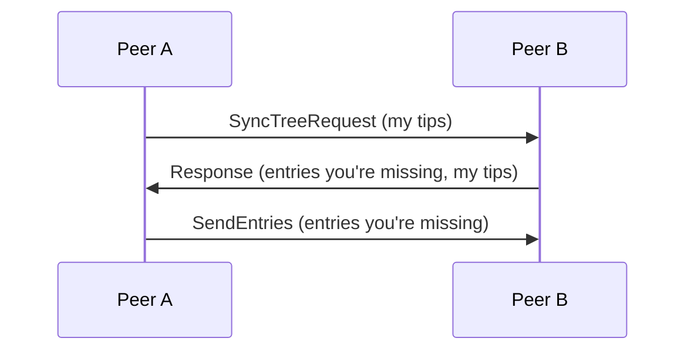
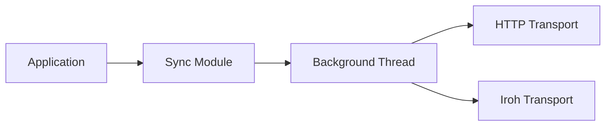

# Sync

Eidetica uses a Merkle-CRDT based sync protocol. Peers exchange tips (current DAG heads) and send only the entries the other is missing.

## Sync Flow

1. Peer A sends its current tips for a Tree
2. Peer B compares DAGs, returns entries A is missing plus B's tips
3. A sends entries B is missing based on the tip comparison

This is **stateless** and **self-correcting** - no tracking of previously synced entries.

## Bootstrap vs Incremental

The same protocol handles both cases:

- **Empty tips** (new database): Peer sends complete Tree from root
- **Has tips** (existing database): Peer sends only missing entries

## Transport Options

- **HTTP**: REST API for server-based sync
- **Iroh P2P**: QUIC-based with NAT traversal for peer-to-peer sync

Both transports implement the same sync protocol.

## Architecture

The Sync module queues operations for a background thread, which handles transport connections and retries failed sends with exponential backoff.

## Current Limitations

The sync system is currently simple and 1:1. Each peer connection requires manual setup with explicit peer addresses. Planned improvements include:

- Peer discovery
- Address sharing and relay coordination
- Multi-peer sync orchestration

See [Bootstrap System](bootstrap.md) for the key exchange flow when joining a database.
